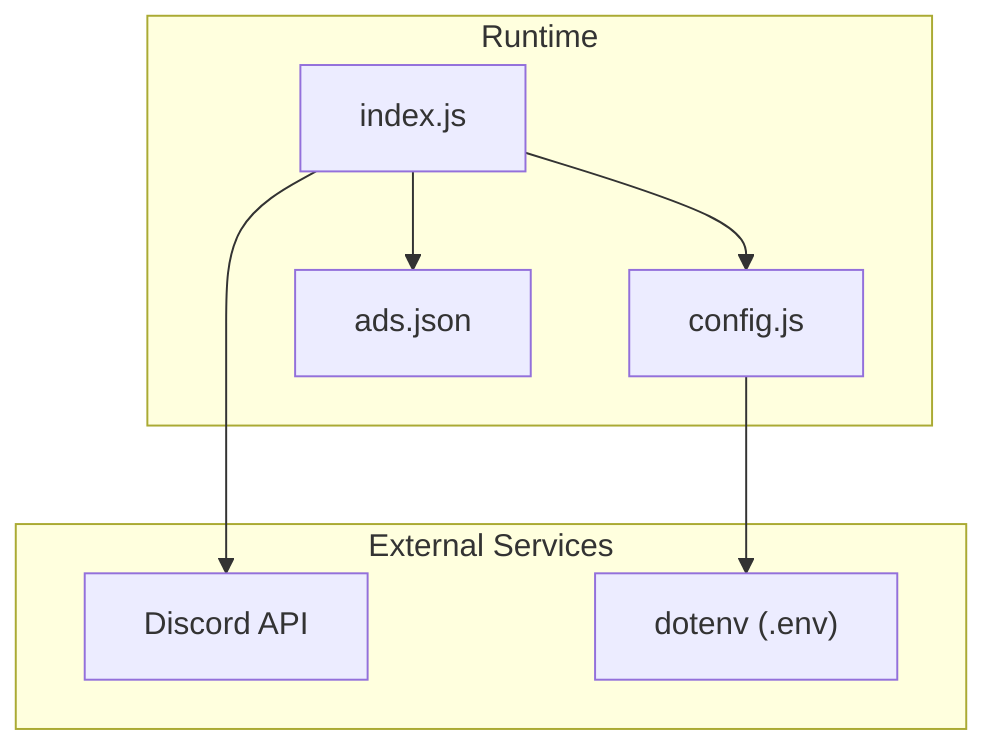
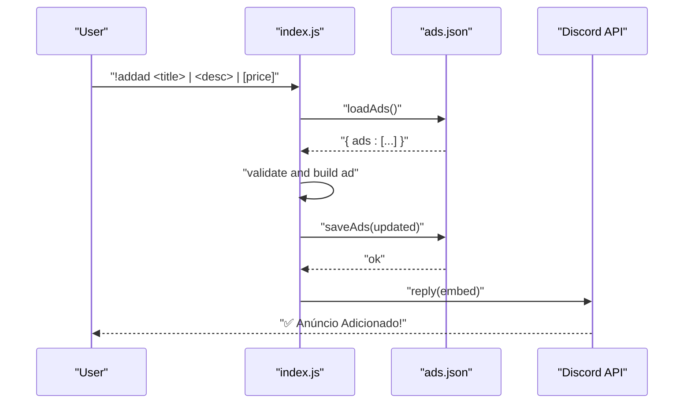
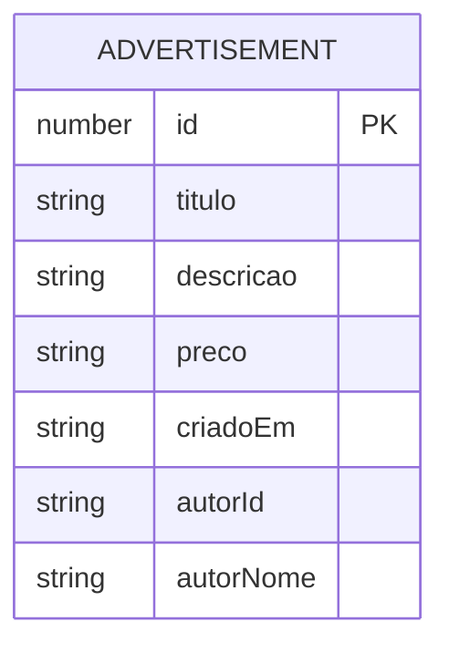
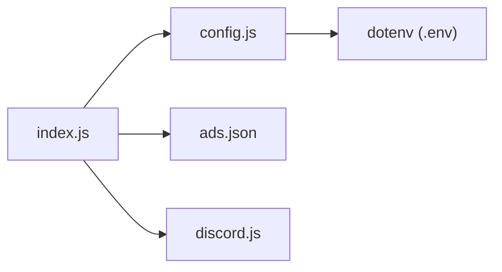

# Advertisement Commands

<cite>
**Referenced Files in This Document**
- [index.js](file://index.js)
- [config.js](file://config.js)
- [README.md](file://README.md)
- [ads.json](file://ads.json)
- [package.json](file://package.json)
</cite>

## Table of Contents
1. [Introduction](#introduction)
2. [Project Structure](#project-structure)
3. [Core Components](#core-components)
4. [Architecture Overview](#architecture-overview)
5. [Detailed Component Analysis](#detailed-component-analysis)
6. [Dependency Analysis](#dependency-analysis)
7. [Performance Considerations](#performance-considerations)
8. [Troubleshooting Guide](#troubleshooting-guide)
9. [Conclusion](#conclusion)

## Introduction
This document provides comprehensive documentation for all advertisement-related commands in the Discord bot. It covers command syntax, parameters, expected behavior, response formats, validation rules, error handling, and permission requirements. The commands enable users to create, view, broadcast, and manage advertisements stored locally in a JSON file.

## Project Structure
The advertisement system is implemented in a single-file architecture with a small set of supporting files:
- index.js: Implements the Discord bot, message processing, and advertisement commands.
- config.js: Loads environment variables for token, prefix, and advertisement channel IDs.
- ads.json: Local storage for advertisements.
- README.md: User-facing documentation including command usage and examples.
- package.json: Dependencies including discord.js and dotenv.

**Diagram sources**
- [index.js:1-396](file://index.js#L1-L396)
- [config.js:1-8](file://config.js#L1-L8)
- [ads.json:1-4](file://ads.json#L1-L4)

**Section sources**
- [index.js:1-396](file://index.js#L1-L396)
- [config.js:1-8](file://config.js#L1-L8)
- [README.md:163-283](file://README.md#L163-L283)

## Core Components
- Advertisement persistence: Stored in a JSON file with a top-level “ads” array.
- Command processor: Parses messages, extracts arguments, and routes to handlers.
- Configuration loader: Reads token, prefix, and advertisement channel IDs from environment variables.
- Embed builder: Generates rich Discord embeds for command responses.

Key behaviors:
- Advertisement creation supports a three-part pipe-separated format for title, description, and optional price.
- Listing commands limit embed fields to 25 entries to comply with Discord limits.
- Broadcasting sends one advertisement per channel with a small delay to avoid rate limits.

**Section sources**
- [index.js:11-29](file://index.js#L11-L29)
- [index.js:60-389](file://index.js#L60-L389)
- [config.js:3-7](file://config.js#L3-L7)
- [README.md:169-283](file://README.md#L169-L283)

## Architecture Overview
The advertisement command flow is event-driven. On message creation, the bot checks if the message starts with the configured prefix, parses the command and arguments, and executes the corresponding handler. Handlers interact with the local JSON file and send embed responses to the user or configured channels.

**Diagram sources**
- [index.js:73-109](file://index.js#L73-L109)
- [index.js:13-29](file://index.js#L13-L29)

## Detailed Component Analysis

### Command: !addad
Purpose: Create a new advertisement with title, description, and optional price.

Syntax
- !addad <title> | <description> | [price]

Parameters
- title: Required. Text for the advertisement title.
- description: Required. Text describing the item/service.
- price: Optional. Defaults to “Consultar” if omitted.

Validation and behavior
- Splits the combined argument string by “|” and trims each part.
- Requires at least two parts; otherwise replies with usage guidance.
- Creates a new advertisement object with:
  - id: numeric timestamp
  - titulo: title
  - descricao: description
  - preco: price or “Consultar”
  - criadoEm: localized timestamp
  - autorId: message author’s ID
  - autorNome: message author’s username
- Saves the updated advertisement list to the JSON file.
- Responds with an embed containing the advertisement details.

Response format
- Embed with fields for title, description, price, and ID.

Common errors
- Missing required parts: usage guidance reply.
- File write failures: logged to console.

Examples
- !addad Camiseta | Camiseta preta tamanho G | R$ 50,00
- !addad Aula de Inglês | Professor nativo, aulas online | Consultar

**Section sources**
- [index.js:73-109](file://index.js#L73-L109)
- [index.js:13-29](file://index.js#L13-L29)
- [README.md:169-195](file://README.md#L169-L195)

### Command: !myads
Purpose: List all advertisements owned by the requesting user.

Syntax
- !myads

Behavior
- Loads all advertisements.
- Filters by author ID (message author).
- Builds an embed listing up to 25 advertisements.
- Replies with either a “no ads” message or the embed.

Response format
- Embed titled “Seus Anúncios (count)” with fields for each advertisement.

Common errors
- No advertisements found: friendly message guiding to create one.

**Section sources**
- [index.js:111-133](file://index.js#L111-L133)
- [README.md:198-219](file://README.md#L198-L219)

### Command: !allads
Purpose: List all advertisements registered in the system.

Syntax
- !allads

Behavior
- Loads all advertisements.
- Builds an embed listing up to 25 advertisements.
- Each field includes the advertisement title, author, description, price, and ID.

Response format
- Embed titled “Todos os Anúncios (count)” with fields for each advertisement.

Common errors
- No advertisements found: friendly message guiding to create one.

**Section sources**
- [index.js:135-156](file://index.js#L135-L156)
- [README.md:222-231](file://README.md#L222-L231)

### Command: !sendads
Purpose: Broadcast all advertisements to configured channels.

Syntax
- !sendads

Behavior
- Loads all advertisements.
- Validates presence of configured advertisement channel IDs.
- Sends an embed per advertisement to each configured channel with a small delay between messages.
- Reports success/failure counts for channels and total advertisements sent.

Response format
- Initial reply indicating number of advertisements and channels.
- Final embed summarizing results.

Common errors
- No advertisements: friendly message.
- No configured channels: guidance to configure AD_CHANNEL_IDS.
- Channel fetch/send failures: logged and counted as failures.

Notes
- Rate limiting: 500ms delay between sending messages to reduce API pressure.

**Section sources**
- [index.js:158-220](file://index.js#L158-L220)
- [config.js:6](file://config.js#L6)
- [README.md:233-253](file://README.md#L233-L253)

### Command: !removead
Purpose: Delete a specific advertisement by ID owned by the requesting user.

Syntax
- !removead <id>

Behavior
- Extracts the advertisement ID from arguments.
- Loads advertisements and filters by both ID and author ID.
- Removes the matching advertisement and saves the updated list.
- Confirms removal with the advertisement title.

Response format
- Confirmation message with the removed advertisement title.

Common errors
- Missing ID: usage guidance.
- Advertisement not found or not owned: ownership verification message.

**Section sources**
- [index.js:222-241](file://index.js#L222-L241)
- [README.md:256-271](file://README.md#L256-L271)

### Command: !clearads
Purpose: Remove all advertisements owned by the requesting user.

Syntax
- !clearads

Behavior
- Loads advertisements.
- Filters out advertisements owned by the author and saves the updated list.
- Reports how many advertisements were removed.

Response format
- Confirmation message with the count of removed advertisements.

**Section sources**
- [index.js:243-251](file://index.js#L243-L251)
- [README.md:274-282](file://README.md#L274-L282)

### Data Model
Advertisements are stored in a JSON file with a top-level “ads” array. Each advertisement object includes:
- id: numeric identifier
- titulo: advertisement title
- descricao: description
- preco: price or “Consultar”
- criadoEm: localized creation timestamp
- autorId: author’s user ID
- autorNome: author’s username

**Diagram sources**
- [index.js:84-92](file://index.js#L84-L92)
- [ads.json:1-4](file://ads.json#L1-L4)

**Section sources**
- [index.js:84-92](file://index.js#L84-L92)
- [ads.json:1-4](file://ads.json#L1-L4)

## Dependency Analysis
- index.js depends on:
  - config.js for environment variables
  - filesystem module for reading/writing ads.json
  - discord.js for message handling and embed building
- config.js depends on dotenv for loading environment variables from .env
- README.md documents command usage and examples

**Diagram sources**
- [index.js:1-6](file://index.js#L1-L6)
- [config.js:1](file://config.js#L1)
- [package.json:14-22](file://package.json#L14-L22)

**Section sources**
- [index.js:1-6](file://index.js#L1-L6)
- [config.js:1-8](file://config.js#L1-L8)
- [package.json:14-22](file://package.json#L14-L22)

## Performance Considerations
- Embed field limits: Listing commands cap at 25 advertisements per embed to comply with Discord’s embed field limit.
- Rate limiting during broadcast: A short delay is applied between sending messages to each channel to avoid hitting rate limits.
- File I/O: Each command reads and writes the entire ads.json file; frequent writes may impact performance on constrained systems.

[No sources needed since this section provides general guidance]

## Troubleshooting Guide
Common issues and resolutions:
- Invalid syntax or missing parameters
  - Example: Missing pipe separators or insufficient parts in !addad.
  - Resolution: Follow the documented format and ensure three parts separated by “|”.

- Missing or empty advertisement channel IDs
  - Symptom: “Nenhum canal de anúncios configurado” when running !sendads.
  - Resolution: Configure AD_CHANNEL_IDS in .env with comma-separated channel IDs (no spaces).

- Permission errors when sending advertisements
  - Symptom: “Missing Permissions” when broadcasting.
  - Resolution: Ensure the bot has “View Channel”, “Send Messages”, “Embed Links”, and “Read Message History” in target channels.

- File write/read errors
  - Symptom: Errors logged when saving or loading advertisements.
  - Resolution: Verify file permissions and that ads.json is not locked by another process.

- Environment configuration problems
  - Symptom: Bot does not respond to commands or fails to connect.
  - Resolution: Confirm DISCORD_TOKEN, PREFIX, and AD_CHANNEL_IDS are correctly set in .env without extra whitespace or quotes.

**Section sources**
- [index.js:75-80](file://index.js#L75-L80)
- [index.js:165-170](file://index.js#L165-L170)
- [index.js:203-206](file://index.js#L203-L206)
- [README.md:508-562](file://README.md#L508-L562)

## Conclusion
The advertisement command suite provides a straightforward way to create, list, broadcast, and manage advertisements within a Discord server. By adhering to the documented syntax and configuration requirements, users can efficiently operate the system while respecting Discord’s rate limits and embed constraints.