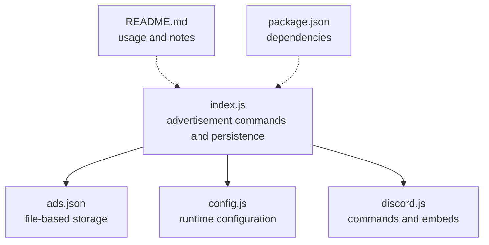
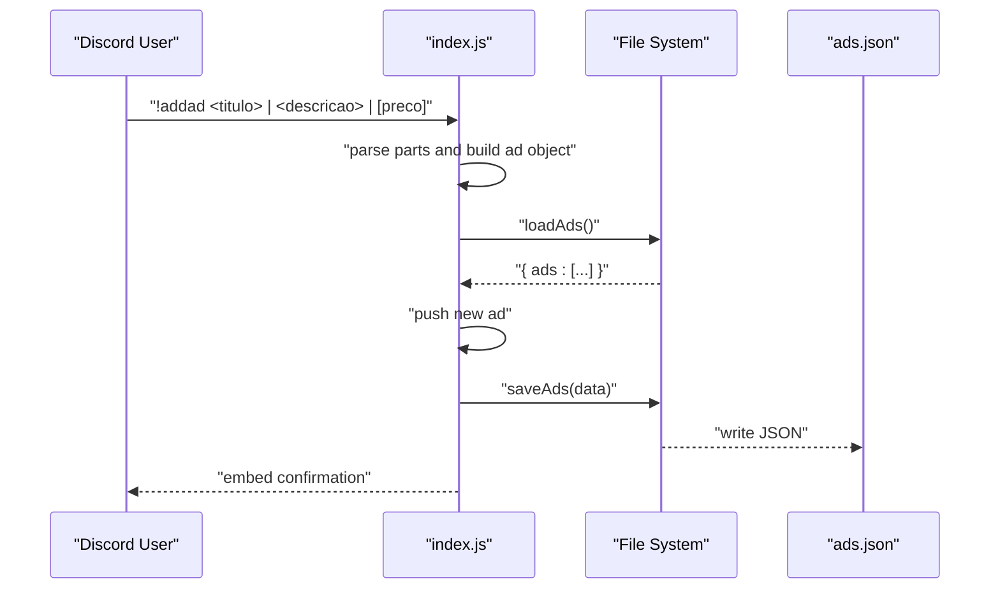
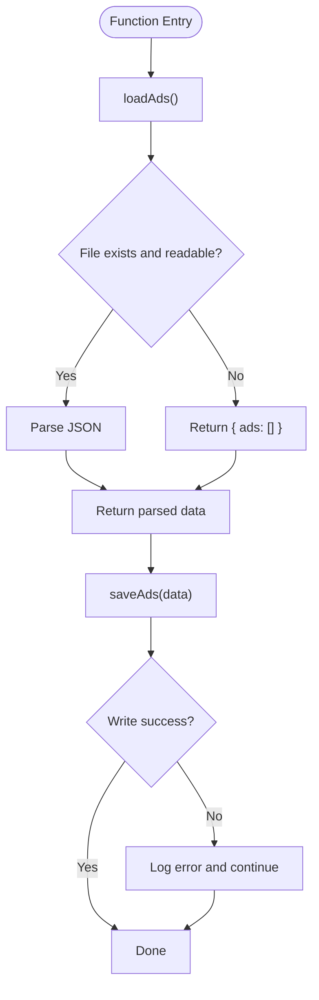
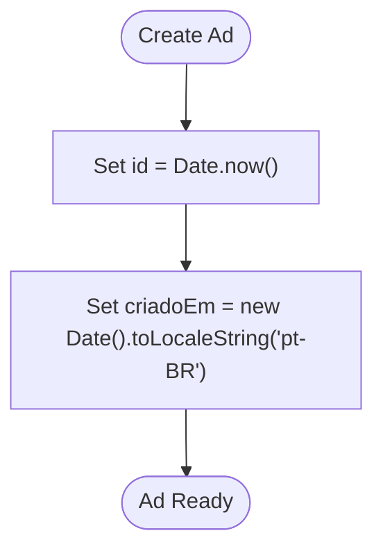
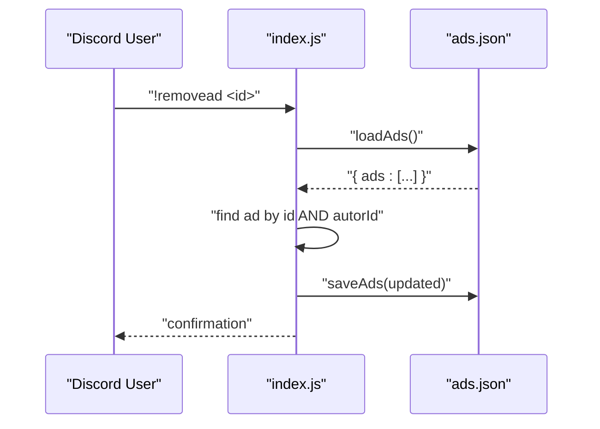
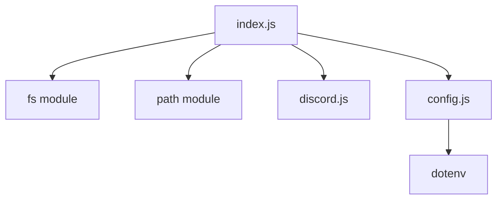

# Advertisement Data Model

<cite>
**Referenced Files in This Document**
- [index.js](file://index.js)
- [config.js](file://config.js)
- [README.md](file://README.md)
- [package.json](file://package.json)
</cite>

## Table of Contents
1. [Introduction](#introduction)
2. [Project Structure](#project-structure)
3. [Core Components](#core-components)
4. [Architecture Overview](#architecture-overview)
5. [Detailed Component Analysis](#detailed-component-analysis)
6. [Dependency Analysis](#dependency-analysis)
7. [Performance Considerations](#performance-considerations)
8. [Troubleshooting Guide](#troubleshooting-guide)
9. [Conclusion](#conclusion)
10. [Appendices](#appendices)

## Introduction
This document describes the advertisement data model and persistence mechanism implemented in the project. It explains the advertisement object schema, file-based storage using ads.json, data loading and saving functions, JSON serialization patterns, unique identifier generation, timestamp formatting, user identification, validation rules, storage limitations, data integrity considerations, backup procedures, and migration strategies for future schema changes.

## Project Structure
The advertisement system is part of a Discord bot that manages announcements and music playback. The relevant files for the advertisement data model are:
- index.js: Contains the advertisement commands, data loading/saving, and the ads.json file path.
- config.js: Provides runtime configuration including the advertisement channel IDs.
- README.md: Documents usage, commands, and operational notes.
- package.json: Lists dependencies including discord.js and dotenv.

**Diagram sources**
- [index.js:11-29](file://index.js#L11-L29)
- [config.js:3-7](file://config.js#L3-L7)
- [README.md:483](file://README.md#L483)
- [package.json:14-22](file://package.json#L14-L22)

**Section sources**
- [index.js:11-29](file://index.js#L11-L29)
- [config.js:3-7](file://config.js#L3-L7)
- [README.md:483](file://README.md#L483)
- [package.json:14-22](file://package.json#L14-L22)

## Core Components
- Advertisement object schema
  - Required fields: id, titulo, descricao, autorId, autorNome
  - Optional fields: preco, criadoEm
- File-based storage
  - Storage file: ads.json
  - Data shape: { ads: [ ... ] }
- Data loading and saving
  - loadAds(): reads and parses ads.json
  - saveAds(data): writes JSON to ads.json
- Unique identifier generation
  - id: numeric timestamp generated via Date.now()
- Timestamp formatting
  - criadoEm: localized string using new Date().toLocaleString('pt-BR')
- User identification
  - autorId: message author’s Discord user ID
  - autorNome: message author’s Discord username
- Validation and limits
  - Command parsing validates presence of required parts
  - Embed field limits enforced by Discord (up to 25 fields)
- Persistence and integrity
  - JSON serialization/deserialization
  - Error handling for file read/write failures
  - Rate limiting during bulk sends to avoid API throttling

**Section sources**
- [index.js:84-92](file://index.js#L84-L92)
- [index.js:13-21](file://index.js#L13-L21)
- [index.js:23-29](file://index.js#L23-L29)
- [index.js:85](file://index.js#L85)
- [index.js:89](file://index.js#L89-L91)
- [index.js:147-153](file://index.js#L147-L153)
- [README.md:646](file://README.md#L646)

## Architecture Overview
The advertisement data model is integrated into the bot’s message processing pipeline. Commands trigger creation, listing, removal, clearing, and broadcasting of advertisements. Data is persisted to a single JSON file.

**Diagram sources**
- [index.js:73-109](file://index.js#L73-L109)
- [index.js:13-21](file://index.js#L13-L21)
- [index.js:23-29](file://index.js#L23-L29)

## Detailed Component Analysis

### Advertisement Object Schema
- Required fields
  - id: numeric unique identifier
  - titulo: string title
  - descricao: string description
  - autorId: string Discord user ID
  - autorNome: string Discord username
- Optional fields
  - preco: string price or “Consultar”
  - criadoEm: string timestamp formatted for pt-BR locale

Example stored advertisement object (paths):
- [index.js:84-92](file://index.js#L84-L92)

Validation rules
- Command parsing ensures at least two parts (title and description) are present
- Price is optional; defaults to “Consultar” if omitted
- Removal requires matching both id and author ID

Storage limitations
- Embeds support up to 25 fields; listing commands cap at 25 items
- Bulk send uses a small delay between messages to avoid rate limits

**Section sources**
- [index.js:84-92](file://index.js#L84-L92)
- [index.js:74-82](file://index.js#L74-L82)
- [index.js:147-153](file://index.js#L147-L153)
- [README.md:642](file://README.md#L642)

### File-Based Storage and JSON Serialization
- Storage file: ads.json located at the project root
- Data shape: { ads: [ ... ] }
- Loading
  - loadAds() reads the file synchronously and parses JSON
  - On failure, logs error and returns empty ads array
- Saving
  - saveAds() writes JSON with indentation for readability
  - On failure, logs error

**Diagram sources**
- [index.js:13-21](file://index.js#L13-L21)
- [index.js:23-29](file://index.js#L23-L29)

**Section sources**
- [index.js:11-29](file://index.js#L11-L29)

### Unique Identifier Generation and Timestamp Formatting
- Unique identifier
  - id is set to the current Unix timestamp in milliseconds (Date.now())
  - This provides a strong uniqueness guarantee for practical purposes
- Timestamp formatting
  - criadoEm is set to a localized string using the pt-BR locale
  - This ensures human-readable timestamps in Brazilian Portuguese

**Diagram sources**
- [index.js:85](file://index.js#L85)
- [index.js:89](file://index.js#L89)

**Section sources**
- [index.js:85](file://index.js#L85)
- [index.js:89](file://index.js#L89)

### User Identification Mechanisms
- autorId: extracted from the message author’s Discord user ID
- autorNome: extracted from the message author’s Discord username
- These identifiers are used for ownership checks in commands like remove and clear

**Diagram sources**
- [index.js:222-241](file://index.js#L222-L241)
- [index.js:13-21](file://index.js#L13-L21)
- [index.js:23-29](file://index.js#L23-L29)

**Section sources**
- [index.js:89-91](file://index.js#L89-L91)
- [index.js:229-231](file://index.js#L229-L231)

### Data Validation Rules
- Command parsing for !addad enforces:
  - Minimum two parts: title and description
  - Optional third part: price
- Ownership validation for removal/clear:
  - Only the original author can remove or clear their ads
- Listing caps:
  - !myads and !allads show at most 25 items due to embed field limits

**Section sources**
- [index.js:74-82](file://index.js#L74-L82)
- [index.js:229-231](file://index.js#L229-L231)
- [index.js:147-153](file://index.js#L147-L153)

### Storage Limitations and Operational Notes
- Embed field limit: 25 fields per embed
- Bulk send rate limiting: 500ms delay between messages to avoid rate limits
- Ads file location: ads.json in project root
- Environment configuration: channels for advertisement publishing are configured via environment variables

**Section sources**
- [README.md:642](file://README.md#L642)
- [README.md:483](file://README.md#L483)
- [config.js:6](file://config.js#L6)

## Dependency Analysis
The advertisement system depends on:
- File system APIs for reading/writing ads.json
- Discord.js for command processing and embed building
- dotenv for environment configuration

**Diagram sources**
- [index.js:1-6](file://index.js#L1-L6)
- [config.js:1](file://config.js#L1)
- [package.json:14-22](file://package.json#L14-L22)

**Section sources**
- [index.js:1-6](file://index.js#L1-L6)
- [config.js:1](file://config.js#L1)
- [package.json:14-22](file://package.json#L14-L22)

## Performance Considerations
- File I/O is synchronous and performed per command invocation
- For high-frequency usage, consider asynchronous file operations and caching
- Embed rendering caps at 25 fields; pagination or separate messages may be needed for larger datasets
- Bulk sending uses a small delay to avoid API rate limits

[No sources needed since this section provides general guidance]

## Troubleshooting Guide
Common issues and resolutions:
- Ads file not found or unreadable
  - The loader returns an empty ads array on failure; ensure the file exists and is readable
- Write failures
  - Errors are logged; verify file permissions and disk availability
- Embed field limit exceeded
  - Listing commands cap at 25 items; reduce the number of ads or paginate
- Rate limit during bulk sends
  - The bot intentionally delays between messages; adjust environment configuration if needed

**Section sources**
- [index.js:17-19](file://index.js#L17-L19)
- [index.js:26-28](file://index.js#L26-L28)
- [README.md:642](file://README.md#L642)

## Conclusion
The advertisement data model uses a simple, robust file-based approach with JSON serialization. The schema is minimal yet expressive, with clear ownership semantics and practical defaults. While suitable for small-scale deployments, consider asynchronous I/O, caching, and schema migrations for scalability and long-term maintainability.

[No sources needed since this section summarizes without analyzing specific files]

## Appendices

### Appendix A: Example Stored Advertisement Objects
Stored advertisement objects follow the schema described above. See the command implementation for construction details.

Paths:
- [index.js:84-92](file://index.js#L84-L92)

### Appendix B: Backup and Migration Strategies
- Backup
  - Regularly copy ads.json to a secure offsite location
  - Include backups in your deployment artifacts
- Migration
  - Add new fields to the ad object and provide sensible defaults
  - Implement a migration script to update existing entries
  - Version the schema and include a migration flag in the data structure

[No sources needed since this section provides general guidance]