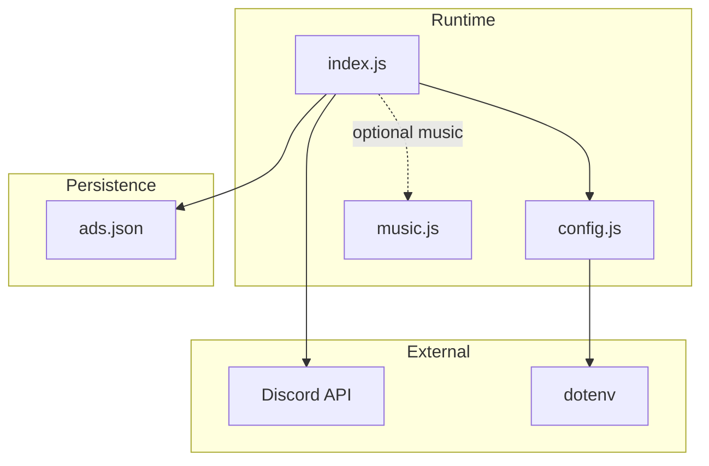
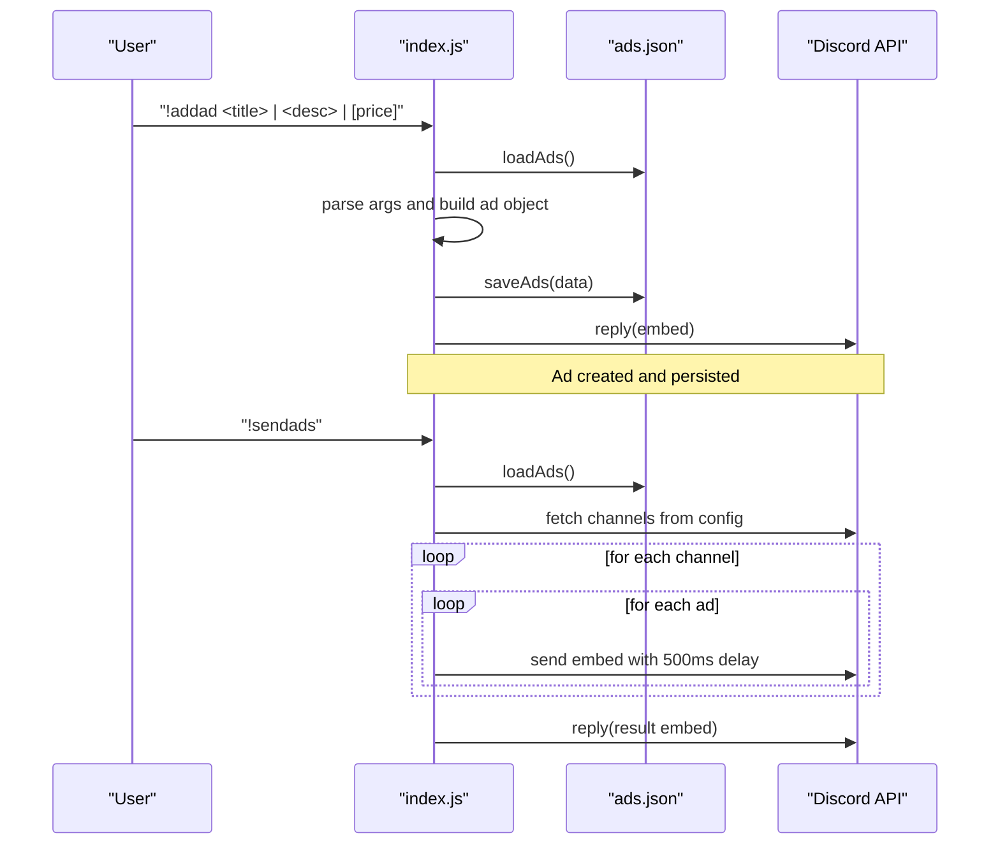
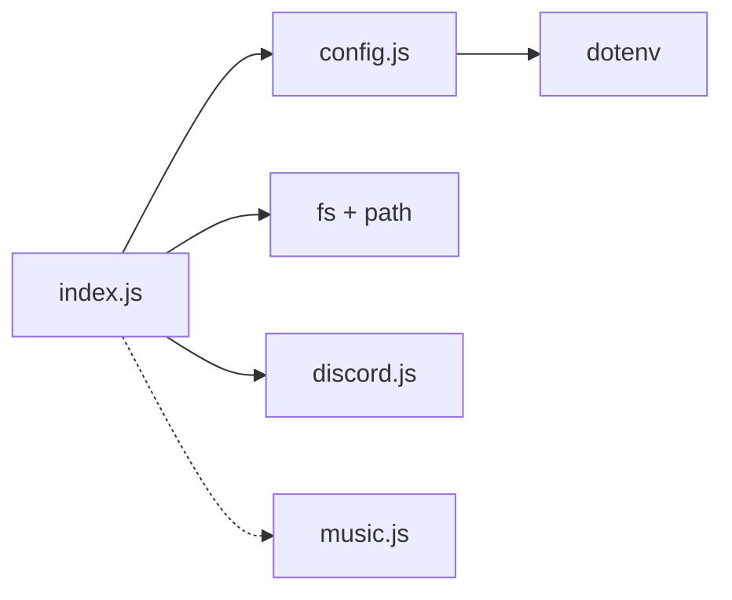
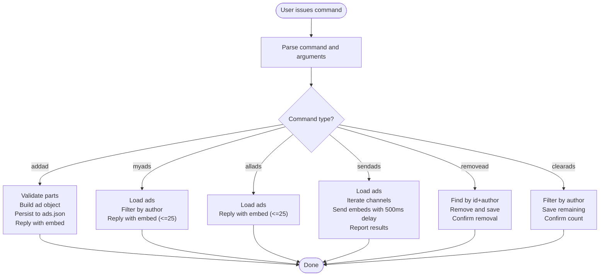

# Advertisement Management System

<cite>
**Referenced Files in This Document**
- [index.js](file://index.js)
- [config.js](file://config.js)
- [README.md](file://README.md)
- [music.js](file://music.js)
- [package.json](file://package.json)
</cite>

## Table of Contents
1. [Introduction](#introduction)
2. [Project Structure](#project-structure)
3. [Core Components](#core-components)
4. [Architecture Overview](#architecture-overview)
5. [Detailed Component Analysis](#detailed-component-analysis)
6. [Dependency Analysis](#dependency-analysis)
7. [Performance Considerations](#performance-considerations)
8. [Troubleshooting Guide](#troubleshooting-guide)
9. [Conclusion](#conclusion)
10. [Appendices](#appendices)

## Introduction
This document explains the advertisement management system built into the Discord bot. It covers the advertisement workflow (creation, viewing, editing, deletion), the full set of advertisement commands, the data model for advertisements, file-based persistence, configuration requirements, permission models, and practical usage examples. It also addresses common issues such as rate limiting during mass sending and embed field limitations.

## Project Structure
The advertisement system is implemented in a single-file architecture with a small supporting configuration module and a separate music subsystem. The key files are:
- index.js: Main bot logic, advertisement commands, and message processing
- config.js: Loads environment variables for token, prefix, and advertisement channel IDs
- README.md: User-facing documentation and examples
- music.js: Separate music playback subsystem (not part of ads)
- package.json: Dependencies including discord.js and dotenv

**Diagram sources**
- [index.js:1-396](file://index.js#L1-L396)
- [config.js:1-8](file://config.js#L1-L8)
- [music.js:1-203](file://music.js#L1-L203)

**Section sources**
- [index.js:1-396](file://index.js#L1-L396)
- [config.js:1-8](file://config.js#L1-L8)
- [README.md:478-505](file://README.md#L478-L505)

## Core Components
- Advertisement persistence: File-based JSON storage in ads.json
- Advertisement commands: Creation, listing, removal, clearing, and mass sending
- Configuration: Environment variables for token, prefix, and advertisement channels
- Embed responses: Rich Discord embeds for command feedback
- Rate limiting: Built-in delays to avoid API rate limits during mass sends

Key responsibilities:
- Load/save advertisements from/to ads.json
- Validate and enforce ownership for remove/clear operations
- Build and send embeds to Discord channels
- Manage advertisement channel IDs from environment configuration

**Section sources**
- [index.js:11-29](file://index.js#L11-L29)
- [index.js:73-251](file://index.js#L73-L251)
- [config.js:3-7](file://config.js#L3-L7)

## Architecture Overview
The advertisement system is event-driven around messageCreate events. Commands are parsed from messages prefixed by the configured prefix. Each command performs validation, interacts with the file system for persistence, and responds with Discord embeds. Mass sending iterates over configured channels and sends embeds with a small delay between each message.

**Diagram sources**
- [index.js:60-389](file://index.js#L60-L389)
- [index.js:11-29](file://index.js#L11-L29)
- [config.js:3-7](file://config.js#L3-L7)

## Detailed Component Analysis

### Advertisement Data Model
Each advertisement record contains:
- id: Unique numeric identifier (timestamp-based)
- title: Short headline
- description: Long description
- price: Optional price string or “Consultar”
- createdOn: Localized timestamp string
- authorId: Discord user ID who created the ad
- authorName: Discord username who created the ad

Storage format:
- File: ads.json
- Root object: { ads: [ ... ] }
- Each ad is an object with the fields above

Complexity:
- Loading/saving: O(n) where n is number of ads
- Filtering by author: O(n)
- Removal by id and author: O(n) for find + O(n) for splice

Constraints:
- Embeds support up to 25 fields; listing commands cap at 25 items
- Price defaults to “Consultar” if omitted

**Section sources**
- [index.js:13-29](file://index.js#L13-L29)
- [index.js:84-92](file://index.js#L84-L92)
- [index.js:147-153](file://index.js#L147-L153)
- [README.md:644](file://README.md#L644)

### Command Reference

#### !addad
Purpose: Create a new advertisement.

Syntax:
- !addad <title> | <description> | [price]

Parameters:
- title: Required
- description: Required
- price: Optional; defaults to “Consultar”

Behavior:
- Parses arguments split by “|”
- Creates ad with id, timestamps, author info
- Saves to ads.json
- Replies with an embed containing title, description, price, and id

Expected output:
- Embed with fields for title, description, price, and id

Example usage:
- !addad Camiseta | Camiseta preta tamanho G | R$ 50,00

**Section sources**
- [index.js:73-109](file://index.js#L73-L109)
- [README.md:169-195](file://README.md#L169-L195)

#### !myads
Purpose: List advertisements owned by the requesting user.

Syntax:
- !myads

Behavior:
- Filters ads by authorId
- Builds an embed with up to 25 entries
- Each field shows title and id, description, and price

Expected output:
- Embed listing user’s ads (up to 25)

**Section sources**
- [index.js:111-133](file://index.js#L111-L133)
- [README.md:198-219](file://README.md#L198-L219)

#### !allads
Purpose: List all advertisements registered in the system.

Syntax:
- !allads

Behavior:
- Retrieves all ads
- Builds an embed with up to 25 entries
- Each field shows title, author, description, price, and id

Expected output:
- Embed listing all ads (up to 25)

**Section sources**
- [index.js:135-156](file://index.js#L135-L156)
- [README.md:222-231](file://README.md#L222-L231)

#### !sendads
Purpose: Broadcast all stored advertisements to configured channels.

Syntax:
- !sendads

Behavior:
- Loads all ads
- Iterates over configured channel IDs
- Sends an embed per ad to each channel
- Inserts a 500ms delay between sends to avoid rate limits
- Reports success/failure counts

Expected output:
- Initial status embed indicating number of ads and channels
- Final result embed with success/failure counts

Notes:
- Requires at least one channel ID configured
- Uses a delay between sends to avoid rate limits

**Section sources**
- [index.js:158-220](file://index.js#L158-L220)
- [README.md:233-253](file://README.md#L233-L253)

#### !removead
Purpose: Remove a specific advertisement by id.

Syntax:
- !removead <id>

Behavior:
- Validates id argument
- Finds ad by id AND authorId
- Removes from array and saves to ads.json
- Confirms removal

Expected output:
- Confirmation message with removed title

**Section sources**
- [index.js:222-241](file://index.js#L222-L241)
- [README.md:256-271](file://README.md#L256-L271)

#### !clearads
Purpose: Remove all advertisements owned by the requesting user.

Syntax:
- !clearads

Behavior:
- Filters out ads where authorId matches requester
- Saves remaining ads to ads.json
- Confirms number of removed ads

Expected output:
- Confirmation message with count of removed ads

**Section sources**
- [index.js:243-251](file://index.js#L243-L251)
- [README.md:274-283](file://README.md#L274-L283)

### Permission and Ownership Model
- Ownership: Each ad stores authorId and authorName. Removal and clearing are restricted to the original author.
- Channel permissions: For !sendads, the bot requires Send Messages, Embed Links, Read Message History, and View Channel in target channels.
- Message content intent: Required to read command messages.

**Section sources**
- [index.js:229-235](file://index.js#L229-L235)
- [index.js:177-184](file://index.js#L177-L184)
- [README.md:532-544](file://README.md#L532-L544)

### File-Based Persistence Mechanism
ads.json
- Location: Same directory as index.js
- Format: JSON object { ads: [ { ... }, ... ] }
- Operations:
  - loadAds(): Reads and parses JSON; returns default empty object on failure
  - saveAds(): Writes JSON stringified data with indentation

Patterns:
- Atomic writes: Entire dataset written at once
- Error handling: Try/catch around file operations logs errors and prevents crashes

**Section sources**
- [index.js:11-29](file://index.js#L11-L29)
- [README.md:483](file://README.md#L483)

### Configuration Requirements
Environment variables (via dotenv):
- DISCORD_TOKEN: Bot token from Discord Developer Portal
- AD_CHANNEL_IDS: Comma-separated list of channel IDs (no spaces)
- PREFIX: Command prefix (default: “!”)

Loading:
- config.js reads .env and exports token, prefix, and parsed channel IDs

**Section sources**
- [config.js:1-7](file://config.js#L1-L7)
- [README.md:99-137](file://README.md#L99-L137)

### Practical Examples from the Codebase
- Creating an ad with price: !addad <title> | <desc> | R$ 50,00
- Listing user’s ads: !myads
- Listing all ads: !allads
- Sending all ads: !sendads
- Removing an ad by id: !removead <id>
- Clearing all user’s ads: !clearads

Response formats:
- Embeds for creation, listing, and send results
- Text replies for missing arguments and errors

**Section sources**
- [index.js:73-109](file://index.js#L73-L109)
- [index.js:111-156](file://index.js#L111-L156)
- [index.js:158-220](file://index.js#L158-L220)
- [index.js:222-251](file://index.js#L222-L251)
- [README.md:169-283](file://README.md#L169-L283)

## Dependency Analysis
External libraries:
- discord.js: Event handling, message parsing, embed building, channel fetching
- dotenv: Loads environment variables from .env
- @discordjs/voice and play-dl: Music subsystem (unrelated to ads)

Internal dependencies:
- index.js depends on config.js for environment variables
- index.js depends on fs and path for ads.json persistence
- index.js optionally delegates music commands to music.js

**Diagram sources**
- [index.js:1-6](file://index.js#L1-L6)
- [config.js:1](file://config.js#L1)
- [package.json:14-21](file://package.json#L14-L21)

**Section sources**
- [package.json:14-21](file://package.json#L14-L21)
- [index.js:1-6](file://index.js#L1-L6)

## Performance Considerations
- Rate limiting during mass sends: 500ms delay between embed sends to avoid API rate limits
- Embed field limit: Listing commands cap at 25 fields; ads beyond 25 are not shown
- File I/O: O(n) load/save operations; acceptable for small to medium datasets
- Channel iteration: Linear iteration over configured channels; consider batching or sharding for very large channel lists

**Section sources**
- [index.js:199](file://index.js#L199)
- [README.md:642-644](file://README.md#L642-L644)

## Troubleshooting Guide
Common issues and resolutions:
- Missing permissions for sending messages/embeds in channels
  - Ensure bot has Send Messages, Embed Links, Read Message History, and View Channel
- Invalid token or missing MESSAGE CONTENT INTENT
  - Verify token correctness and intents in Developer Portal
- Empty or malformed AD_CHANNEL_IDS
  - Ensure comma-separated IDs with no spaces
- File encoding issues causing parsing errors
  - Save .env with UTF-8 without BOM
- Bot not responding to commands
  - Confirm prefix matches configuration and bot has View Channel permission

**Section sources**
- [README.md:508-594](file://README.md#L508-L594)
- [index.js:165-170](file://index.js#L165-L170)

## Conclusion
The advertisement management system provides a straightforward, file-backed solution for creating, listing, removing, and broadcasting ads across multiple Discord channels. It emphasizes simplicity and reliability with basic ownership checks, embed-driven UX, and built-in rate-limiting safeguards. For production deployments, consider adding database-backed storage, pagination for large listings, and stricter validation and rate limiting controls.

## Appendices

### Advertisement Workflow Diagram

**Diagram sources**
- [index.js:60-389](file://index.js#L60-L389)