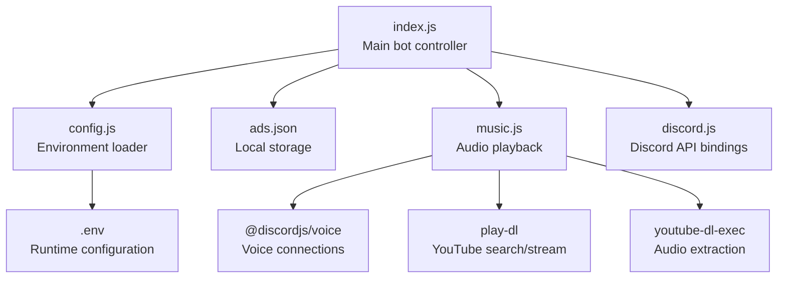
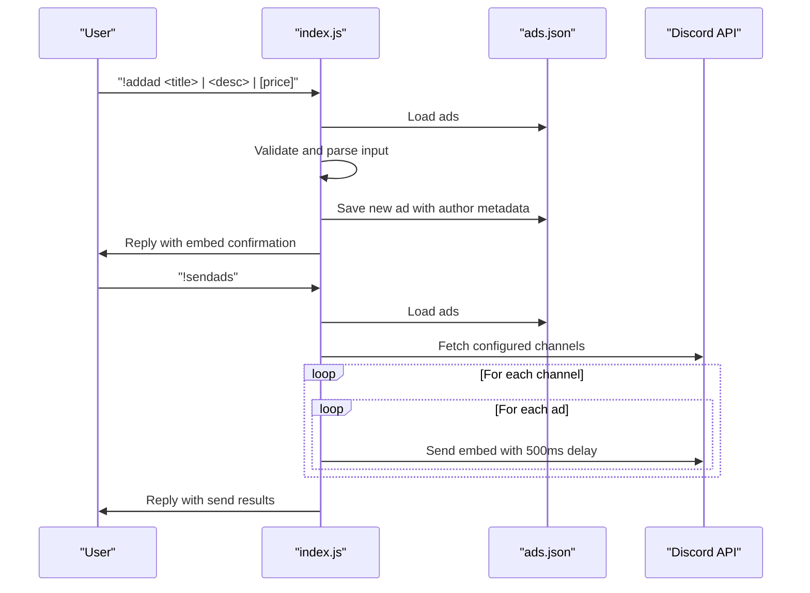
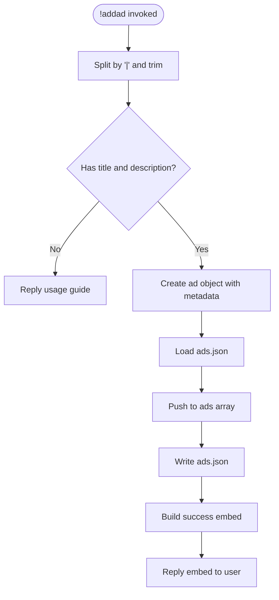
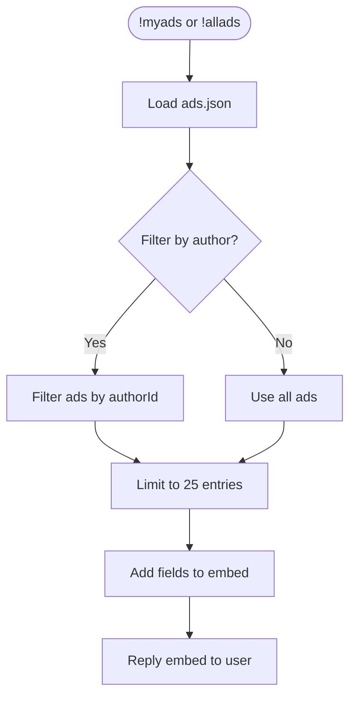
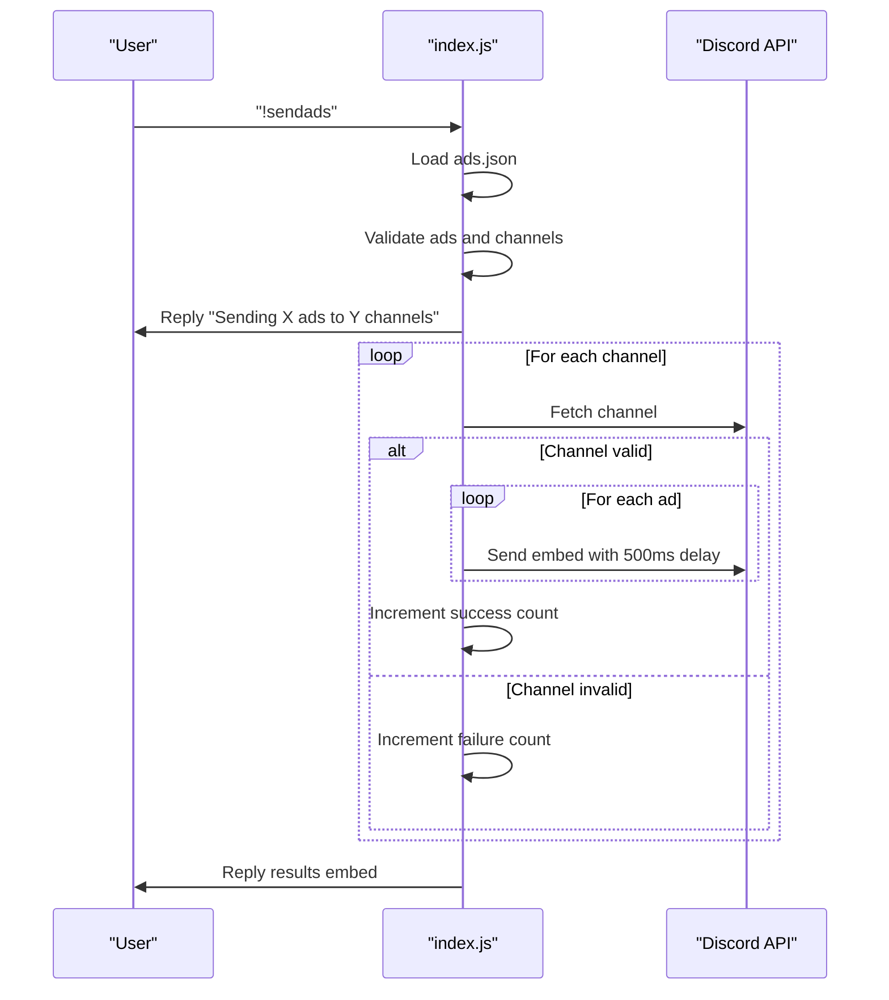
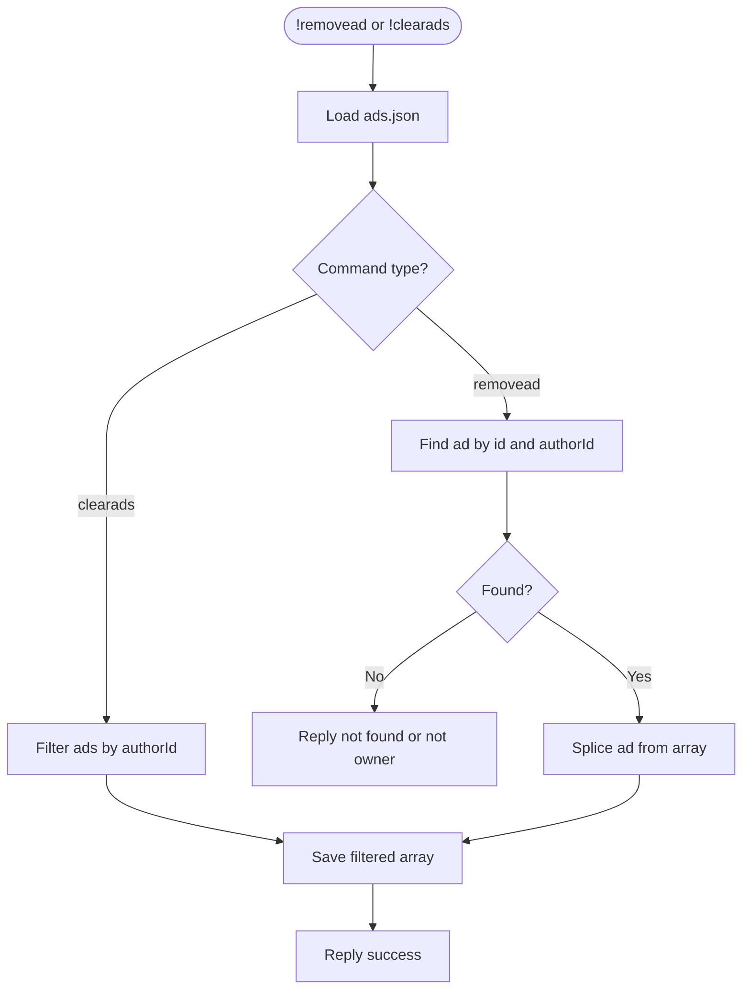
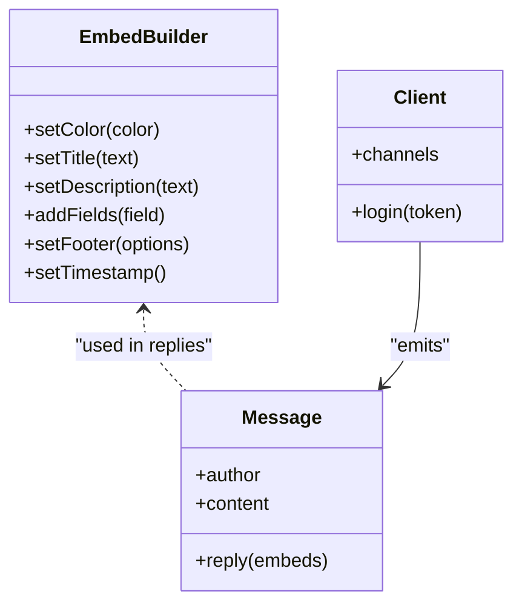
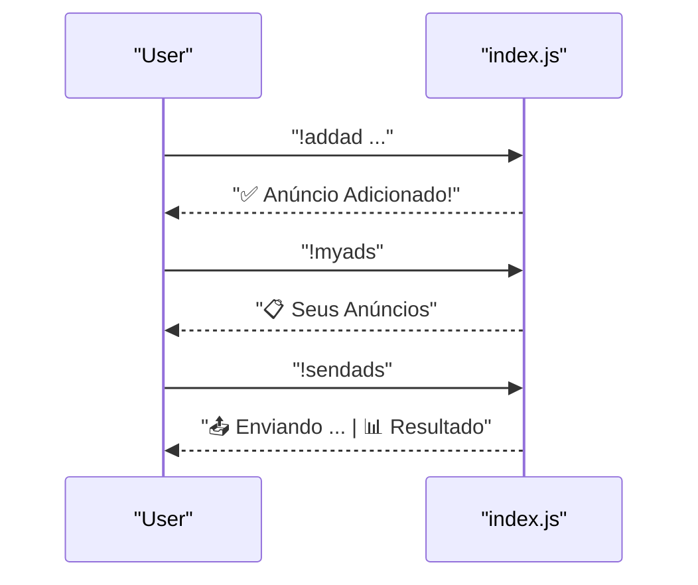
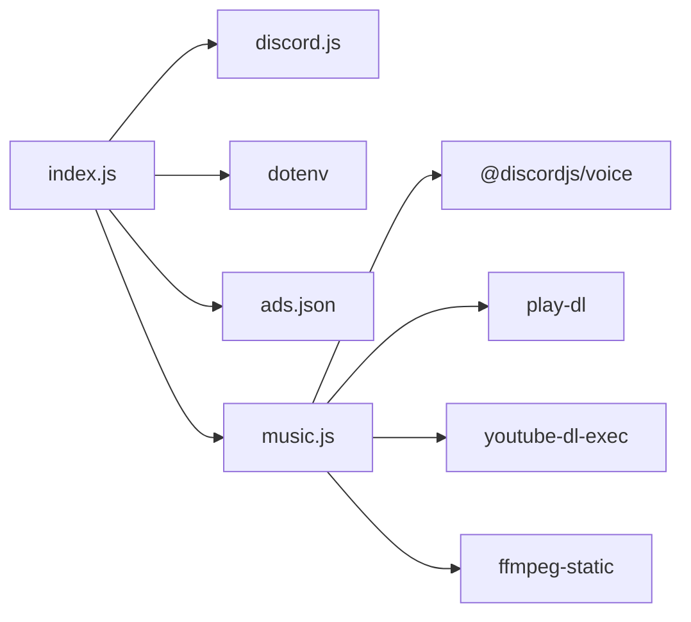

# Advertisement Workflow

<cite>
**Referenced Files in This Document**
- [index.js](file://index.js)
- [config.js](file://config.js)
- [music.js](file://music.js)
- [package.json](file://package.json)
- [README.md](file://README.md)
- [ads.json](file://ads.json)
</cite>

## Table of Contents
1. [Introduction](#introduction)
2. [Project Structure](#project-structure)
3. [Core Components](#core-components)
4. [Architecture Overview](#architecture-overview)
5. [Detailed Component Analysis](#detailed-component-analysis)
6. [Dependency Analysis](#dependency-analysis)
7. [Performance Considerations](#performance-considerations)
8. [Troubleshooting Guide](#troubleshooting-guide)
9. [Conclusion](#conclusion)

## Introduction
This document explains the complete advertisement workflow from creation to distribution within the Discord bot. It covers the advertisement lifecycle including creation validation, user association, storage persistence, and broadcast distribution. It also documents integration with Discord channels, embed building for rich media presentation, rate limiting considerations during mass sending, user experience flows, command chaining patterns, administrative oversight capabilities, error recovery mechanisms, and performance optimization strategies for large-scale advertisement management.

## Project Structure
The project is a Node.js application built with discord.js v14. It consists of:
- A central bot controller that handles commands and event processing
- A configuration module that loads environment variables
- A music module for audio playback (separate functional area)
- Local JSON storage for advertisements
- Environment configuration via dotenv

**Diagram sources**
- [index.js:1-396](file://index.js#L1-L396)
- [config.js:1-8](file://config.js#L1-L8)
- [music.js:1-212](file://music.js#L1-L212)
- [package.json:1-24](file://package.json#L1-L24)

**Section sources**
- [index.js:1-396](file://index.js#L1-L396)
- [config.js:1-8](file://config.js#L1-L8)
- [music.js:1-212](file://music.js#L1-L212)
- [package.json:1-24](file://package.json#L1-L24)

## Core Components
- Advertisement storage and persistence: Local JSON file with a simple array of ads
- Command processor: Central handler for advertisement commands and music commands
- Discord integration: Embed building, channel fetching, and message sending
- Rate limiting safeguards: Delays between sends to avoid API throttling
- Administrative oversight: Commands to list, remove, and clear ads with user ownership checks

Key responsibilities:
- Creation: Parse user input, validate format, associate author metadata, persist to storage
- Listing: Filter by author or show all, build rich embeds with up to 25 fields
- Distribution: Fetch configured channels, send embeds with delays, report results
- Removal: Validate ownership and remove specific or all ads for an author

**Section sources**
- [index.js:13-29](file://index.js#L13-L29)
- [index.js:73-109](file://index.js#L73-L109)
- [index.js:111-156](file://index.js#L111-L156)
- [index.js:158-220](file://index.js#L158-L220)
- [index.js:222-251](file://index.js#L222-L251)
- [ads.json:1-4](file://ads.json#L1-L4)

## Architecture Overview
The advertisement workflow is event-driven around messageCreate events. Users trigger commands prefixed by the configured prefix. The bot validates inputs, updates local storage, builds embeds, and distributes messages to configured channels.

**Diagram sources**
- [index.js:60-389](file://index.js#L60-L389)
- [index.js:13-29](file://index.js#L13-L29)
- [ads.json:1-4](file://ads.json#L1-L4)

## Detailed Component Analysis

### Advertisement Creation and Validation
- Input parsing: Split by pipe delimiter and trim segments
- Validation: Require at least title and description; price is optional
- Metadata: Capture author ID and username, timestamp, and unique numeric ID
- Persistence: Append to ads array and write JSON to disk

**Diagram sources**
- [index.js:73-109](file://index.js#L73-L109)
- [index.js:13-29](file://index.js#L13-L29)

**Section sources**
- [index.js:73-109](file://index.js#L73-L109)
- [index.js:13-29](file://index.js#L13-L29)

### Advertisement Listing and Embed Building
- My Ads: Filter by author ID, build embed with up to 25 fields
- All Ads: Show all ads with author attribution, up to 25 fields
- Embeds: Rich media presentation with color, title, fields, timestamps

**Diagram sources**
- [index.js:111-156](file://index.js#L111-L156)
- [index.js:13-29](file://index.js#L13-L29)

**Section sources**
- [index.js:111-156](file://index.js#L111-L156)
- [index.js:13-29](file://index.js#L13-L29)

### Advertisement Distribution and Rate Limiting
- Channel selection: Load configured channel IDs from environment
- Channel validation: Fetch each channel and ensure it is text-based
- Embed construction: Build rich embed with title, description, fields, footer, timestamp
- Sending: Iterate through channels and ads, sending with 500ms delay between messages
- Reporting: Aggregate success/failure counts and reply with results embed

**Diagram sources**
- [index.js:158-220](file://index.js#L158-L220)

**Section sources**
- [index.js:158-220](file://index.js#L158-L220)

### Advertisement Removal and Administrative Oversight
- Remove by ID: Validate ownership and remove specific ad
- Clear by author: Remove all ads owned by the requesting user
- Ownership enforcement: Match author ID to prevent unauthorized deletions

**Diagram sources**
- [index.js:222-251](file://index.js#L222-L251)
- [index.js:13-29](file://index.js#L13-L29)

**Section sources**
- [index.js:222-251](file://index.js#L222-L251)
- [index.js:13-29](file://index.js#L13-L29)

### Discord Integration and Embed Building
- EmbedBuilder usage: Color, title, fields, footer, timestamp
- Rich media presentation: Fields for price and seller, mentions for author
- Channel integration: Fetch channels by ID, validate text-based channels

**Diagram sources**
- [index.js:97-108](file://index.js#L97-L108)
- [index.js:187-196](file://index.js#L187-L196)

**Section sources**
- [index.js:97-108](file://index.js#L97-L108)
- [index.js:187-196](file://index.js#L187-L196)

### Command Chaining Patterns and User Experience
- Help command: Comprehensive embed listing all commands and aliases
- Chainable actions: Create multiple ads, review with myads/allads, then distribute with sendads
- Immediate feedback: Confirmation embeds for creation, listing, and send results
- Error messaging: Clear guidance for invalid usage and missing permissions

**Diagram sources**
- [index.js:306-384](file://index.js#L306-L384)
- [index.js:73-109](file://index.js#L73-L109)
- [index.js:111-156](file://index.js#L111-L156)
- [index.js:158-220](file://index.js#L158-L220)

**Section sources**
- [index.js:306-384](file://index.js#L306-L384)
- [index.js:73-109](file://index.js#L73-L109)
- [index.js:111-156](file://index.js#L111-L156)
- [index.js:158-220](file://index.js#L158-L220)

## Dependency Analysis
External libraries and their roles:
- discord.js: Event handling, embed building, channel operations
- dotenv: Loading environment variables from .env
- @discordjs/voice: Voice connections and audio playback (music module)
- play-dl: YouTube search and stream handling (music module)
- youtube-dl-exec: Audio extraction process (music module)
- ffmpeg-static: FFmpeg path configuration (music module)

**Diagram sources**
- [index.js:1-396](file://index.js#L1-L396)
- [music.js:1-212](file://music.js#L1-L212)
- [package.json:14-22](file://package.json#L14-L22)

**Section sources**
- [package.json:14-22](file://package.json#L14-L22)
- [index.js:1-396](file://index.js#L1-L396)
- [music.js:1-212](file://music.js#L1-L212)

## Performance Considerations
- Rate limiting: 500ms delay between embed sends prevents API throttling
- Field limits: Embeds support up to 25 fields; listing commands cap at 25
- Batch processing: Sequential sends per channel reduce memory overhead
- Local storage: JSON file I/O is synchronous; consider async alternatives for large datasets
- Channel validation: Early fetch and validation avoids wasted send attempts

[No sources needed since this section provides general guidance]

## Troubleshooting Guide
Common issues and resolutions:
- Invalid token: Verify DISCORD_TOKEN in .env
- Missing intents: Enable MESSAGE CONTENT INTENT in Developer Portal
- Missing permissions: Grant Send Messages, Embed Links, Read Message History
- Empty channel IDs: Ensure AD_CHANNEL_IDS is comma-separated without spaces
- UTF-8 BOM: Save .env as UTF-8 without BOM
- Rate limit warnings: Delay is already implemented; avoid manual rapid sends

**Section sources**
- [README.md:508-657](file://README.md#L508-L657)
- [index.js:391-395](file://index.js#L391-L395)

## Conclusion
The advertisement workflow integrates cleanly with Discord’s API through embeds and channels, providing a robust user experience for creating, reviewing, and distributing advertisements. The system enforces user ownership, persists data locally, and includes safeguards against rate limiting. For large-scale deployments, consider migrating to a database-backed storage model, adding asynchronous file I/O, and implementing configurable rate limits and retry policies.