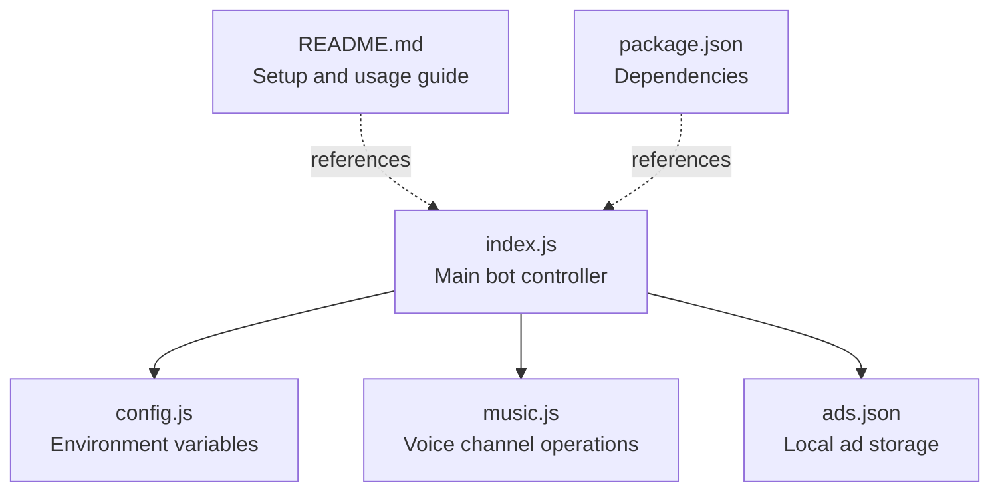
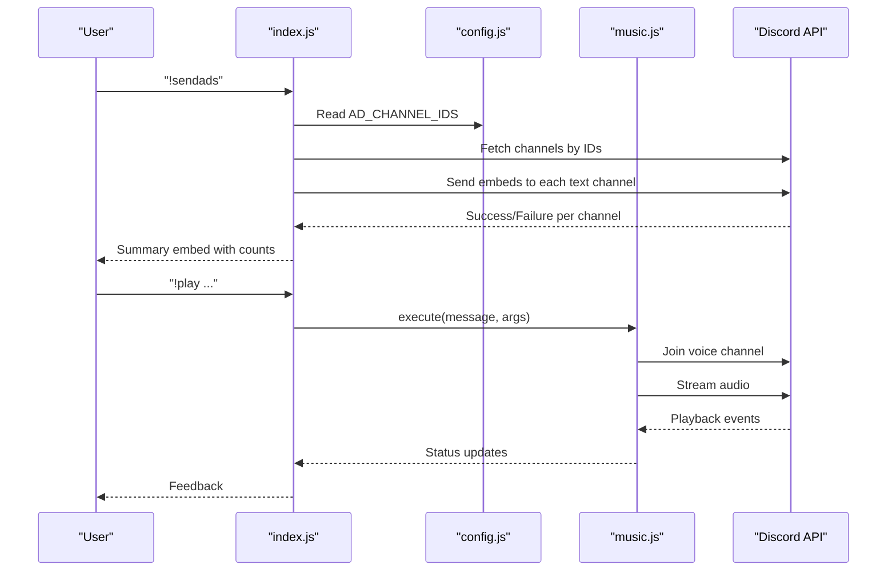
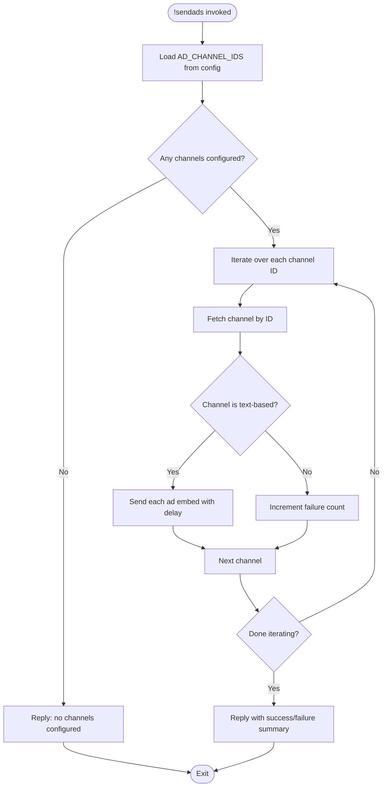
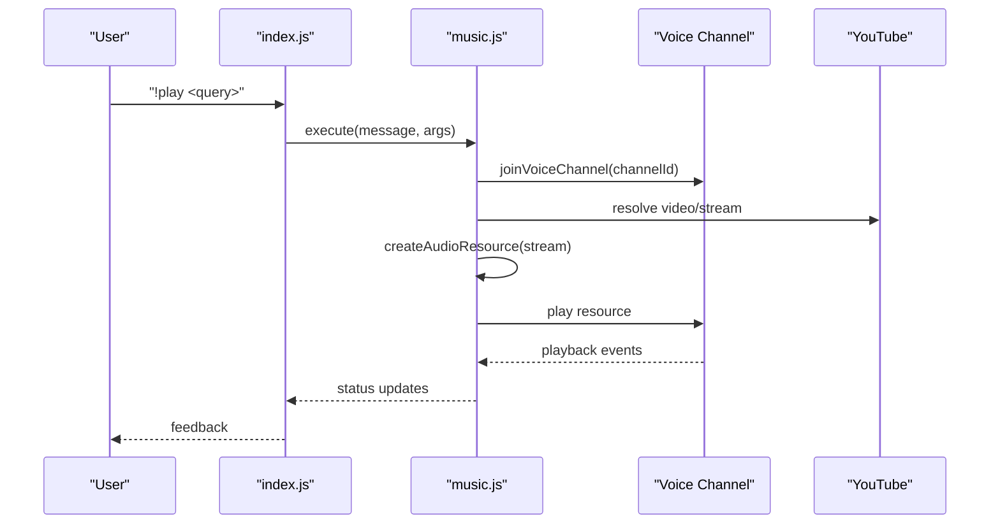
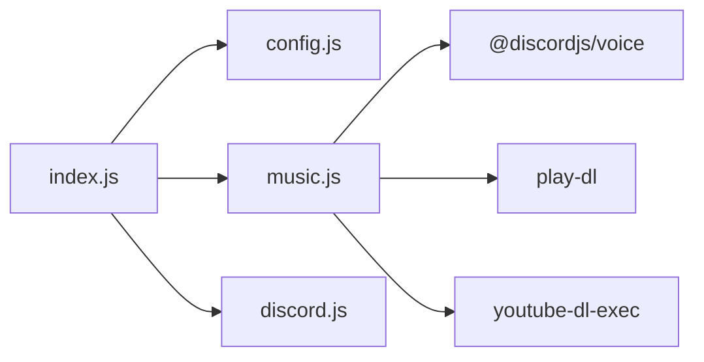

# Channel Configuration and Permissions

<cite>
**Referenced Files in This Document**
- [README.md](file://README.md)
- [config.js](file://config.js)
- [index.js](file://index.js)
- [music.js](file://music.js)
- [package.json](file://package.json)
- [ads.json](file://ads.json)
</cite>

## Table of Contents
1. [Introduction](#introduction)
2. [Project Structure](#project-structure)
3. [Core Components](#core-components)
4. [Architecture Overview](#architecture-overview)
5. [Detailed Component Analysis](#detailed-component-analysis)
6. [Dependency Analysis](#dependency-analysis)
7. [Performance Considerations](#performance-considerations)
8. [Troubleshooting Guide](#troubleshooting-guide)
9. [Conclusion](#conclusion)

## Introduction
This document explains how to configure Discord channels for bot functionality, focusing on two distinct areas:
- Advertisement posting to text channels
- Music playback in voice channels

It covers how to obtain channel IDs with Developer Mode, proper formatting for multiple channels, required permissions, and troubleshooting steps for common channel-related issues.

## Project Structure
The bot consists of:
- A main entry point that handles commands and orchestrates features
- A configuration module that reads environment variables
- A music module for voice channel operations
- A persistent storage file for advertisements
- A README with setup and troubleshooting guidance

**Diagram sources**
- [index.js:1-396](file://index.js#L1-L396)
- [config.js:1-8](file://config.js#L1-L8)
- [music.js:1-212](file://music.js#L1-L212)
- [ads.json:1-4](file://ads.json#L1-L4)
- [README.md:1-663](file://README.md#L1-L663)
- [package.json:1-24](file://package.json#L1-L24)

**Section sources**
- [README.md:1-663](file://README.md#L1-L663)
- [index.js:1-396](file://index.js#L1-L396)
- [config.js:1-8](file://config.js#L1-L8)
- [music.js:1-212](file://music.js#L1-L212)
- [ads.json:1-4](file://ads.json#L1-L4)
- [package.json:1-24](file://package.json#L1-L24)

## Core Components
- Advertisement posting: The bot posts embeds to configured text channels. It requires:
  - Text channel IDs in the environment variable
  - Permissions to view channels, send messages, embed links, and read message history
- Music playback: The bot joins a user’s voice channel and streams audio. It requires:
  - Voice channel connectivity and speaking permissions
  - Proper intents for voice state updates

Key configuration points:
- Environment variables for token, prefix, and advertisement channel IDs
- Channel type requirements (text channels for ads; voice channels for music)
- Permission requirements for both text and voice channels

**Section sources**
- [README.md:99-137](file://README.md#L99-L137)
- [config.js:6](file://config.js#L6)
- [index.js:158-220](file://index.js#L158-L220)
- [music.js:9-95](file://music.js#L9-L95)

## Architecture Overview
The bot routes commands to either advertisement or music handlers. Advertisement posting targets configured text channels, while music commands operate in voice channels.

**Diagram sources**
- [index.js:158-220](file://index.js#L158-L220)
- [config.js:6](file://config.js#L6)
- [music.js:9-95](file://music.js#L9-L95)

## Detailed Component Analysis

### Advertisement Posting to Text Channels
- Purpose: Post embedded advertisements to configured text channels.
- Channel type requirement: Text channels only.
- Required permissions per channel:
  - View Channel
  - Send Messages
  - Embed Links
  - Read Message History
- How it works:
  - Reads comma-separated text channel IDs from the environment variable
  - Validates each channel is text-based before sending
  - Sends one advertisement embed per channel with a small delay to avoid rate limits

**Diagram sources**
- [index.js:158-220](file://index.js#L158-L220)
- [config.js:6](file://config.js#L6)

**Section sources**
- [README.md:133-136](file://README.md#L133-L136)
- [README.md:532-544](file://README.md#L532-L544)
- [index.js:158-220](file://index.js#L158-L220)
- [config.js:6](file://config.js#L6)

### Music Playback in Voice Channels
- Purpose: Play audio from YouTube in a user’s voice channel.
- Channel type requirement: Voice channels only.
- Required permissions per voice channel:
  - Connect
  - Speak
- How it works:
  - User must be in a voice channel
  - Bot joins the voice channel and creates a player
  - Streams audio from YouTube and manages a queue

**Diagram sources**
- [index.js:257-269](file://index.js#L257-L269)
- [music.js:9-95](file://music.js#L9-L95)

**Section sources**
- [README.md:300-302](file://README.md#L300-L302)
- [README.md:627-634](file://README.md#L627-L634)
- [index.js:257-269](file://index.js#L257-L269)
- [music.js:9-95](file://music.js#L9-L95)

### Channel ID Retrieval and Formatting
- Obtain channel IDs with Developer Mode enabled:
  - Enable Developer Mode in Discord user settings
  - Right-click a channel and select Copy ID
- Format for multiple channels:
  - Comma-separated without spaces
  - Example: CHANNEL_ID_1,CHANNEL_ID_2,CHANNEL_ID_3
- Verification:
  - The bot logs configured advertisement channels on startup
  - The bot validates each channel is text-based before sending

**Section sources**
- [README.md:122-136](file://README.md#L122-L136)
- [index.js:50-54](file://index.js#L50-L54)
- [index.js:177-184](file://index.js#L177-L184)

### Permission Requirements Summary
- Advertisement channels (text):
  - View Channel
  - Send Messages
  - Embed Links
  - Read Message History
- Music channels (voice):
  - Connect
  - Speak

These permissions must be granted to the bot in each target channel.

**Section sources**
- [README.md:86-92](file://README.md#L86-L92)
- [README.md:532-544](file://README.md#L532-L544)
- [README.md:627-634](file://README.md#L627-L634)

## Dependency Analysis
- index.js depends on:
  - config.js for environment variables
  - music.js for voice operations
  - discord.js for client and intents
- music.js depends on:
  - @discordjs/voice for voice connections
  - play-dl and youtube-dl-exec for YouTube streaming
- package.json lists the runtime dependencies

**Diagram sources**
- [index.js:1-396](file://index.js#L1-L396)
- [config.js:1-8](file://config.js#L1-L8)
- [music.js:1-212](file://music.js#L1-L212)
- [package.json:14-22](file://package.json#L14-L22)

**Section sources**
- [index.js:1-396](file://index.js#L1-L396)
- [music.js:1-212](file://music.js#L1-L212)
- [package.json:14-22](file://package.json#L14-L22)

## Performance Considerations
- Advertisement posting:
  - The bot sends one advertisement embed per channel with a small delay to avoid rate limits
  - This reduces the chance of temporary API throttling
- Music streaming:
  - Uses external tools to stream audio; ensure network stability and appropriate bandwidth

**Section sources**
- [README.md:252](file://README.md#L252)
- [music.js:112-134](file://music.js#L112-L134)

## Troubleshooting Guide

### Advertisement Posting Issues
- Symptom: “No advertisement channels configured”
  - Cause: AD_CHANNEL_IDS is empty or incorrectly formatted
  - Fix: Ensure comma-separated IDs without spaces; verify channel IDs are for text channels
- Symptom: “Missing Permissions” when sending
  - Cause: Bot lacks required text channel permissions
  - Fix: Grant View Channel, Send Messages, Embed Links, Read Message History in each target channel
- Symptom: “Channel is not text-based”
  - Cause: Non-text channel ID included
  - Fix: Remove voice or category IDs; keep only text channel IDs

**Section sources**
- [README.md:547-562](file://README.md#L547-L562)
- [README.md:532-544](file://README.md#L532-L544)
- [index.js:177-184](file://index.js#L177-L184)

### Music Playback Issues
- Symptom: “You need to be in a voice channel to use this command!”
  - Cause: User not connected to a voice channel
  - Fix: Join a voice channel and retry the command
- Symptom: “Already playing in another voice channel!”
  - Cause: Bot is already connected to a different voice channel
  - Fix: Join the same voice channel as the bot or use the leave command to disconnect it
- Symptom: “No audio output” or muted playback
  - Cause: Missing voice permissions
  - Fix: Grant Connect and Speak permissions in the voice channel

**Section sources**
- [README.md:597-614](file://README.md#L597-L614)
- [README.md:627-634](file://README.md#L627-L634)
- [music.js:9-11](file://music.js#L9-L11)

### General Setup and Validation
- Verify environment variables:
  - DISCORD_TOKEN is set and correct
  - AD_CHANNEL_IDS is comma-separated without spaces
  - PREFIX is set appropriately
- Confirm intents:
  - MESSAGE CONTENT INTENT is enabled in the Developer Portal
- Confirm permissions:
  - Text channels: View Channel, Send Messages, Embed Links, Read Message History
  - Voice channels: Connect, Speak

**Section sources**
- [README.md:99-137](file://README.md#L99-L137)
- [README.md:510-529](file://README.md#L510-L529)
- [README.md:86-92](file://README.md#L86-L92)

## Conclusion
To configure the bot for channel-based features:
- Use Developer Mode to copy text channel IDs and paste them into AD_CHANNEL_IDS as comma-separated values without spaces
- Assign the required permissions to the bot in each target channel
- For music, ensure users are in a voice channel and grant Connect/Speak permissions
- Validate configuration by checking startup logs and testing commands