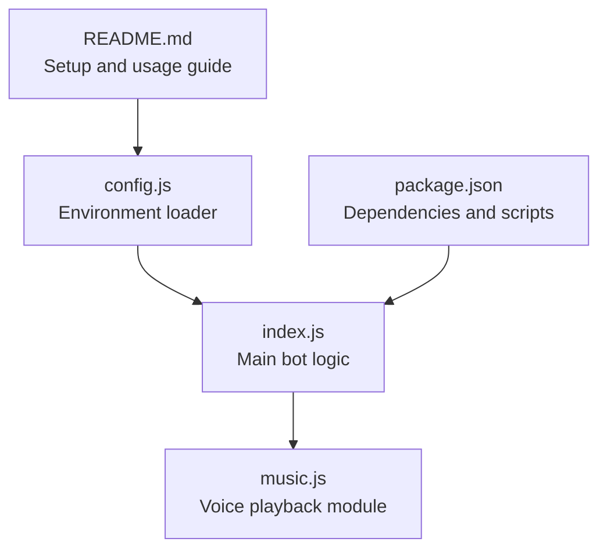
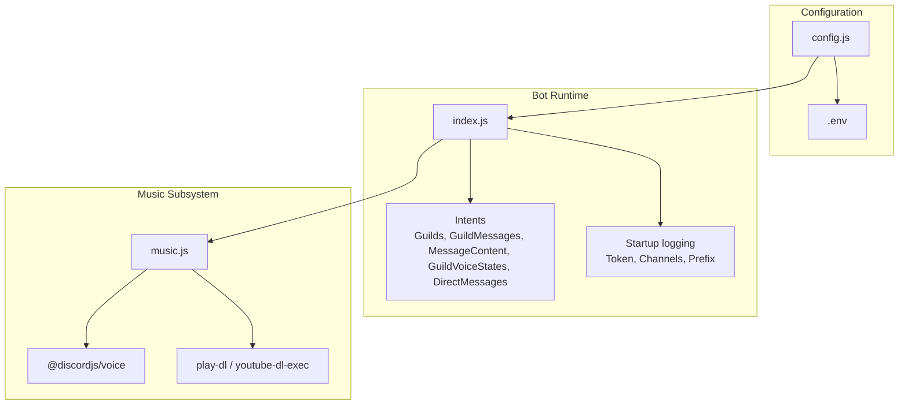
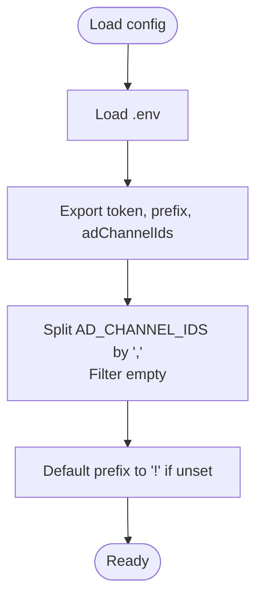
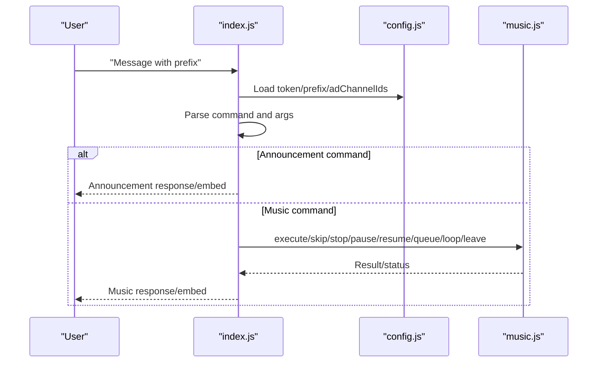
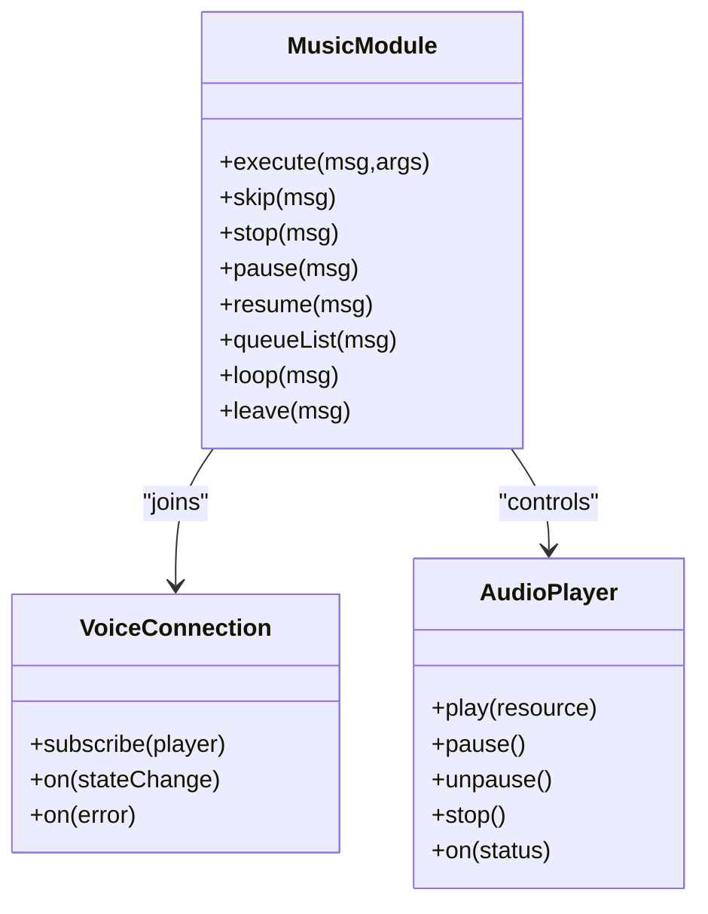
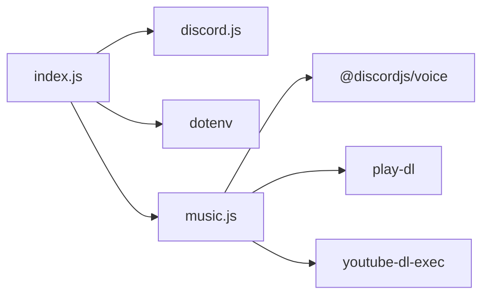

# Configuration and Setup

<cite>
**Referenced Files in This Document**
- [README.md](file://README.md)
- [config.js](file://config.js)
- [index.js](file://index.js)
- [music.js](file://music.js)
- [package.json](file://package.json)
</cite>

## Table of Contents
1. [Introduction](#introduction)
2. [Project Structure](#project-structure)
3. [Core Components](#core-components)
4. [Architecture Overview](#architecture-overview)
5. [Detailed Component Analysis](#detailed-component-analysis)
6. [Dependency Analysis](#dependency-analysis)
7. [Performance Considerations](#performance-considerations)
8. [Troubleshooting Guide](#troubleshooting-guide)
9. [Conclusion](#conclusion)
10. [Appendices](#appendices)

## Introduction
This document provides comprehensive configuration and setup guidance for deploying the Discord bot. It covers environment variable configuration, Discord Developer Portal setup, channel ID collection, permission requirements, OAuth URL generation, and operational validation. It also includes troubleshooting for common configuration errors, security best practices for token management, and production deployment recommendations.

## Project Structure
The project consists of a small Node.js application with a configuration loader, a main bot entrypoint, and a music subsystem. The configuration is loaded from environment variables via dotenv and consumed by the main bot logic.

**Diagram sources**
- [README.md](file://README.md)
- [config.js](file://config.js)
- [index.js](file://index.js)
- [music.js](file://music.js)
- [package.json](file://package.json)

**Section sources**
- [README.md](file://README.md)
- [config.js](file://config.js)
- [index.js](file://index.js)
- [music.js](file://music.js)
- [package.json](file://package.json)

## Core Components
- Environment configuration loader: Loads environment variables and exposes token, prefix, and parsed channel IDs.
- Main bot entrypoint: Initializes the client with required intents, logs startup information, and handles commands.
- Music subsystem: Manages voice connections, audio playback, and queue operations.

Key configuration variables:
- DISCORD_TOKEN: The bot’s token from the Discord Developer Portal.
- AD_CHANNEL_IDS: Comma-separated list of text channel IDs where announcements are sent.
- PREFIX: Command prefix used to trigger bot commands.

Validation and defaults:
- PREFIX defaults to "!" if not set.
- AD_CHANNEL_IDS is split by commas and filtered to remove empty entries.

**Section sources**
- [config.js](file://config.js)
- [index.js](file://index.js)
- [README.md](file://README.md)

## Architecture Overview
The bot reads environment variables, initializes the client with specific intents, and listens for messages to process commands. The music module integrates with voice channels and streams audio.

**Diagram sources**
- [config.js](file://config.js)
- [index.js](file://index.js)
- [music.js](file://music.js)
- [package.json](file://package.json)

**Section sources**
- [index.js](file://index.js)
- [music.js](file://music.js)
- [package.json](file://package.json)

## Detailed Component Analysis

### Environment Configuration Loader
The loader uses dotenv to populate process.env and exports:
- token: DISCORD_TOKEN
- prefix: PREFIX or "!"
- adChannelIds: Split and filtered AD_CHANNEL_IDS

Behavior highlights:
- AD_CHANNEL_IDS is split by "," and empty entries are removed.
- PREFIX falls back to "!" if missing.

**Diagram sources**
- [config.js](file://config.js)

**Section sources**
- [config.js](file://config.js)

### Main Bot Initialization and Command Processing
- Client initialization sets required intents for guilds, messages, message content, voice states, and direct messages.
- On ready event, logs bot tag and configured announcement channels.
- Listens to messageCreate events, filters bot messages, checks prefix, parses arguments, and routes to command handlers.

Command routing includes:
- Announcement commands: addad, myads, allads, sendads, removead, clearads.
- Music commands: play, skip, stop, pause/resume, queue, loop, leave.
- Help command returns a comprehensive embed of available commands.

**Diagram sources**
- [index.js](file://index.js)
- [config.js](file://config.js)
- [music.js](file://music.js)

**Section sources**
- [index.js](file://index.js)
- [README.md](file://README.md)

### Music Subsystem
- Uses @discordjs/voice to manage voice connections and audio players.
- Integrates play-dl and youtube-dl-exec for YouTube search/streaming.
- Maintains per-guild queues and supports looping, skipping, stopping, pausing, and listing queued items.
- Handles connection state changes and player events.

**Diagram sources**
- [music.js](file://music.js)

**Section sources**
- [music.js](file://music.js)
- [package.json](file://package.json)

## Dependency Analysis
External dependencies relevant to configuration and setup:
- discord.js: Provides client, intents, embeds, and voice adapter.
- dotenv: Loads environment variables from .env.
- @discordjs/voice: Voice connection and audio player.
- play-dl and youtube-dl-exec: YouTube search and audio streaming.

**Diagram sources**
- [index.js](file://index.js)
- [music.js](file://music.js)
- [package.json](file://package.json)

**Section sources**
- [package.json](file://package.json)

## Performance Considerations
- Announcement sending uses a deliberate delay between messages to avoid rate limits.
- Embed field limits apply to command outputs; lists are truncated to 25 items.
- Music playback relies on external streaming; ensure adequate bandwidth and CPU resources.

[No sources needed since this section provides general guidance]

## Troubleshooting Guide

Common configuration errors and resolutions:
- Invalid token: Verify DISCORD_TOKEN in .env is correct, unquoted, and without extra whitespace.
- Missing privileged intents: Enable MESSAGE CONTENT INTENT in the Developer Portal; save changes and restart the bot.
- Missing permissions in channels: Ensure the bot has View Channel, Send Messages, Embed Links, and Read Message History in target channels.
- Incorrect AD_CHANNEL_IDS format: Separate IDs by commas with no spaces; confirm IDs are for text channels.
- UTF-8 BOM issues: Save .env as UTF-8 without BOM; ensure the first line starts cleanly with DISCORD_TOKEN=.
- Bot not responding to commands: Confirm PREFIX matches the intended prefix; ensure MESSAGE CONTENT INTENT is enabled; verify the bot has View Channel in the channel.
- Disallowed intents: For bots under 100 servers, intents should work; verify Developer Portal settings and restart the bot.
- Voice-related issues: Ensure Connect and Speak permissions in the voice channel; verify ffmpeg availability via ffmpeg-static.

**Section sources**
- [README.md](file://README.md)
- [index.js](file://index.js)

## Conclusion
By following the environment variable configuration and Developer Portal setup steps, you can deploy a functional Discord bot capable of managing announcements and playing music. Validate configurations carefully, adhere to security best practices, and leverage the troubleshooting guidance to resolve common issues quickly.

[No sources needed since this section summarizes without analyzing specific files]

## Appendices

### A. Environment Variables Reference
- DISCORD_TOKEN: Bot token from the Developer Portal.
- AD_CHANNEL_IDS: Comma-separated list of text channel IDs.
- PREFIX: Command prefix (defaults to "!" if omitted).

**Section sources**
- [README.md](file://README.md)
- [config.js](file://config.js)

### B. Discord Developer Portal Setup Steps
- Create an application and configure the bot, reset or view the token.
- Enable MESSAGE CONTENT INTENT and optionally SERVER MEMBERS INTENT and PRESENCE INTENT.
- Generate an OAuth URL with the bot scope and required permissions, then authorize the bot in your server.

**Section sources**
- [README.md](file://README.md)

### C. Channel ID Collection and Permission Requirements
- Enable Developer Mode in Discord to copy channel IDs.
- Grant the bot permissions: View Channel, Send Messages, Embed Links, Read Message History, Connect, and Speak.

**Section sources**
- [README.md](file://README.md)

### D. Security Best Practices
- Protect DISCORD_TOKEN; never commit .env to version control.
- Restrict OAuth scopes and permissions to the minimal required set.
- Monitor logs for unauthorized access attempts and rotate tokens if compromised.

**Section sources**
- [README.md](file://README.md)

### E. Deployment Considerations
- Use a process manager or containerization for production stability.
- Store .env securely and restrict filesystem access.
- Monitor rate limits and adjust announcement intervals if necessary.
- Ensure ffmpeg-static is available and compatible with your runtime environment.

**Section sources**
- [README.md](file://README.md)
- [music.js](file://music.js)