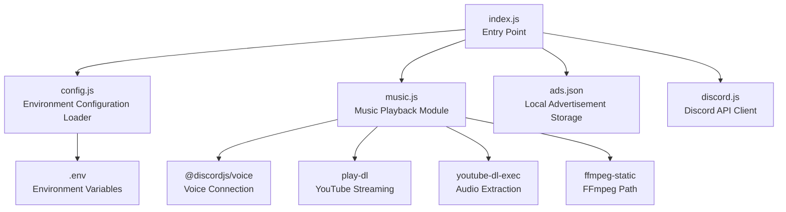
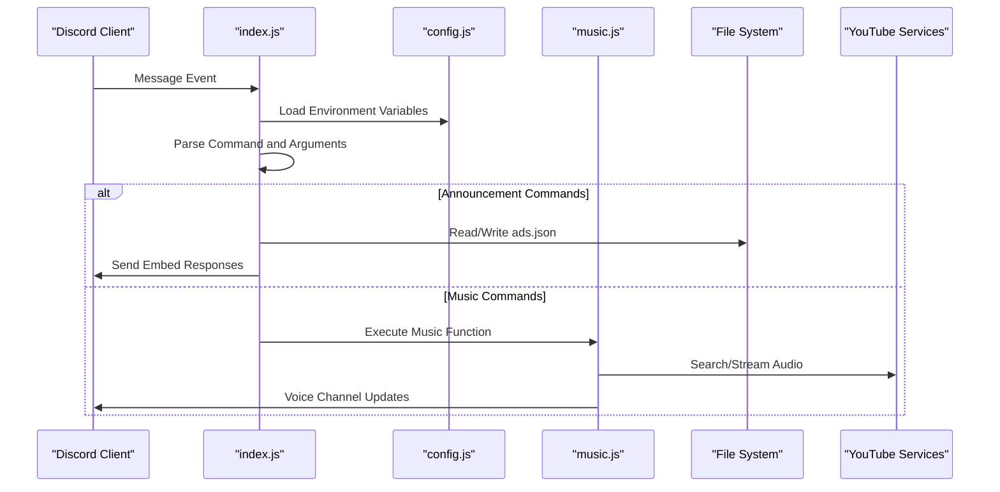
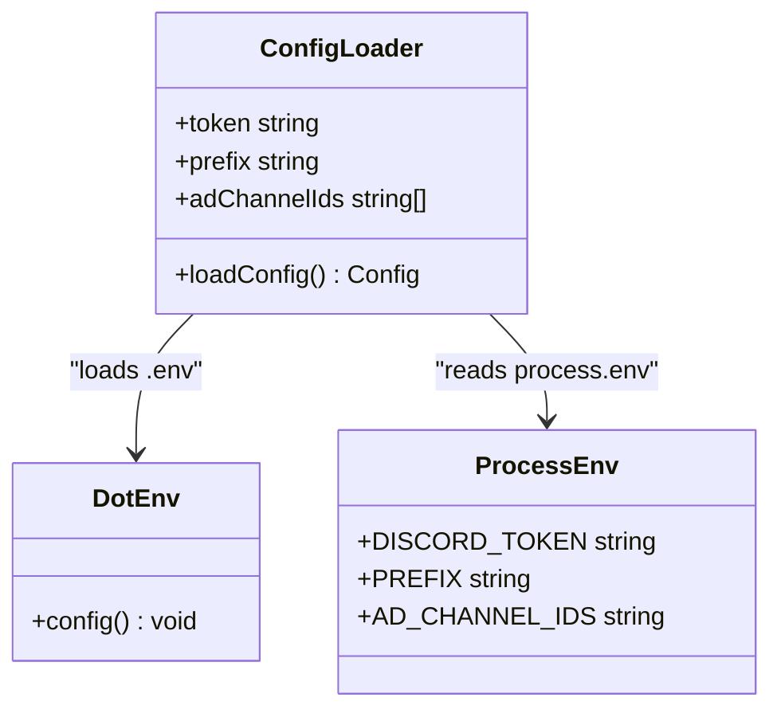
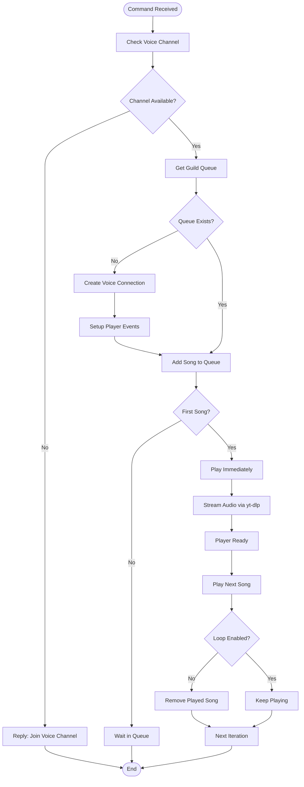
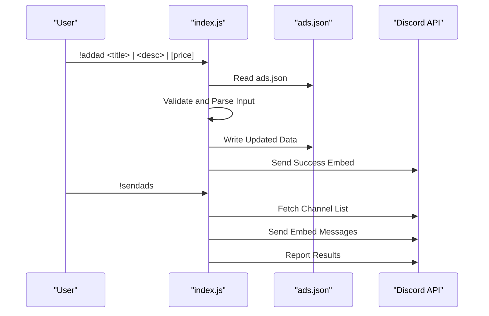
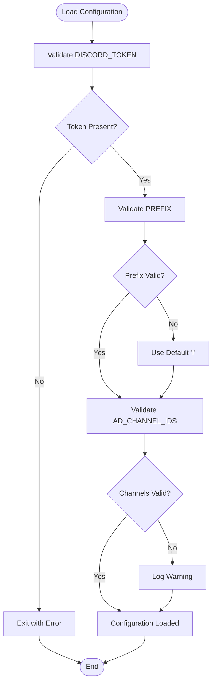
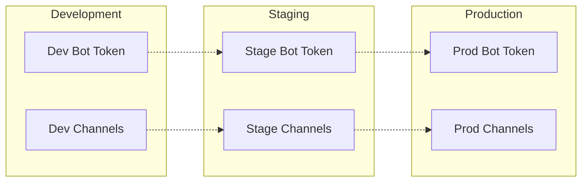
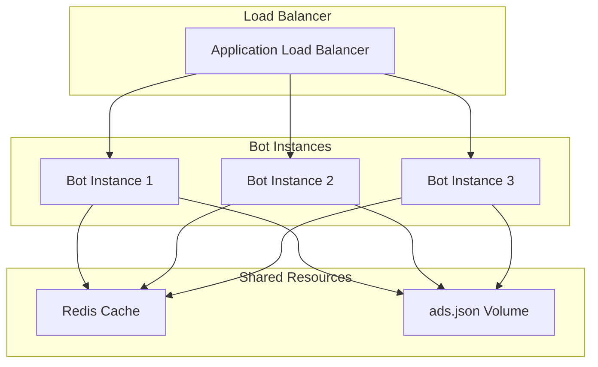

# Deployment and Production Configuration

<cite>
**Referenced Files in This Document**
- [README.md](file://README.md)
- [package.json](file://package.json)
- [config.js](file://config.js)
- [index.js](file://index.js)
- [music.js](file://music.js)
</cite>

## Table of Contents
1. [Introduction](#introduction)
2. [Project Structure](#project-structure)
3. [Core Components](#core-components)
4. [Architecture Overview](#architecture-overview)
5. [Detailed Component Analysis](#detailed-component-analysis)
6. [Environment Variables and Configuration Management](#environment-variables-and-configuration-management)
7. [Containerization Setup with Docker](#containerization-setup-with-docker)
8. [Cloud Platform Deployment Options](#cloud-platform-deployment-options)
9. [Security Best Practices](#security-best-practices)
10. [CI/CD Integration Patterns](#cicd-integration-patterns)
11. [Monitoring and Observability](#monitoring-and-observability)
12. [Scaling Considerations](#scaling-considerations)
13. [Backup Strategies](#backup-strategies)
14. [Maintenance Procedures](#maintenance-procedures)
15. [Troubleshooting Guide](#troubleshooting-guide)
16. [Conclusion](#conclusion)

## Introduction
This document provides comprehensive deployment and production configuration guidance for the Discord Bot project. It covers environment variable management across development, staging, and production environments, containerization with Docker, cloud platform deployment options, security best practices for production tokens and environment isolation, configuration validation, deployment scripts, CI/CD integration patterns, monitoring setup, scaling considerations, backup strategies, and maintenance procedures tailored to a production-grade deployment.

## Project Structure
The project follows a modular structure with clear separation of concerns:
- Entry point initializes the bot and loads configuration
- Environment variables are loaded via dotenv
- Music playback functionality is encapsulated in a separate module
- Local persistence for advertisements using a JSON file



**Diagram sources**
- [index.js:1-396](file://index.js#L1-L396)
- [config.js:1-8](file://config.js#L1-L8)
- [music.js:1-212](file://music.js#L1-L212)
- [package.json:1-24](file://package.json#L1-L24)

**Section sources**
- [README.md:478-496](file://README.md#L478-L496)
- [package.json:1-24](file://package.json#L1-L24)

## Core Components
The application consists of two primary functional areas:
- Announcement management: CRUD operations for advertisements with Discord embeds
- Music playback: YouTube streaming with queue management and voice channel integration

Key runtime characteristics:
- Uses discord.js v14 for API interactions
- Implements @discordjs/voice for audio streaming
- Employs play-dl for YouTube search and streaming
- Stores advertisements locally in JSON format

**Section sources**
- [index.js:1-396](file://index.js#L1-L396)
- [music.js:1-212](file://music.js#L1-L212)
- [package.json:14-22](file://package.json#L14-L22)

## Architecture Overview
The system architecture combines event-driven message processing with external service integrations:



**Diagram sources**
- [index.js:60-389](file://index.js#L60-L389)
- [config.js:1-8](file://config.js#L1-L8)
- [music.js:9-95](file://music.js#L9-L95)

## Detailed Component Analysis

### Environment Configuration Module
The configuration loader centralizes environment variable access with sensible defaults and type conversion.



**Diagram sources**
- [config.js:1-8](file://config.js#L1-L8)

**Section sources**
- [config.js:1-8](file://config.js#L1-L8)

### Music Playback Engine
The music module manages voice connections, audio streaming, and queue operations with robust error handling.



**Diagram sources**
- [music.js:9-155](file://music.js#L9-L155)

**Section sources**
- [music.js:1-212](file://music.js#L1-L212)

### Announcement Management System
The announcement system handles CRUD operations with Discord embed responses and local JSON persistence.



**Diagram sources**
- [index.js:73-220](file://index.js#L73-L220)

**Section sources**
- [index.js:11-29](file://index.js#L11-L29)
- [index.js:158-220](file://index.js#L158-L220)

## Environment Variables and Configuration Management
The application uses environment variables for configuration management across different deployment environments.

### Environment Variable Reference
| Variable | Purpose | Required | Default Value |
|----------|---------|----------|---------------|
| DISCORD_TOKEN | Bot authentication token | Yes | None |
| PREFIX | Command prefix | No | "!" |
| AD_CHANNEL_IDS | Comma-separated channel IDs | No | "" |

### Multi-Environment Configuration Strategy
For production deployments, implement environment-specific configuration files:

**Development Environment (.env.development)**
- Local testing with limited channels
- Debug logging enabled
- Lower rate limits for testing

**Staging Environment (.env.staging)**
- Mirror production configuration
- Separate bot account for testing
- Reduced scale testing

**Production Environment (.env.production)**
- Secure token storage
- Production channel IDs
- Monitoring and alerting enabled

### Configuration Validation
Implement runtime validation for critical configuration parameters:



**Section sources**
- [config.js:3-7](file://config.js#L3-L7)
- [README.md:99-136](file://README.md#L99-L136)

## Containerization Setup with Docker
Create a production-ready Docker deployment for the Discord bot.

### Dockerfile Configuration
```dockerfile
FROM node:16-alpine

WORKDIR /app

COPY package*.json ./
RUN npm ci --only=production

COPY . .

# Create non-root user for security
RUN addgroup -g 1001 -S appuser && \
    adduser -S appuser && \
    chown -R appuser:appuser /app
USER appuser

EXPOSE 3000

CMD ["npm", "start"]
```

### Docker Compose Setup
```yaml
version: '3.8'
services:
  discord-bot:
    build: .
    restart: unless-stopped
    environment:
      - NODE_ENV=production
      - DISCORD_TOKEN=${DISCORD_TOKEN}
      - PREFIX=${PREFIX}
      - AD_CHANNEL_IDS=${AD_CHANNEL_IDS}
    volumes:
      - ./ads.json:/app/ads.json
    logging:
      driver: "json-file"
      options:
        max-size: "10m"
        max-file: "3"
```

### Security Considerations
- Run as non-root user
- Use read-only filesystem except for persistent volume
- Implement health checks
- Configure resource limits

**Section sources**
- [package.json:6-8](file://package.json#L6-L8)

## Cloud Platform Deployment Options
Choose from several cloud platforms based on your infrastructure requirements.

### Platform Comparison Matrix

| Platform | Pros | Cons | Best For |
|----------|------|------|----------|
| **Heroku** | Easy setup, free tier, automatic scaling | Limited uptime, dyno sleep | Small-scale deployments |
| **Railway** | Fast deployment, good free tier, GitHub integration | Limited resources | Rapid prototyping |
| **Render** | Green energy, simple scaling, good monitoring | Limited customization | Environment-conscious projects |
| **AWS ECS/Fargate** | Enterprise-grade, extensive monitoring | Complex setup, cost | Large-scale production |
| **Google Cloud Run** | Serverless, automatic scaling, pay-per-use | Cold starts, limited session affinity | Stateless applications |
| **Azure Container Apps** | Managed Kubernetes, enterprise features | Learning curve | Microsoft ecosystem |

### Infrastructure-as-Code Example (Terraform)
```hcl
resource "aws_ecs_cluster" "discord_bot" {
  name = "discord-bot-cluster"
}

resource "aws_ecs_task_definition" "discord_bot" {
  family                   = "discord-bot"
  container_definitions    = jsonencode([
    {
      name  = "bot"
      image = "your-registry/discord-bot:latest"
      environment = [
        { name = "NODE_ENV", value = "production" }
      ]
      essential = true
      memory    = 512
    }
  ])
}

resource "aws_ecs_service" "discord_bot" {
  name            = "discord-bot-service"
  cluster         = aws_ecs_cluster.discord_bot.id
  task_definition = aws_ecs_task_definition.discord_bot.id
  desired_count   = 2
}
```

## Security Best Practices
Implement comprehensive security measures for production deployments.

### Token Management
- Store DISCORD_TOKEN in secure secret management systems
- Never commit tokens to version control
- Use environment-specific secrets per deployment stage
- Implement token rotation policies

### Environment Isolation


### Network Security
- Restrict inbound traffic to necessary ports only
- Use private networks for internal services
- Implement network segmentation
- Monitor for unusual traffic patterns

### Data Protection
- Encrypt sensitive data at rest
- Implement access controls for ads.json
- Regular security audits
- Vulnerability scanning

**Section sources**
- [README.md:640](file://README.md#L640)

## CI/CD Integration Patterns
Establish automated deployment pipelines for reliable releases.

### GitHub Actions Workflow
```yaml
name: Deploy Discord Bot

on:
  push:
    branches: [ main ]

jobs:
  deploy:
    runs-on: ubuntu-latest
    steps:
    - uses: actions/checkout@v3
    
    - name: Setup Node.js
      uses: actions/setup-node@v3
      with:
        node-version: '16'
        
    - name: Install Dependencies
      run: npm ci
      
    - name: Build Container
      run: docker build -t discord-bot:${GITHUB_SHA} .
      
    - name: Push to Registry
      run: |
        echo ${{ secrets.DOCKER_PASSWORD }} | docker login -u ${{ secrets.DOCKER_USERNAME }} --password-stdin
        docker push discord-bot:${GITHUB_SHA}
        
    - name: Deploy to Production
      run: |
        ssh ${{ secrets.SSH_USER }}@${{ secrets.HOST }} << EOF
        docker pull discord-bot:${GITHUB_SHA}
        docker stop discord-bot || true
        docker rm discord-bot || true
        docker run -d --name discord-bot \
          -e DISCORD_TOKEN="${{ secrets.DISCORD_TOKEN }}" \
          -e AD_CHANNEL_IDS="${{ secrets.AD_CHANNEL_IDS }}" \
          discord-bot:${GITHUB_SHA}
        EOF
```

### GitLab CI/CD Pipeline
```yaml
stages:
  - build
  - test
  - deploy

build_job:
  stage: build
  image: node:16
  script:
    - npm ci
    - npm run build
  artifacts:
    paths:
      - dist/

test_job:
  stage: test
  script:
    - npm test

deploy_job:
  stage: deploy
  environment: production
  script:
    - docker build -t discord-bot:$CI_COMMIT_SHA .
    - docker push registry/discord-bot:$CI_COMMIT_SHA
    - ssh prod-server "docker pull discord-bot:$CI_COMMIT_SHA && docker restart discord-bot"
```

## Monitoring and Observability
Implement comprehensive monitoring for production reliability.

### Health Check Endpoint
```javascript
// Add to index.js
app.get('/health', (req, res) => {
  res.json({
    status: 'healthy',
    timestamp: new Date().toISOString(),
    uptime: process.uptime(),
    memory: process.memoryUsage(),
    version: process.env.VERSION || 'unknown'
  });
});
```

### Logging Configuration
```javascript
const winston = require('winston');

const logger = winston.createLogger({
  level: 'info',
  format: winston.format.combine(
    winston.format.timestamp(),
    winston.format.errors({ stack: true }),
    winston.format.json()
  ),
  transports: [
    new winston.transports.File({ filename: 'error.log', level: 'error' }),
    new winston.transports.File({ filename: 'combined.log' })
  ]
});

if (process.env.NODE_ENV !== 'production') {
  logger.add(new winston.transports.Console());
}
```

### Metrics Collection
- Track command execution rates
- Monitor voice connection stability
- Measure response times
- Record error rates and types

### Alerting Configuration
- Critical errors (token invalid, rate limits)
- Service availability (uptime percentage)
- Resource utilization (memory, CPU)
- External service failures (YouTube API)

## Scaling Considerations
Plan for horizontal and vertical scaling based on usage patterns.

### Horizontal Scaling Strategy


### State Management
- Voice connections are ephemeral per instance
- Persistent state stored in shared volume
- Redis cache for temporary data sharing
- Database migration planned for future scaling

### Rate Limiting and Throttling
- Implement command cooldowns
- Add queue management for heavy commands
- Monitor Discord API rate limits
- Graceful degradation during API restrictions

## Backup Strategies
Implement comprehensive backup solutions for critical data.

### Automated Backup Schedule
```bash
#!/bin/bash
# backup.sh

BACKUP_DIR="/backups"
DATE=$(date +%Y%m%d_%H%M%S)
BACKUP_NAME="discord-bot-backup_${DATE}"

mkdir -p ${BACKUP_DIR}/${BACKUP_NAME}

# Backup ads.json
cp /app/ads.json ${BACKUP_DIR}/${BACKUP_NAME}/ads.json

# Create tar archive
tar -czf ${BACKUP_DIR}/${BACKUP_NAME}.tar.gz -C ${BACKUP_DIR} ${BACKUP_NAME}

# Cleanup old backups (keep last 7 days)
find ${BACKUP_DIR} -name "discord-bot-backup_*.tar.gz" -mtime +7 -delete
```

### Disaster Recovery Plan
1. **Daily Backups**: Automated daily snapshots of ads.json
2. **Weekly Full**: Complete system snapshot with environment variables
3. **Monthly Verification**: Test restore procedures monthly
4. **Geographic Redundancy**: Store backups in multiple regions

### Data Integrity Checks
- Verify backup integrity before retention
- Monitor for corruption indicators
- Test restoration procedures regularly
- Maintain backup rotation policies

## Maintenance Procedures
Establish routine maintenance tasks for long-term reliability.

### Daily Operations
- Monitor bot uptime and error logs
- Verify advertisement persistence
- Check voice connection stability
- Review rate limit usage

### Weekly Tasks
- Rotate environment variables
- Update dependencies and security patches
- Review backup integrity
- Audit user permissions

### Monthly Activities
- Performance tuning based on usage patterns
- Capacity planning for growth
- Security audit of configurations
- Documentation updates

### Emergency Procedures
1. **Critical Failure**: Immediate rollback to previous stable version
2. **Token Compromise**: Rotate tokens and redeploy
3. **Data Loss**: Restore from latest backup
4. **Service Outage**: Scale up instances and investigate root cause

## Troubleshooting Guide
Common issues and their resolutions for production environments.

### Authentication Issues
**Problem**: "Invalid token provided" errors
**Solution**: 
- Verify token in secret management system
- Check token expiration and rotation schedule
- Validate bot permissions in Discord Developer Portal

### Connectivity Problems
**Problem**: Voice connection failures
**Solution**:
- Verify ffmpeg installation and PATH
- Check network connectivity to YouTube
- Review voice channel permissions

### Performance Degradation
**Problem**: Slow command responses
**Solution**:
- Monitor memory usage and garbage collection
- Implement command caching for frequently accessed data
- Optimize database queries and file I/O operations

### Scaling Challenges
**Problem**: Rate limiting from Discord API
**Solution**:
- Implement exponential backoff retry logic
- Add command queuing for high-volume periods
- Consider sharding for large guild counts

**Section sources**
- [README.md:508-635](file://README.md#L508-L635)

## Conclusion
This deployment guide provides a comprehensive framework for operating the Discord Bot in production environments. By implementing the outlined security practices, containerization strategies, monitoring setup, and operational procedures, you can achieve reliable, scalable, and maintainable bot operations. The modular architecture and clear separation of concerns facilitate easy maintenance and future enhancements while the documented CI/CD patterns ensure consistent and automated deployments across all environments.

Key success factors include:
- Robust environment variable management with proper isolation
- Comprehensive security measures for token protection
- Automated monitoring and alerting systems
- Well-defined backup and disaster recovery procedures
- Scalable infrastructure design with proper load balancing
- Established maintenance and emergency response procedures