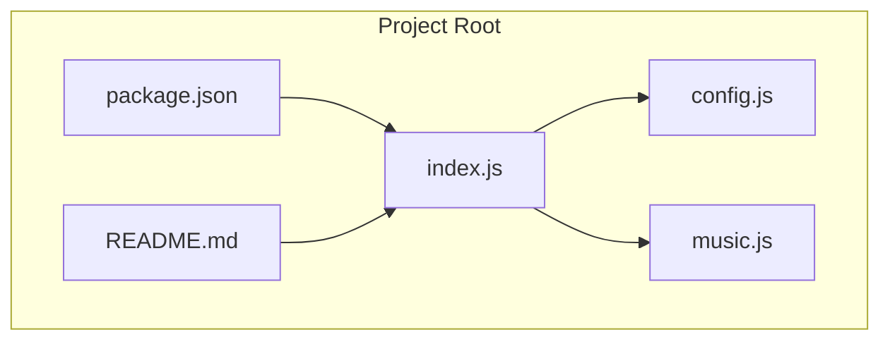
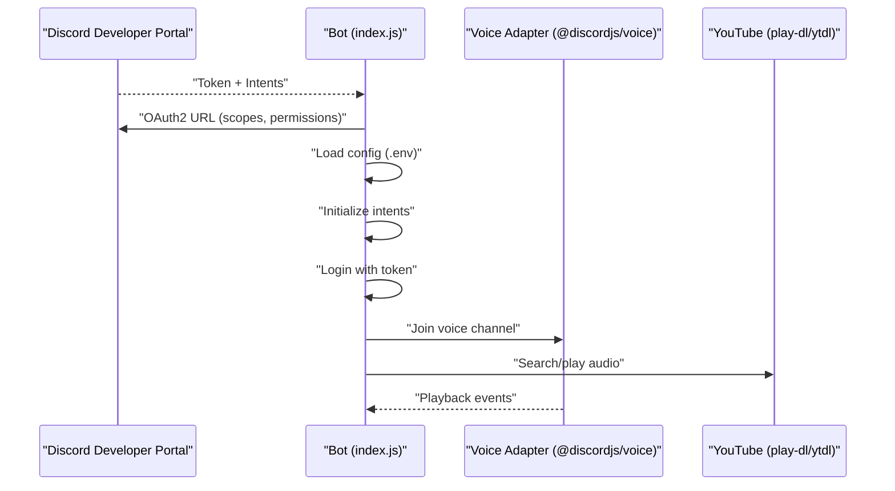
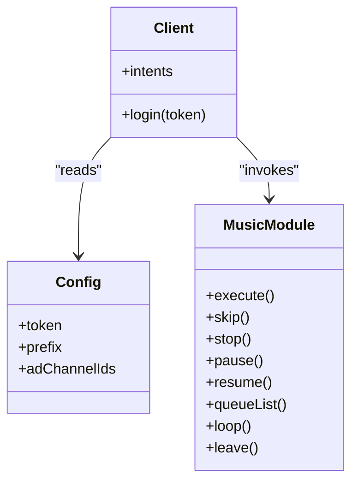
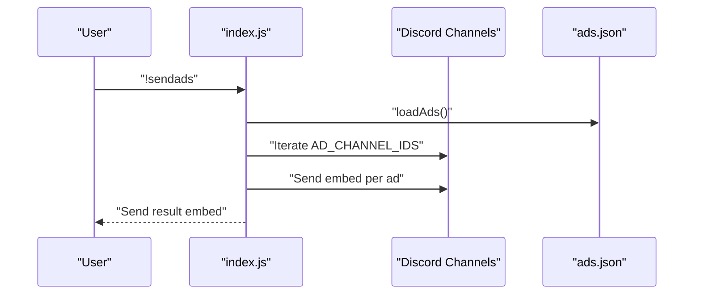
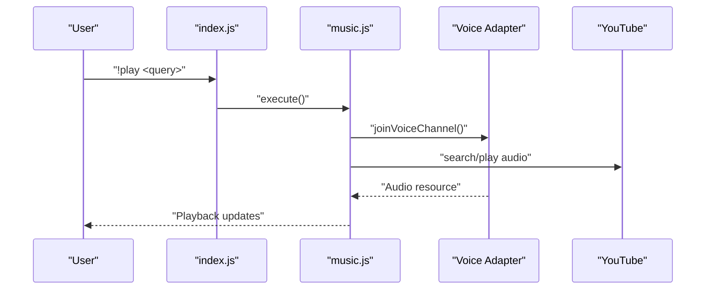
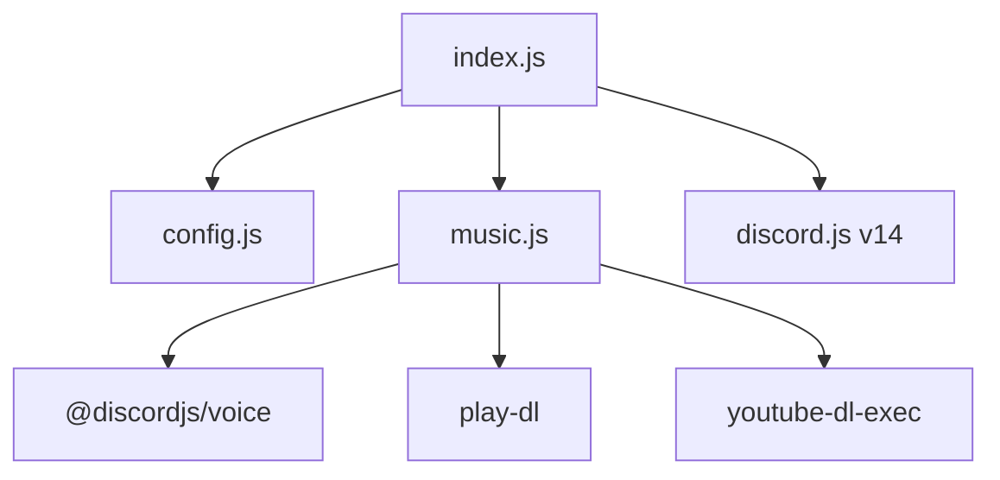

# Discord Developer Portal Setup

<cite>
**Referenced Files in This Document**
- [README.md](file://README.md)
- [package.json](file://package.json)
- [config.js](file://config.js)
- [index.js](file://index.js)
- [music.js](file://music.js)
</cite>

## Table of Contents
1. [Introduction](#introduction)
2. [Project Structure](#project-structure)
3. [Core Components](#core-components)
4. [Architecture Overview](#architecture-overview)
5. [Detailed Component Analysis](#detailed-component-analysis)
6. [Dependency Analysis](#dependency-analysis)
7. [Performance Considerations](#performance-considerations)
8. [Troubleshooting Guide](#troubleshooting-guide)
9. [Conclusion](#conclusion)
10. [Appendices](#appendices)

## Introduction
This document provides a comprehensive guide to setting up a Discord application and bot using the Discord Developer Portal, configuring intents, OAuth2 scopes and permissions, and managing tokens securely. It complements the project’s existing documentation by offering step-by-step instructions aligned with the repository’s requirements and codebase behavior.

## Project Structure
The project is a Node.js bot using discord.js v14. It integrates announcement commands and music playback capabilities. The setup process described here focuses on creating the application, enabling intents, generating the bot token, and inviting the bot with appropriate permissions.

**Diagram sources**
- [index.js:1-396](file://index.js#L1-L396)
- [config.js:1-8](file://config.js#L1-L8)
- [package.json:1-24](file://package.json#L1-L24)
- [README.md:1-663](file://README.md#L1-L663)
- [music.js:1-212](file://music.js#L1-L212)

**Section sources**
- [README.md:47-663](file://README.md#L47-L663)
- [package.json:1-24](file://package.json#L1-L24)

## Core Components
- Application and Bot creation in the Developer Portal
- Intent configuration (MESSAGE CONTENT INTENT, SERVER MEMBERS INTENT, PRESENCE INTENT)
- OAuth2 URL generation with scopes and permissions
- Token management and environment configuration
- Verification steps and common pitfalls

**Section sources**
- [README.md:62-96](file://README.md#L62-L96)
- [README.md:99-137](file://README.md#L99-L137)

## Architecture Overview
The bot connects to Discord using intents configured in the Developer Portal and reads messages to process commands. Music commands rely on voice connections and external libraries for audio streaming.

**Diagram sources**
- [index.js:35-44](file://index.js#L35-L44)
- [index.js:391-396](file://index.js#L391-L396)
- [music.js:9-95](file://music.js#L9-L95)
- [README.md:81-96](file://README.md#L81-L96)

## Detailed Component Analysis

### Discord Application Creation
- Access the Developer Portal and create a new application.
- Navigate to the Bot section and reset or view the token.
- Enable privileged intents required by the bot.

Key steps and rationale:
- MESSAGE CONTENT INTENT is required to read message content for command processing.
- SERVER MEMBERS INTENT is recommended for member-related features.
- PRESENCE INTENT is optional and depends on your needs.

Security note:
- Treat the bot token as highly sensitive. It grants full control over the bot account.

**Section sources**
- [README.md:64-79](file://README.md#L64-L79)

### OAuth2 URL Generation and Permission Setup
- Go to OAuth2 > URL Generator.
- Select the bot scope.
- Grant permissions needed for announcements and music:
  - Send Messages
  - Embed Links
  - Read Message History
  - Read Messages/View Channels
  - Connect
  - Speak

After copying the generated URL, authorize the bot in your server.

**Section sources**
- [README.md:83-95](file://README.md#L83-L95)

### Environment Configuration and Token Management
- Create a .env file with DISCORD_TOKEN, AD_CHANNEL_IDS, and PREFIX.
- Ensure the token is correct and free of extra spaces or quotes.
- Confirm that AD_CHANNEL_IDS contains comma-separated numeric IDs without spaces.

Best practices:
- Never commit .env to version control.
- Rotate tokens periodically if compromised.
- Store tokens in a secure secret manager in production environments.

**Section sources**
- [README.md:99-137](file://README.md#L99-L137)
- [config.js:1-8](file://config.js#L1-L8)

### Intents and Code Behavior Alignment
The bot initializes several intents, including MESSAGE CONTENT, GUILD MESSAGES, GUILD VOICE STATES, DIRECT MESSAGES, and GUILDS. These align with the portal’s MESSAGE CONTENT INTENT requirement and the music functionality’s voice state handling.

**Diagram sources**
- [index.js:35-44](file://index.js#L35-L44)
- [config.js:3-7](file://config.js#L3-L7)
- [music.js:9-212](file://music.js#L9-L212)

**Section sources**
- [index.js:35-44](file://index.js#L35-L44)
- [README.md:75-79](file://README.md#L75-L79)

### Command Processing and Announcement Flow
The bot listens for messages, validates the prefix, parses arguments, and executes commands. The announcement flow sends embeds to configured channels with a small delay to avoid rate limits.

**Diagram sources**
- [index.js:158-220](file://index.js#L158-L220)
- [README.md:233-252](file://README.md#L233-L252)

**Section sources**
- [index.js:158-220](file://index.js#L158-L220)
- [README.md:233-252](file://README.md#L233-L252)

### Music Playback Flow
Music commands rely on voice connections and external libraries for audio streaming. The module manages queues per guild and handles playback lifecycle events.

**Diagram sources**
- [index.js:257-269](file://index.js#L257-L269)
- [music.js:9-95](file://music.js#L9-L95)
- [music.js:97-155](file://music.js#L97-L155)

**Section sources**
- [index.js:257-269](file://index.js#L257-L269)
- [music.js:9-95](file://music.js#L9-L95)
- [music.js:97-155](file://music.js#L97-L155)

## Dependency Analysis
The project relies on discord.js v14 for bot operations and @discordjs/voice for voice support. The music module integrates play-dl and youtube-dl-exec for audio streaming.

**Diagram sources**
- [package.json:14-22](file://package.json#L14-L22)
- [index.js:1-6](file://index.js#L1-L6)
- [music.js:3-6](file://music.js#L3-L6)

**Section sources**
- [package.json:14-22](file://package.json#L14-L22)

## Performance Considerations
- Announcement sending includes a small delay between messages to avoid rate limits.
- Voice playback uses efficient streaming and resource management.
- Queue handling ensures smooth transitions and cleanup on errors.

[No sources needed since this section provides general guidance]

## Troubleshooting Guide
Common issues and resolutions:
- Invalid token: Verify the token in .env and regenerate if needed.
- Missing privileged intents: Enable MESSAGE CONTENT INTENT in the Developer Portal.
- Missing permissions in channels: Ensure the bot has required permissions in target channels.
- Incorrect channel IDs: Confirm IDs are comma-separated without spaces and refer to text channels.
- UTF-8 encoding issues: Save .env with UTF-8 without BOM and ensure no invisible characters at the start.
- Disallowed intents: Confirm intents are saved and approved; bots under 100 servers generally work without restrictions.
- Voice-related errors: Ensure the bot has Connect and Speak permissions in the voice channel.

**Section sources**
- [README.md:508-636](file://README.md#L508-L636)

## Conclusion
By following the steps outlined—creating the application, enabling intents, generating the token, configuring OAuth2 scopes and permissions, and managing environment variables—you can deploy a functional Discord bot that supports announcements and music playback. Adhering to security best practices and validating configurations will minimize common pitfalls and ensure reliable operation.

[No sources needed since this section summarizes without analyzing specific files]

## Appendices

### OAuth2 Scope and Permission Checklist
- Scopes:
  - bot
- Bot Permissions:
  - Send Messages
  - Embed Links
  - Read Message History
  - Read Messages/View Channels
  - Connect
  - Speak

**Section sources**
- [README.md:84-93](file://README.md#L84-L93)

### Intent Requirements Summary
- MESSAGE CONTENT INTENT (required)
- SERVER MEMBERS INTENT (recommended)
- PRESENCE INTENT (optional)

**Section sources**
- [README.md:75-79](file://README.md#L75-L79)
- [index.js:36-42](file://index.js#L36-L42)