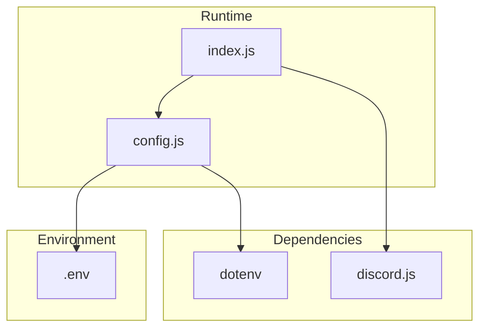
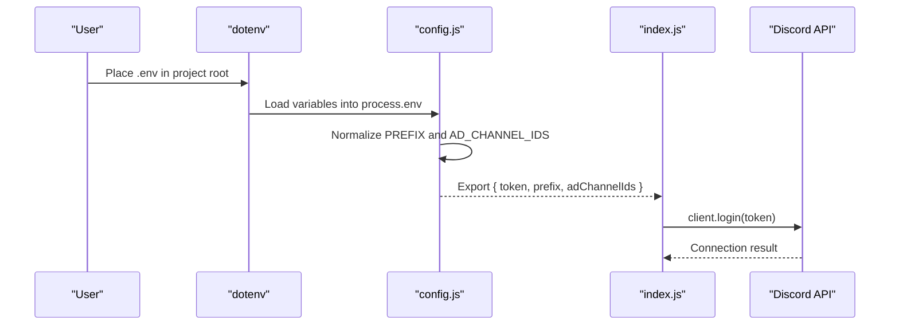
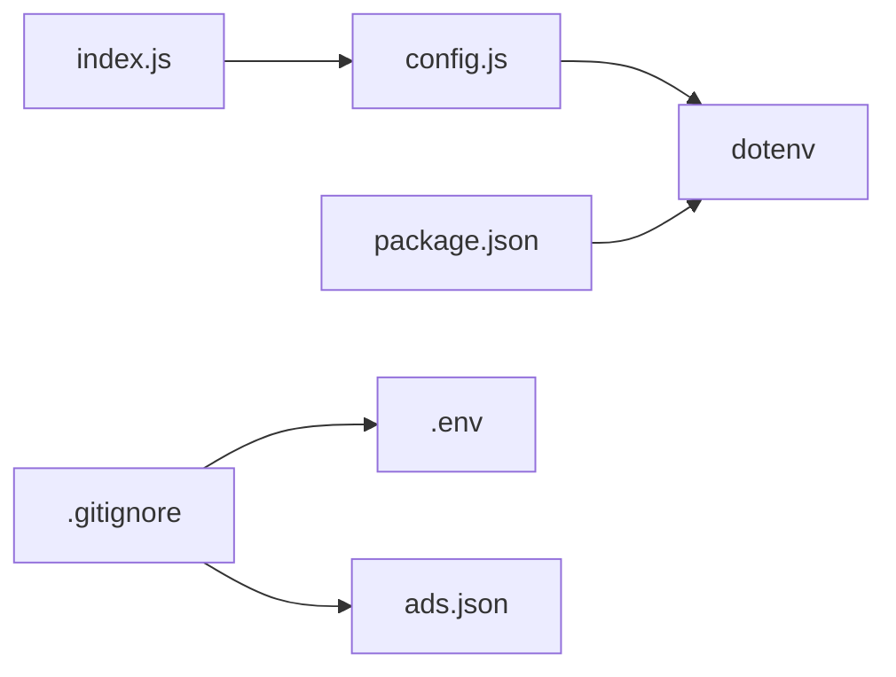

# Environment Setup

<cite>
**Referenced Files in This Document**
- [README.md](file://README.md)
- [config.js](file://config.js)
- [index.js](file://index.js)
- [package.json](file://package.json)
- [.gitignore](file://.gitignore)
</cite>

## Table of Contents
1. [Introduction](#introduction)
2. [Project Structure](#project-structure)
3. [Core Components](#core-components)
4. [Architecture Overview](#architecture-overview)
5. [Detailed Component Analysis](#detailed-component-analysis)
6. [Dependency Analysis](#dependency-analysis)
7. [Performance Considerations](#performance-considerations)
8. [Troubleshooting Guide](#troubleshooting-guide)
9. [Conclusion](#conclusion)
10. [Appendices](#appendices)

## Introduction
This document explains how to set up the environment for the project, focusing on the .env file configuration process. It covers all required environment variables, their data types and formatting, the dotenv configuration mechanism, and how variables are loaded into the application. It also provides step-by-step instructions for creating the .env file, validation methods, and common configuration errors with fixes.

## Project Structure
The environment configuration relies on a small set of files:
- index.js: Loads configuration and runs the bot.
- config.js: Loads environment variables via dotenv and exports them.
- README.md: Provides instructions and examples for .env configuration.
- package.json: Declares dotenv as a dependency.
- .gitignore: Ensures sensitive files (.env, ads.json) are not committed.

**Diagram sources**
- [index.js:1-6](file://index.js#L1-L6)
- [config.js:1-7](file://config.js#L1-L7)
- [package.json:14-22](file://package.json#L14-L22)
- [.gitignore:1-4](file://.gitignore#L1-L4)

**Section sources**
- [README.md:99-137](file://README.md#L99-L137)
- [config.js:1-7](file://config.js#L1-L7)
- [package.json:14-22](file://package.json#L14-L22)
- [.gitignore:1-4](file://.gitignore#L1-L4)

## Core Components
- Environment loader: dotenv loads variables from .env into process.env.
- Configuration module: config.js reads process.env and exports normalized values.
- Runtime usage: index.js imports config.js and uses exported values (TOKEN, PREFIX, AD_CHANNEL_IDS).

Key environment variables:
- DISCORD_TOKEN: Required string token for the bot.
- PREFIX: Optional string prefix for commands; defaults to "!" if unset.
- AD_CHANNEL_IDS: Optional comma-separated list of numeric channel IDs; defaults to empty list if unset.

How variables are loaded:
- dotenv.config() is invoked in config.js, populating process.env from .env.
- config.js normalizes values: PREFIX defaults to "!", and AD_CHANNEL_IDS is split into an array.

Validation and normalization:
- PREFIX falls back to "!" when missing.
- AD_CHANNEL_IDS is split by commas and filtered to remove empty entries.
- TOKEN is required; the bot attempts to log in with it and reports errors if invalid.

**Section sources**
- [config.js:1-7](file://config.js#L1-L7)
- [index.js:46-48](file://index.js#L46-L48)
- [index.js:392-395](file://index.js#L392-L395)
- [README.md:103-112](file://README.md#L103-L112)

## Architecture Overview
The environment setup pipeline:

**Diagram sources**
- [config.js:1-7](file://config.js#L1-L7)
- [index.js:46-48](file://index.js#L46-L48)
- [index.js:392-395](file://index.js#L392-L395)

## Detailed Component Analysis

### Environment Variables Reference
- DISCORD_TOKEN
  - Type: string
  - Required: Yes
  - Description: The bot’s token from the Discord Developer Portal.
  - Example: DISCORD_TOKEN=your_bot_token_here
  - Notes: Must not include quotes, spaces, or line breaks.

- PREFIX
  - Type: string
  - Required: No
  - Default: "!"
  - Description: Command prefix used to trigger bot commands.
  - Example: PREFIX=!

- AD_CHANNEL_IDS
  - Type: comma-separated string of numeric IDs
  - Required: No
  - Default: empty list
  - Description: IDs of channels where announcements are sent. Separate IDs with commas and no spaces.
  - Example: AD_CHANNEL_IDS=111111111111111111,222222222222222222,333333333333333333

**Section sources**
- [README.md:103-112](file://README.md#L103-L112)
- [config.js:4-6](file://config.js#L4-L6)

### dotenv Configuration Process
- dotenv is required in config.js and invoked via dotenv.config().
- This loads variables from .env into process.env before they are accessed.
- The project depends on dotenv as declared in package.json.

**Section sources**
- [config.js:1](file://config.js#L1)
- [package.json:18](file://package.json#L18)

### Variable Loading and Normalization
- TOKEN: Retrieved directly from process.env.DISCORD_TOKEN.
- PREFIX: Retrieved from process.env.PREFIX with a fallback to "!".
- AD_CHANNEL_IDS: Retrieved from process.env.AD_CHANNEL_IDS, split by "," and filtered to remove empty entries.

**Section sources**
- [config.js:4-6](file://config.js#L4-L6)

### Runtime Usage of Environment Variables
- index.js imports config.js and assigns:
  - PREFIX to a constant used to detect command messages.
  - TOKEN to client.login().
  - AD_CHANNEL_IDS to control where announcements are sent.
- On login failure, index.js logs a clear error suggesting to verify the token in .env.

**Section sources**
- [index.js:46-48](file://index.js#L46-L48)
- [index.js:392-395](file://index.js#L392-L395)

### Step-by-Step .env Creation Instructions
1. Create a file named .env in the project root.
2. Add the required variables:
   - DISCORD_TOKEN=your_bot_token_here
   - AD_CHANNEL_IDS=111111111111111111,222222222222222222,333333333333333333
   - PREFIX=!
3. Save the file with UTF-8 encoding (no BOM).
4. Verify that .env is ignored by Git (see .gitignore).
5. Start the bot with npm start.

**Section sources**
- [README.md:99-137](file://README.md#L99-L137)
- [.gitignore:2](file://.gitignore#L2)

### Validation Methods
- Confirm token correctness:
  - Ensure DISCORD_TOKEN is present and not empty.
  - Ensure no extra characters (quotes, spaces, line breaks).
- Confirm channel IDs formatting:
  - Use only numeric IDs separated by commas with no spaces.
  - IDs must correspond to text channels.
- Confirm prefix usage:
  - Use the configured PREFIX to trigger commands (default is "!").

**Section sources**
- [README.md:508-583](file://README.md#L508-L583)
- [README.md:103-112](file://README.md#L103-L112)

### Fallback Mechanisms
- PREFIX defaults to "!" if not set.
- AD_CHANNEL_IDS defaults to an empty list if not set.

**Section sources**
- [config.js:5-6](file://config.js#L5-L6)

## Dependency Analysis
- index.js depends on config.js for runtime configuration.
- config.js depends on dotenv to populate process.env.
- package.json declares dotenv as a dependency.
- .gitignore ensures .env and ads.json are not committed.

**Diagram sources**
- [index.js:1](file://index.js#L1)
- [config.js:1](file://config.js#L1)
- [package.json:18](file://package.json#L18)
- [.gitignore:1-4](file://.gitignore#L1-L4)

**Section sources**
- [index.js:1](file://index.js#L1)
- [config.js:1](file://config.js#L1)
- [package.json:18](file://package.json#L18)
- [.gitignore:1-4](file://.gitignore#L1-L4)

## Performance Considerations
- Environment variables are loaded once at startup via dotenv.config(), so there is no repeated overhead during runtime.
- Using a default prefix avoids unnecessary checks later in message handling.

[No sources needed since this section provides general guidance]

## Troubleshooting Guide
Common configuration errors and resolutions:
- Missing or empty DISCORD_TOKEN
  - Symptom: Login error indicating an invalid token.
  - Fix: Paste the correct token from the Discord Developer Portal into DISCORD_TOKEN without quotes or extra characters.
- Incorrect AD_CHANNEL_IDS formatting
  - Symptom: "!sendads" reports no channels configured or fails to send.
  - Fix: Ensure IDs are comma-separated with no spaces and correspond to text channels.
- Incorrect encoding of .env
  - Symptom: Unexpected errors like "Cannot read properties of undefined".
  - Fix: Save .env with UTF-8 encoding (without BOM) and ensure the first line starts with DISCORD_TOKEN=.
- Missing MESSAGE CONTENT INTENT
  - Symptom: Bot does not respond to commands.
  - Fix: Enable MESSAGE CONTENT INTENT in the Discord Developer Portal under Bot settings.

**Section sources**
- [README.md:508-583](file://README.md#L508-L583)

## Conclusion
The environment setup is straightforward: create a .env file with DISCORD_TOKEN, PREFIX, and AD_CHANNEL_IDS, ensure dotenv is installed, and start the bot. The configuration module normalizes values and provides sensible defaults, while the runtime logs clear errors when the token is invalid.

[No sources needed since this section summarizes without analyzing specific files]

## Appendices

### Appendix A: Example .env Entries
- DISCORD_TOKEN=your_bot_token_here
- AD_CHANNEL_IDS=111111111111111111,222222222222222222,333333333333333333
- PREFIX=!

**Section sources**
- [README.md:103-112](file://README.md#L103-L112)