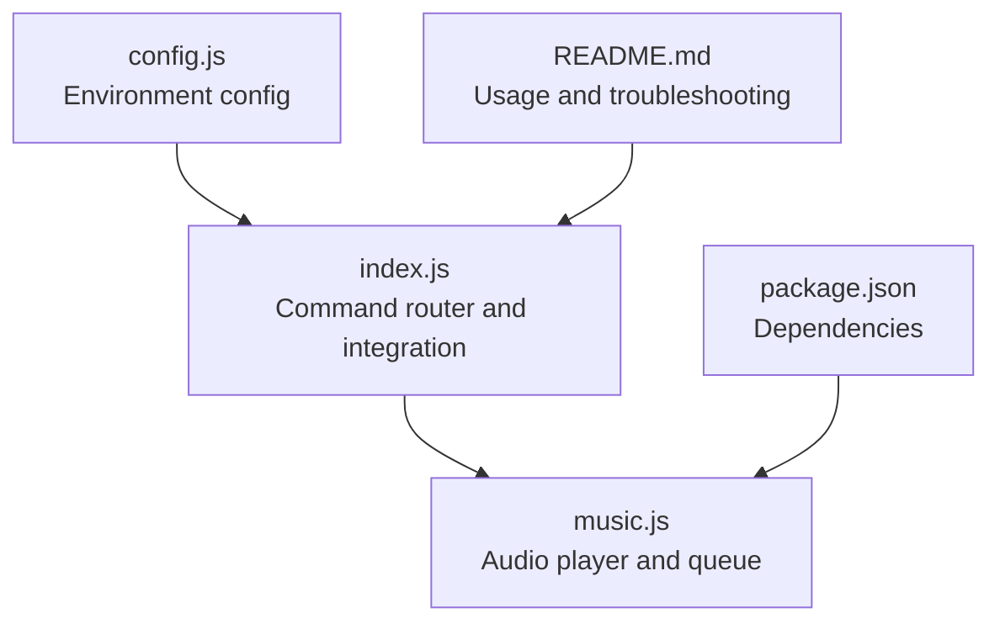
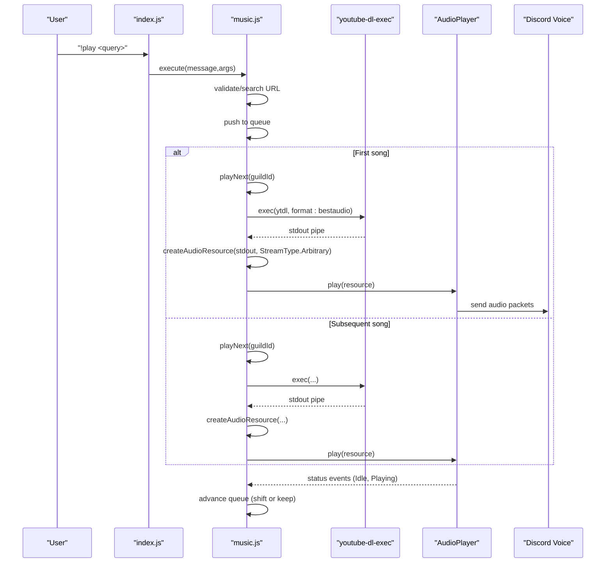
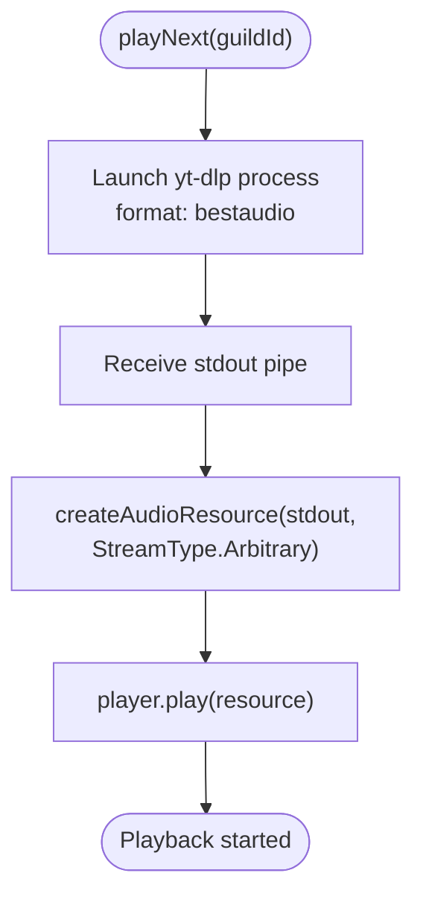
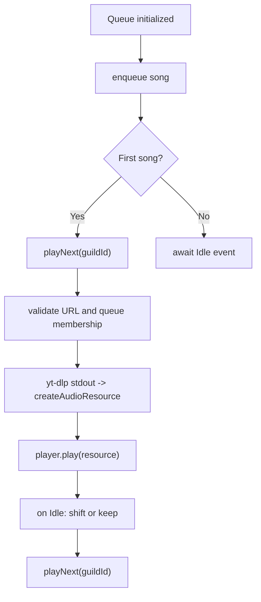
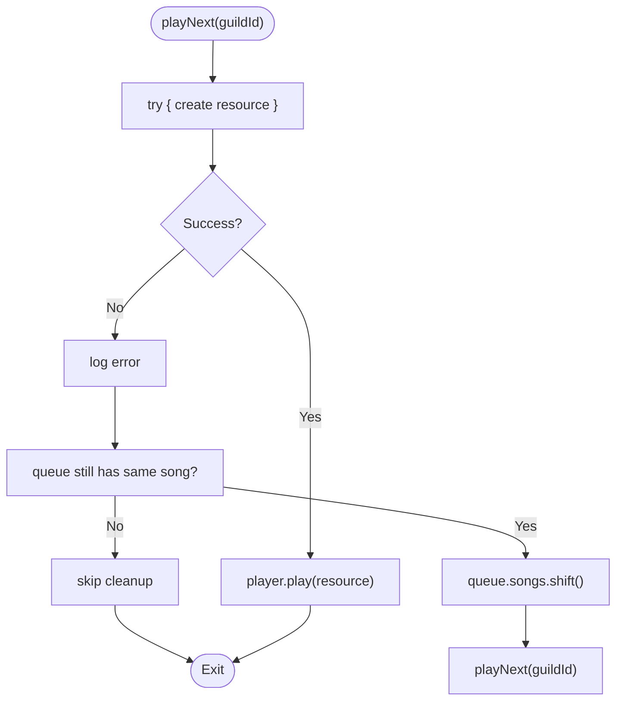
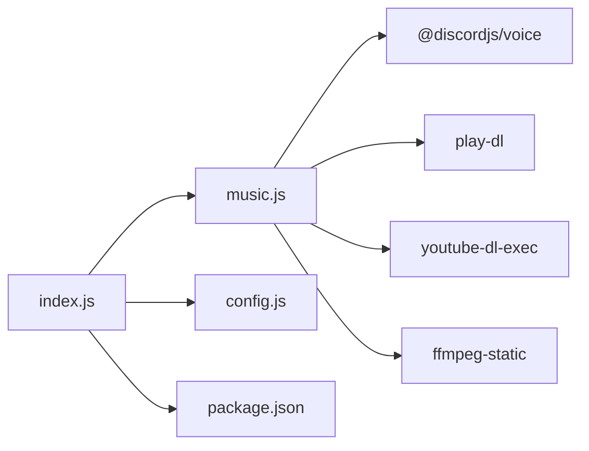

# Audio Streaming and Performance Optimization

<cite>
**Referenced Files in This Document**
- [index.js](file://index.js)
- [music.js](file://music.js)
- [config.js](file://config.js)
- [package.json](file://package.json)
- [README.md](file://README.md)
</cite>

## Table of Contents
1. [Introduction](#introduction)
2. [Project Structure](#project-structure)
3. [Core Components](#core-components)
4. [Architecture Overview](#architecture-overview)
5. [Detailed Component Analysis](#detailed-component-analysis)
6. [Dependency Analysis](#dependency-analysis)
7. [Performance Considerations](#performance-considerations)
8. [Troubleshooting Guide](#troubleshooting-guide)
9. [Conclusion](#conclusion)
10. [Appendices](#appendices)

## Introduction
This document explains the audio streaming architecture and performance optimization strategies implemented in the project. It focuses on how audio resources are created, how streams are configured, and how playback is orchestrated. It also covers error handling, quality and bandwidth considerations, and operational reliability measures such as queue management and connection state handling.

## Project Structure
The project is a Discord bot with two primary concerns:
- Announcement management (ads) and administrative commands
- Music playback via YouTube streams

Key files:
- index.js: Bot initialization, command routing, and integration with the music module
- music.js: Audio player lifecycle, queue management, stream creation, and playback orchestration
- config.js: Environment configuration loading
- package.json: Dependencies including Discord voice SDK, YouTube downloaders, and FFmpeg
- README.md: Usage, commands, and troubleshooting notes

**Diagram sources**
- [index.js:1-396](file://index.js#L1-L396)
- [music.js:1-212](file://music.js#L1-L212)
- [config.js:1-8](file://config.js#L1-L8)
- [package.json:1-24](file://package.json#L1-L24)
- [README.md:1-663](file://README.md#L1-L663)

**Section sources**
- [index.js:1-396](file://index.js#L1-L396)
- [music.js:1-212](file://music.js#L1-L212)
- [config.js:1-8](file://config.js#L1-L8)
- [package.json:1-24](file://package.json#L1-L24)
- [README.md:1-663](file://README.md#L1-L663)

## Core Components
- Audio player and queue manager: Orchestrates playback, manages the song queue, and handles transitions
- Stream pipeline: Uses youtube-dl-exec to fetch audio streams and creates audio resources for playback
- Command integration: Routes user commands to the music module and handles errors gracefully

Key responsibilities:
- Queue lifecycle: Add songs, play next, skip, stop, pause/resume, loop toggle, leave
- Stream creation: Build audio resources from external streams with StreamType.Arbitrary
- Error handling: Connection errors, player errors, and race conditions during queue operations

**Section sources**
- [music.js:1-212](file://music.js#L1-L212)
- [index.js:257-301](file://index.js#L257-L301)

## Architecture Overview
The audio subsystem integrates Discord voice APIs with external stream providers. The flow is:
- User triggers a play command
- The system validates the input (URL or search) and enqueues the song
- On the first enqueue or idle state, it starts playback
- A subprocess is launched to fetch the audio stream
- The stream is wrapped as an audio resource and fed to the player
- Playback events drive queue advancement and loop behavior

**Diagram sources**
- [index.js:257-269](file://index.js#L257-L269)
- [music.js:9-95](file://music.js#L9-L95)
- [music.js:97-155](file://music.js#L97-L155)

## Detailed Component Analysis

### Audio Resource Creation and Stream Configuration
- Stream source: youtube-dl-exec is invoked with a format targeting best available audio
- Stream type: StreamType.Arbitrary is used to wrap the raw audio stream
- Player consumption: The audio resource is passed to the player’s play method

**Diagram sources**
- [music.js:112-133](file://music.js#L112-L133)

**Section sources**
- [music.js:112-133](file://music.js#L112-L133)

### Queue Management and Playback Control
- Queue storage: A Map keyed by guild ID stores connection, player, song list, and loop flag
- Lifecycle events: Player emits Idle and Playing events; Idle advances the queue
- Commands: skip, stop, pause, resume, queueList, loop, leave
- Race condition protection: Validates queue membership before sending resource to player

**Diagram sources**
- [music.js:13-33](file://music.js#L13-L33)
- [music.js:97-155](file://music.js#L97-L155)

**Section sources**
- [music.js:13-33](file://music.js#L13-L33)
- [music.js:97-155](file://music.js#L97-L155)

### Error Handling Strategies
- Connection errors: Logged and surfaced via connection error events
- Player errors: Logged; queue advances and next song is attempted
- yt-dlp process errors: Logged; queue advances and next song is attempted
- Race conditions: Checks whether the queue still references the same song before playing
- General runtime errors: Try/catch around play operations; queue cleanup and retry

**Diagram sources**
- [music.js:146-154](file://music.js#L146-L154)

**Section sources**
- [music.js:40-58](file://music.js#L40-L58)
- [music.js:123-129](file://music.js#L123-L129)
- [music.js:146-154](file://music.js#L146-L154)

### Audio Quality, Filters, and Bandwidth Considerations
- Quality selection: The stream is requested with a “best audio” format, delegating quality to the downloader
- Filters: The configuration sets preferences to avoid certificates checks and prefer free formats
- Bandwidth: The system relies on the downloader’s network handling; no explicit bitrate or buffer tuning is present
- FFmpeg path: The project sets an FFmpeg path for static binaries, aligning with the voice library expectations

**Section sources**
- [music.js:112-119](file://music.js#L112-L119)
- [music.js:1](file://music.js#L1)
- [package.json:14-22](file://package.json#L14-L22)

### Performance Monitoring and Reliability Measures
- Logging: Extensive logs for connection state changes, player status, and process lifecycle
- Idle-driven progression: Queue advances automatically on Idle events
- Graceful degradation: On errors, the system attempts to continue playback by advancing the queue
- Stability: Player and connection event listeners provide visibility into transient issues

**Section sources**
- [music.js:36-58](file://music.js#L36-L58)
- [music.js:127-129](file://music.js#L127-L129)

## Dependency Analysis
External libraries and their roles:
- @discordjs/voice: Provides audio player, voice connections, and stream types
- play-dl: Validates YouTube URLs and assists in search
- youtube-dl-exec: Executes yt-dlp to produce audio streams
- ffmpeg-static: Supplies FFmpeg binary path for decoding/processing
- discord.js: Bot framework and message/command handling

**Diagram sources**
- [music.js:3-5](file://music.js#L3-L5)
- [package.json:14-22](file://package.json#L14-L22)
- [index.js:1-6](file://index.js#L1-L6)

**Section sources**
- [music.js:3-5](file://music.js#L3-L5)
- [package.json:14-22](file://package.json#L14-L22)

## Performance Considerations
- Stream type and memory: Using StreamType.Arbitrary avoids internal buffering assumptions; the downstream player manages buffering. There is no explicit highWaterMark configuration in the code.
- Buffering and latency: The player’s internal buffering is managed by the voice library; no custom buffer tuning is implemented.
- CPU and network: The “best audio” format selection delegates quality to the downloader; higher quality may increase CPU usage and network throughput.
- Concurrency: Each guild maintains a single player and connection; concurrent guilds operate independently.
- Reliability: Event-driven queue advancement reduces polling overhead; error handling attempts to recover by skipping problematic entries.

[No sources needed since this section provides general guidance]

## Troubleshooting Guide
Common issues and mitigations:
- Connection errors: Inspect connection state logs and ensure permissions for Connect/Speak
- Player errors: Logs indicate failures; queue advances automatically to prevent stalls
- yt-dlp errors: Process errors are logged; queue advances to next item
- Race conditions: The system verifies queue membership before playback to avoid stale items
- Invalid URLs: Validation occurs early; fallback to search or URL extraction prevents crashes
- Missing permissions: Ensure the bot has voice permissions in the target channel

**Section sources**
- [music.js:40-58](file://music.js#L40-L58)
- [music.js:123-129](file://music.js#L123-L129)
- [music.js:104-108](file://music.js#L104-L108)
- [music.js:146-154](file://music.js#L146-L154)

## Conclusion
The audio streaming subsystem is built around a clean separation of concerns: command handling, queue management, and stream creation. It leverages Discord voice APIs and external stream providers to deliver reliable playback. While the implementation prioritizes simplicity and resilience, it does not include explicit highWaterMark tuning or advanced buffering controls. Quality and bandwidth characteristics are primarily governed by the downloader’s format selection and network behavior.

[No sources needed since this section summarizes without analyzing specific files]

## Appendices

### StreamType.Arbitrary and Buffering Behavior
- Arbitrary streams bypass internal buffering assumptions; the player manages buffering internally
- No custom buffer tuning is present in the code

**Section sources**
- [music.js:131-133](file://music.js#L131-L133)

### Relationship Between Streaming Quality and Server Resources
- Higher-quality audio streams increase CPU usage and network throughput
- The system selects “best audio”; adjust expectations accordingly for server capacity

**Section sources**
- [music.js:112-119](file://music.js#L112-L119)