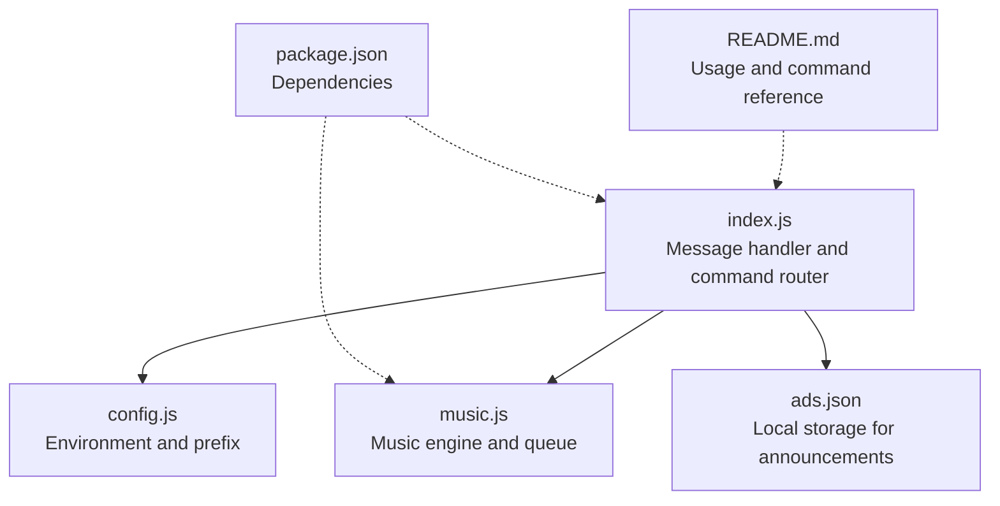
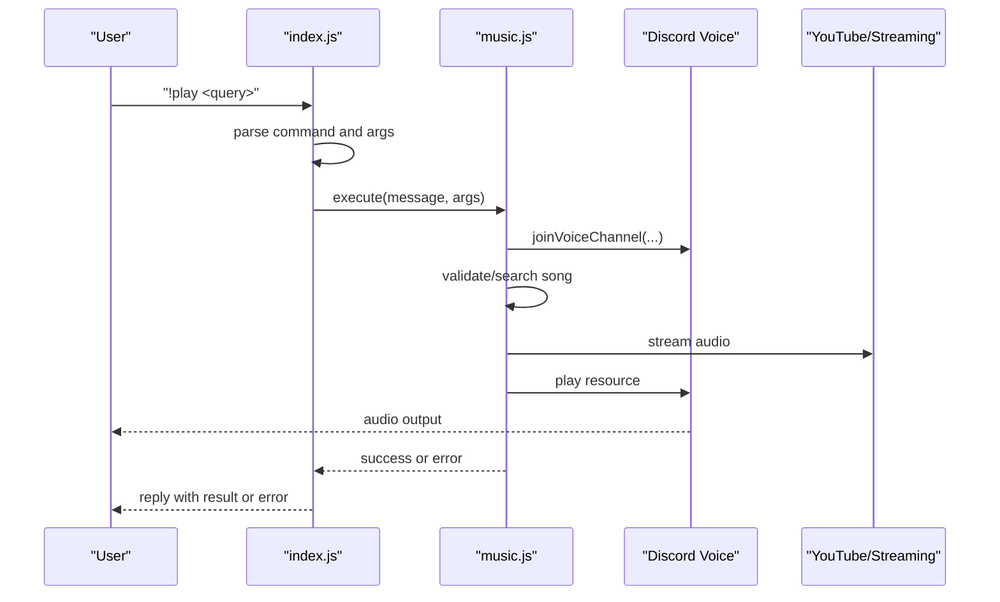
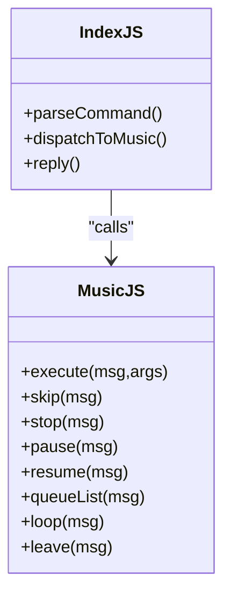
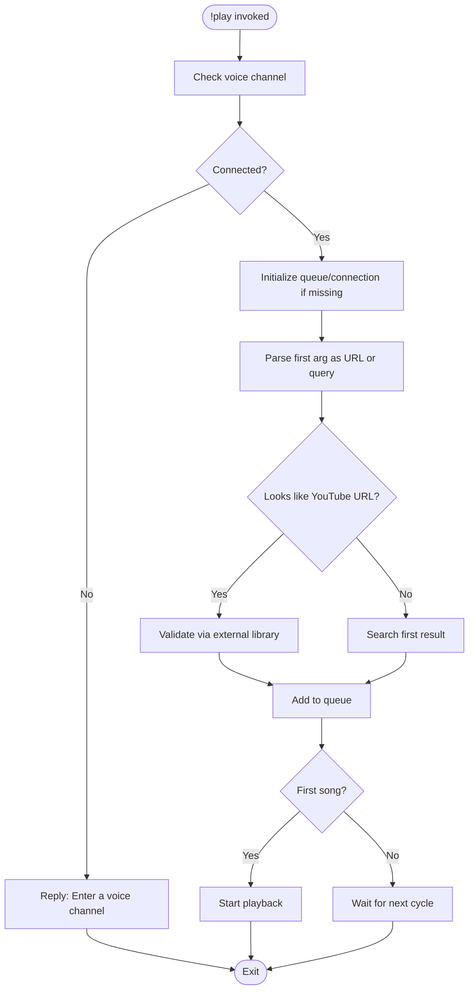
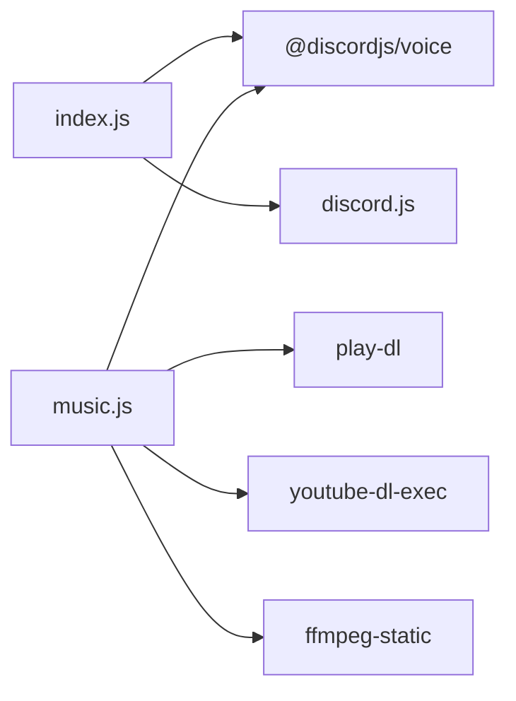

# Music Commands and Operations

<cite>
**Referenced Files in This Document**
- [index.js](file://index.js)
- [music.js](file://music.js)
- [config.js](file://config.js)
- [README.md](file://README.md)
- [package.json](file://package.json)
- [ads.json](file://ads.json)
</cite>

## Table of Contents
1. [Introduction](#introduction)
2. [Project Structure](#project-structure)
3. [Core Components](#core-components)
4. [Architecture Overview](#architecture-overview)
5. [Detailed Component Analysis](#detailed-component-analysis)
6. [Dependency Analysis](#dependency-analysis)
7. [Performance Considerations](#performance-considerations)
8. [Troubleshooting Guide](#troubleshooting-guide)
9. [Conclusion](#conclusion)
10. [Appendices](#appendices)

## Introduction
This document provides comprehensive documentation for all music-related commands and their operations. It covers command syntax, aliases, parameters, execution flow, argument parsing, validation logic, and the integration between command handlers and the underlying music engine. Practical usage examples, error scenarios, user feedback messages, permission requirements, and voice channel prerequisites are included. Command chaining, queue manipulation, and playback control sequences are explained alongside the relationship between index.js command handlers and music.js functions.

## Project Structure
The project consists of a small set of files that implement a Discord bot with two primary subsystems:
- Command routing and message processing in index.js
- Music engine and queue management in music.js
- Configuration loading in config.js
- Documentation in README.md
- Dependencies in package.json
- Local data persistence for announcements in ads.json

**Diagram sources**
- [index.js:60-389](file://index.js#L60-L389)
- [music.js:1-212](file://music.js#L1-L212)
- [config.js:1-8](file://config.js#L1-L8)
- [README.md:1-663](file://README.md#L1-L663)
- [package.json:1-24](file://package.json#L1-L24)
- [ads.json:1-4](file://ads.json#L1-L4)

**Section sources**
- [index.js:60-389](file://index.js#L60-L389)
- [music.js:1-212](file://music.js#L1-L212)
- [config.js:1-8](file://config.js#L1-L8)
- [README.md:1-663](file://README.md#L1-L663)
- [package.json:1-24](file://package.json#L1-L24)
- [ads.json:1-4](file://ads.json#L1-L4)

## Core Components
- Command routing and dispatch: index.js parses incoming messages, extracts the command and arguments, and routes to the appropriate handler.
- Music engine: music.js manages voice connections, audio players, queues, and playback lifecycle.
- Configuration: config.js loads environment variables for token, prefix, and announcement channels.
- Documentation: README.md provides usage examples, aliases, and troubleshooting notes.

Key responsibilities:
- index.js handles command parsing, alias resolution, and error handling wrappers around music.js functions.
- music.js encapsulates YouTube search/validation, audio streaming, queue manipulation, and voice channel lifecycle.

**Section sources**
- [index.js:60-389](file://index.js#L60-L389)
- [music.js:1-212](file://music.js#L1-L212)
- [config.js:1-8](file://config.js#L1-L8)
- [README.md:300-429](file://README.md#L300-L429)

## Architecture Overview
The music command architecture follows a clear separation of concerns:
- index.js listens for messages, validates prefixes, splits arguments, and dispatches to music.js functions.
- music.js maintains per-guild queues, manages voice connections, and orchestrates playback via Discord Voice and external libraries.
- Error handling is centralized in index.js command branches to provide user-friendly feedback.

**Diagram sources**
- [index.js:257-269](file://index.js#L257-L269)
- [music.js:9-95](file://music.js#L9-L95)
- [music.js:110-155](file://music.js#L110-L155)

## Detailed Component Analysis

### Command Execution Flow and Argument Parsing
- Prefix detection and argument extraction occur in index.js before command dispatch.
- The first token becomes the command; remaining tokens form the argument list.
- Aliases are handled via a switch-case on the normalized command string.

Validation and error handling:
- Each music command branch wraps the music.js function call in a try/catch and logs errors to the console while replying with a generic friendly message.

**Section sources**
- [index.js:60-66](file://index.js#L60-L66)
- [index.js:257-300](file://index.js#L257-L300)

### Command Reference and Behavior

#### !play (aliases: p, tocar)
- Purpose: Play a YouTube video or add it to the queue.
- Syntax: !play <name or YouTube URL>
- Aliases: p, tocar
- Voice channel prerequisite: Must be connected to a voice channel.
- Arguments:
  - First argument is treated as either a YouTube URL or a search query.
  - Supports direct YouTube watch URLs and video IDs.
- Validation logic:
  - Detects YouTube URLs using a regex pattern.
  - Validates URLs via external library checks.
  - Falls back to searching the first result if no URL is detected.
- Queue behavior:
  - Creates a new voice connection and player if none exists for the guild.
  - Adds the song to the queue; starts playback immediately if it was the first song.
- User feedback:
  - Replies with a message indicating the song was added.
  - On first song addition, logs that playback is starting.
- Error scenarios:
  - No voice channel: "Enter a voice channel!"
  - No results found: "Song not found!"
  - Invalid URL: "Invalid song URL!"
  - Generic processing errors: "Error processing the song. Try another link or name."

Practical usage examples:
- !play Never Gonna Give You Up
- !play https://www.youtube.com/watch?v=dQw4w9WgXcQ
- !p lofi hip hop radio

**Section sources**
- [index.js:257-269](file://index.js#L257-L269)
- [music.js:9-95](file://music.js#L9-L95)
- [README.md:306-338](file://README.md#L306-L338)

#### !skip (aliases: s, pular)
- Purpose: Skip the currently playing song.
- Syntax: !skip
- Aliases: s, pular
- Voice channel prerequisite: Must be connected to a voice channel.
- Behavior:
  - Stops the current track, advancing the queue if loop is disabled.
- User feedback:
  - "Skipped!"
- Error scenarios:
  - Nothing playing: "Nothing is playing!"

**Section sources**
- [index.js:271-274](file://index.js#L271-L274)
- [music.js:157-162](file://music.js#L157-L162)

#### !stop (aliases: parar)
- Purpose: Stop playback, clear the queue, and disconnect.
- Syntax: !stop
- Aliases: parar
- Behavior:
  - Clears the queue and stops the player.
- User feedback:
  - "Stopped!"
- Error scenarios:
  - Nothing playing: "Nothing is playing!"

**Section sources**
- [index.js:276-278](file://index.js#L276-L278)
- [music.js:164-171](file://music.js#L164-L171)

#### !pause (aliases: pausar)
- Purpose: Pause the current song.
- Syntax: !pause
- Aliases: pausar
- Behavior:
  - Pauses the player.
- User feedback:
  - "Paused!"
- Error scenarios:
  - Nothing playing: "Nothing is playing!"

**Section sources**
- [index.js:280-282](file://index.js#L280-L282)
- [music.js:173-178](file://music.js#L173-L178)

#### !resume (aliases: despausar, continuar)
- Purpose: Resume the paused song.
- Syntax: !resume
- Aliases: despausar, continuar
- Behavior:
  - Unpauses the player.
- User feedback:
  - "Resumed!"
- Error scenarios:
  - Nothing playing: "Nothing is playing!"

**Section sources**
- [index.js:284-287](file://index.js#L284-L287)
- [music.js:180-185](file://music.js#L180-L185)

#### !queue (aliases: q, fila)
- Purpose: List the current queue.
- Syntax: !queue
- Aliases: q, fila
- Behavior:
  - Lists all queued songs.
- User feedback:
  - "Queue list"
- Error scenarios:
  - Empty queue: "Queue is empty!"

**Section sources**
- [index.js:289-292](file://index.js#L289-L292)
- [music.js:187-192](file://music.js#L187-L192)

#### !loop
- Purpose: Toggle loop mode for the current song.
- Syntax: !loop
- Behavior:
  - Toggles loop flag; when enabled, the current song repeats.
- User feedback:
  - "Loop activated" or "Loop deactivated"
- Error scenarios:
  - Nothing playing: "Nothing is playing!"

**Section sources**
- [index.js:294-295](file://index.js#L294-L295)
- [music.js:194-200](file://music.js#L194-L200)

#### !leave (aliases: sair, disconnect)
- Purpose: Disconnect from the voice channel.
- Syntax: !leave
- Aliases: sair, disconnect
- Behavior:
  - Destroys the voice connection and removes the guild queue.
- User feedback:
  - "Left the call!"
- Error scenarios:
  - Not connected: "I'm not in a call!"

**Section sources**
- [index.js:297-300](file://index.js#L297-L300)
- [music.js:202-209](file://music.js#L202-L209)

### Relationship Between index.js and music.js
- index.js acts as the command router and error boundary.
- Each music command triggers a corresponding function in music.js.
- music.js encapsulates:
  - Voice connection creation and subscription
  - Queue management (songs array, loop flag)
  - Playback lifecycle (idle transitions, error handling)
  - Song fetching and streaming via external libraries

**Diagram sources**
- [index.js:257-300](file://index.js#L257-L300)
- [music.js:211](file://music.js#L211)

**Section sources**
- [index.js:257-300](file://index.js#L257-L300)
- [music.js:211](file://music.js#L211)

### Command Chaining and Queue Manipulation
- Adding multiple songs: Use !play repeatedly; each invocation adds to the queue.
- Skipping: !skip advances the queue; if loop is disabled, the current song is removed.
- Stopping: !stop clears the queue and disconnects.
- Looping: !loop toggles repeat behavior for the current song.
- Leaving: !leave disconnects without clearing the queue.

Playback control sequences:
- Start playback: Join voice channel, use !play with a valid URL or search term.
- Pause/resume: Use !pause and !resume to control the current track.
- Skip to next: Use !skip to move to the next item in the queue.

**Section sources**
- [music.js:9-95](file://music.js#L9-L95)
- [music.js:157-209](file://music.js#L157-L209)
- [README.md:300-429](file://README.md#L300-L429)

### Argument Parsing and Validation Logic
- YouTube URL detection: Uses a regex to extract a valid YouTube video ID from common URL forms.
- URL validation: Leverages external library checks to confirm validity.
- Search fallback: If no URL is detected, performs a single-result YouTube search.
- Defensive checks: Guards against undefined or invalid URLs during playback preparation.

**Diagram sources**
- [music.js:9-95](file://music.js#L9-L95)

**Section sources**
- [music.js:63-85](file://music.js#L63-L85)

### Permission Requirements and Voice Channel Prerequisites
- Voice channel prerequisite: Users must be in a voice channel to use music commands.
- Bot permissions: The bot requires Connect and Speak permissions in the voice channel.
- Intent requirements: MESSAGE CONTENT INTENT is required to read commands.

**Section sources**
- [README.md:300-302](file://README.md#L300-L302)
- [README.md:597-603](file://README.md#L597-L603)
- [README.md:627-634](file://README.md#L627-L634)
- [config.js:34-44](file://config.js#L34-L44)

## Dependency Analysis
External dependencies used by the music subsystem:
- @discordjs/voice: Voice connection and audio player
- play-dl: YouTube search and stream metadata
- youtube-dl-exec: Audio stream extraction and piping
- ffmpeg-static: FFmpeg binary for audio processing

**Diagram sources**
- [package.json:14-22](file://package.json#L14-L22)
- [index.js:1-6](file://index.js#L1-L6)
- [music.js:1-6](file://music.js#L1-L6)

**Section sources**
- [package.json:14-22](file://package.json#L14-L22)
- [index.js:1-6](file://index.js#L1-L6)
- [music.js:1-6](file://music.js#L1-L6)

## Performance Considerations
- Streaming quality: Audio is streamed from YouTube; quality depends on the platform’s availability.
- Resource cleanup: Queues are per-guild; unused queues are removed when leaving voice channels.
- Error resilience: Playback failures automatically advance the queue to prevent stalls.
- Rate limiting: While not directly applicable to music commands, general best practices apply to command usage.

[No sources needed since this section provides general guidance]

## Troubleshooting Guide
Common issues and resolutions:
- Cannot connect to voice: Ensure the bot has Connect and Speak permissions in the voice channel.
- No response to commands: Verify MESSAGE CONTENT INTENT is enabled and the prefix matches the configured value.
- Invalid token or intents: Confirm DISCORD_TOKEN and intents are correctly configured.
- URL validation failures: Use a valid YouTube URL or refine the search query.
- Queue stalls: Errors trigger automatic advancement; if stuck, use !skip or !stop.

**Section sources**
- [README.md:508-634](file://README.md#L508-L634)
- [music.js:146-154](file://music.js#L146-L154)

## Conclusion
The music command system integrates cleanly between index.js and music.js, providing a robust foundation for voice channel playback. Users benefit from intuitive commands, clear feedback, and resilient error handling. Proper configuration of intents, permissions, and environment variables ensures reliable operation across servers.

[No sources needed since this section summarizes without analyzing specific files]

## Appendices

### Command Summary Table
- !play (aliases: p, tocar): Add a song to the queue or start playback.
- !skip (aliases: s, pular): Skip the current song.
- !stop (aliases: parar): Stop playback and clear the queue.
- !pause (aliases: pausar): Pause the current song.
- !resume (aliases: despausar, continuar): Resume playback.
- !queue (aliases: q, fila): List the queue.
- !loop: Toggle loop mode.
- !leave (aliases: sair, disconnect): Leave the voice channel.

**Section sources**
- [index.js:257-300](file://index.js#L257-L300)
- [README.md:300-429](file://README.md#L300-L429)