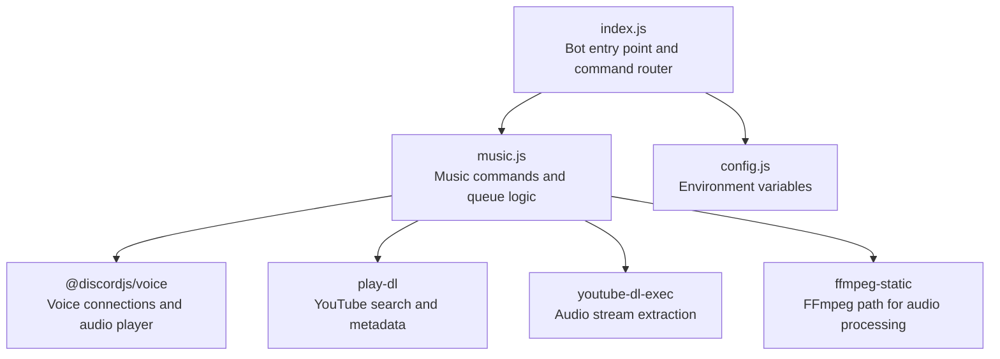
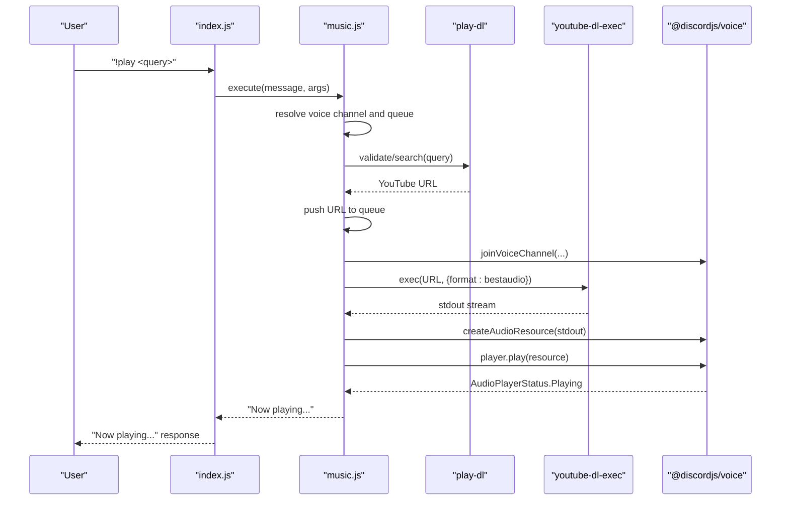
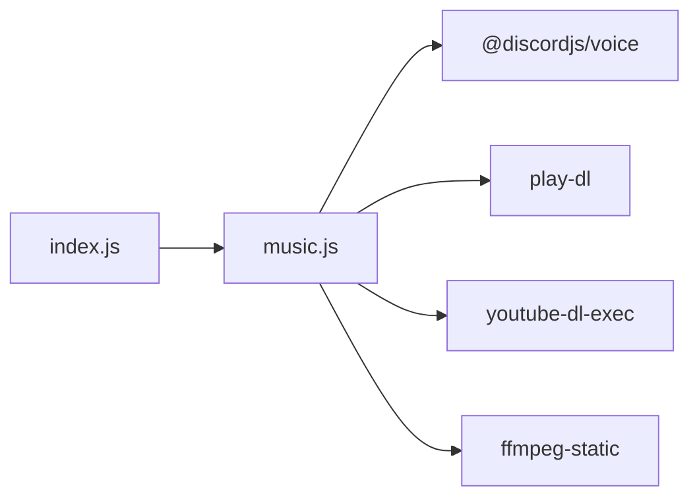

# Music Streaming System

<cite>
**Referenced Files in This Document**
- [index.js](file://index.js)
- [music.js](file://music.js)
- [package.json](file://package.json)
- [config.js](file://config.js)
- [README.md](file://README.md)
- [ads.json](file://ads.json)
</cite>

## Table of Contents
1. [Introduction](#introduction)
2. [Project Structure](#project-structure)
3. [Core Components](#core-components)
4. [Architecture Overview](#architecture-overview)
5. [Detailed Component Analysis](#detailed-component-analysis)
6. [Dependency Analysis](#dependency-analysis)
7. [Performance Considerations](#performance-considerations)
8. [Troubleshooting Guide](#troubleshooting-guide)
9. [Conclusion](#conclusion)
10. [Appendices](#appendices)

## Introduction
This document explains the music streaming system integrated into the Discord bot. It covers YouTube integration, voice channel connectivity, queue management, and all music commands. It also details the audio streaming architecture using play-dl and @discordjs/voice, and provides practical examples for common workflows such as adding songs to the queue, skipping tracks, looping, and leaving voice channels. Guidance is included for beginners and advanced developers extending the system.

## Project Structure
The music system is implemented as a separate module that the main bot integrates. The primary files involved are:
- index.js: Bot entry point, command routing, and integration with the music module
- music.js: Core music logic, YouTube parsing, queue management, and voice connectivity
- package.json: Dependencies including discord.js, @discordjs/voice, play-dl, youtube-dl-exec, ffmpeg-static
- config.js: Loads environment variables for token, prefix, and advertisement channel IDs
- README.md: Command documentation and usage examples
- ads.json: Local storage for advertisements (unrelated to music but part of the project)

**Diagram sources**
- [index.js:257-300](file://index.js#L257-L300)
- [music.js:1-212](file://music.js#L1-L212)
- [package.json:14-22](file://package.json#L14-L22)

**Section sources**
- [index.js:1-396](file://index.js#L1-L396)
- [music.js:1-212](file://music.js#L1-L212)
- [package.json:1-24](file://package.json#L1-L24)
- [config.js:1-8](file://config.js#L1-L8)

## Core Components
- Command Router: Routes incoming messages to the appropriate handler based on the prefix and command name. Music commands are delegated to the music module.
- Music Module: Implements YouTube URL parsing, queue management, voice channel joining, audio streaming, and player controls.
- Voice Connectivity: Uses @discordjs/voice to connect to voice channels and manage audio playback.
- Audio Streaming: Uses play-dl for YouTube search/validation and youtube-dl-exec to extract best audio streams, processed by ffmpeg-static.

Key responsibilities:
- Parse YouTube URLs and fallback to search when needed
- Manage a guild-based queue with loop control
- Handle player events (idle, playing, errors)
- Provide commands for play, skip, stop, pause, resume, queue, loop, and leave

**Section sources**
- [index.js:257-300](file://index.js#L257-L300)
- [music.js:9-155](file://music.js#L9-L155)
- [music.js:157-212](file://music.js#L157-L212)

## Architecture Overview
The music system follows a modular design:
- index.js listens for messages and dispatches music commands to music.js
- music.js manages voice connections, audio players, and queues per guild
- play-dl validates YouTube URLs and performs searches
- youtube-dl-exec extracts audio streams
- @discordjs/voice handles voice connections and audio resources

**Diagram sources**
- [index.js:257-269](file://index.js#L257-L269)
- [music.js:9-95](file://music.js#L9-L95)
- [music.js:110-155](file://music.js#L110-L155)

## Detailed Component Analysis

### YouTube Integration and URL Parsing
- URL Validation and Extraction:
  - Recognizes YouTube watch URLs and short links (yout.be)
  - Extracts the 11-character video ID and constructs a canonical URL
  - Falls back to play-dl’s validation for direct URLs
- Search Fallback:
  - If input is not a valid YouTube URL, performs a single-result search via play-dl
  - Uses the first search result’s URL
- Audio Quality:
  - youtube-dl-exec is configured to fetch the best available audio stream
  - ffmpeg-static is used to ensure FFmpeg availability for audio processing

Operational behavior:
- If a URL is invalid or search yields no results, the system replies with an error and does not enqueue the track
- The queue stores raw YouTube URLs; playback is deferred until the player is ready

**Section sources**
- [music.js:63-85](file://music.js#L63-L85)
- [music.js:110-134](file://music.js#L110-L134)
- [music.js:146-154](file://music.js#L146-L154)

### Voice Channel Connectivity
- Joining:
  - On first play, the bot joins the user’s voice channel and creates a player
  - Subsequent plays reuse the existing connection and player
- Connection Events:
  - Logs state changes and errors for diagnostics
- Leaving:
  - destroy() disconnects the bot and clears the guild’s queue
- Auto-disconnect:
  - The README mentions an auto-disconnect behavior after the queue becomes empty; however, the current implementation does not implement a timer-based disconnect. The queue is cleared on stop, and the bot leaves on leave command.

Permissions:
- Requires Connect and Speak permissions in the voice channel
- MESSAGE CONTENT INTENT is required for the bot to read commands

**Section sources**
- [music.js:16-39](file://music.js#L16-L39)
- [music.js:202-209](file://music.js#L202-L209)
- [README.md:607-614](file://README.md#L607-L614)

### Queue Management
- Guild-based Queue:
  - Each guild maintains its own queue stored in memory
  - Queue items are YouTube URLs
- Playback Flow:
  - When the queue length transitions from 0 to 1, the system starts playback
  - On idle, if not looping, the current song is removed and the next song is played
  - On player error, the current song is removed and the next song is attempted
- Loop Controls:
  - Toggle loop mode per guild; when enabled, the current song repeats instead of advancing
- Queue Commands:
  - queueList prints the current queue indices and URLs
- Auto-disconnect:
  - The README documents an auto-disconnect after 30 seconds when the queue is empty; the current implementation does not implement this timing. The queue is cleared on stop and the bot leaves on leave.

Song Positioning:
- The queue is an ordered list; indexing starts at 0
- The current song is at index 0; subsequent songs follow

**Section sources**
- [music.js:24-29](file://music.js#L24-L29)
- [music.js:44-58](file://music.js#L44-L58)
- [music.js:187-192](file://music.js#L187-L192)
- [music.js:194-200](file://music.js#L194-L200)
- [README.md:656](file://README.md#L656)

### Audio Streaming Architecture
- play-dl:
  - Validates YouTube URLs and performs searches
  - Provides metadata and URLs for playback
- youtube-dl-exec:
  - Spawns a process to extract the best audio stream
  - Streams audio to the player via stdout
- @discordjs/voice:
  - Creates audio players and resources
  - Manages voice connections and playback lifecycle
- ffmpeg-static:
  - Sets the FFmpeg executable path for audio processing

Error Handling:
- Errors during URL validation, search, or stream creation are caught and logged
- On player error, the system advances to the next song automatically

**Section sources**
- [music.js:3](file://music.js#L3-L5)
- [music.js:110-155](file://music.js#L110-L155)
- [package.json:14-22](file://package.json#L14-L22)

### Music Commands Reference

- !play, !p, !tocar
  - Aliases: p, tocar
  - Behavior: Joins voice channel, validates/loads YouTube URL, enqueues, and starts playback if queue was empty
  - Syntax: !play <YouTube URL or search term>
  - Notes: First play triggers voice join; subsequent plays add to queue

- !skip, !s, !pular
  - Aliases: s, pular
  - Behavior: Stops current playback and proceeds to next song

- !stop, !parar
  - Aliases: parar
  - Behavior: Clears the queue and stops playback; disconnects the bot

- !pause, !pausar
  - Aliases: pausar
  - Behavior: Pauses current playback

- !resume, !despausar, !continuar
  - Aliases: despausar, continuar
  - Behavior: Resumes paused playback

- !queue, !q, !fila
  - Aliases: q, fila
  - Behavior: Lists queued URLs with positions

- !loop
  - Behavior: Toggles loop mode for the current song

- !leave, !sair, !disconnect
  - Aliases: sair, disconnect
  - Behavior: Disconnects the bot and removes the guild’s queue

Operational Notes:
- All commands require the user to be in a voice channel except leave
- Player events drive queue advancement and error recovery
- The queue is guild-scoped; multiple text channels share the same queue

**Section sources**
- [index.js:257-300](file://index.js#L257-L300)
- [music.js:157-212](file://music.js#L157-L212)

### Practical Workflows

- Adding a Song to the Queue
  - User enters a voice channel
  - Executes !play with a YouTube URL or search term
  - Bot validates the URL, enqueues, and starts playback if needed

- Skipping to the Next Song
  - Execute !skip to stop the current song and advance to the next

- Stopping Playback and Clearing the Queue
  - Execute !stop to clear the queue and disconnect the bot

- Pausing and Resuming Playback
  - Execute !pause to pause and !resume to resume

- Viewing the Queue
  - Execute !queue to list queued URLs

- Looping the Current Song
  - Execute !loop to toggle repeat mode

- Leaving the Voice Channel
  - Execute !leave to disconnect without clearing the queue

**Section sources**
- [index.js:257-300](file://index.js#L257-L300)
- [music.js:9-95](file://music.js#L9-L95)
- [music.js:157-212](file://music.js#L157-L212)

## Dependency Analysis
External libraries and their roles:
- discord.js: Bot framework and message handling
- @discordjs/voice: Voice connections and audio player
- play-dl: YouTube URL validation and search
- youtube-dl-exec: Audio stream extraction
- ffmpeg-static: FFmpeg executable path

**Diagram sources**
- [package.json:14-22](file://package.json#L14-L22)
- [music.js:1-6](file://music.js#L1-L6)

**Section sources**
- [package.json:14-22](file://package.json#L14-L22)
- [music.js:1-6](file://music.js#L1-L6)

## Performance Considerations
- Stream Selection: Using bestaudio ensures optimal quality from YouTube’s available formats
- Resource Cleanup: On player error, the system advances to the next song to prevent stalls
- Queue Efficiency: Queue operations are O(1) for push/pop at the head/tail; queue listing is linear in the number of items
- Memory: Queues are held in memory per guild; consider persistence if scaling to many guilds
- FFmpeg Availability: ffmpeg-static sets the executable path to ensure consistent audio processing

[No sources needed since this section provides general guidance]

## Troubleshooting Guide
Common issues and resolutions:
- Cannot read properties of undefined (reading 'split')
  - Cause: Incorrect encoding in .env (e.g., UTF-8 with BOM)
  - Resolution: Save .env as UTF-8 without BOM and ensure no leading spaces or invisible characters
- Invalid token
  - Cause: Incorrect DISCORD_TOKEN in .env
  - Resolution: Regenerate token in Discord Developer Portal and update .env
- Missing Permissions
  - Cause: Bot lacks Connect/Speak in voice channel or Send Messages in text channel
  - Resolution: Grant required permissions in channel settings
- MESSAGE CONTENT INTENT not enabled
  - Cause: Bot cannot read command messages
  - Resolution: Enable MESSAGE CONTENT INTENT in Developer Portal
- “You need to be in a voice channel”
  - Cause: Executing music commands without being in a voice channel
  - Resolution: Join a voice channel and retry
- “Already playing in another voice channel”
  - Cause: Bot is connected to a different voice channel
  - Resolution: Join the same voice channel or use !leave to move the bot

**Section sources**
- [README.md:508-594](file://README.md#L508-L594)
- [README.md:597-635](file://README.md#L597-L635)

## Conclusion
The music streaming system integrates seamlessly with the bot’s command router and provides a robust foundation for YouTube playback in voice channels. It supports guild-scoped queues, loop controls, and essential player actions. While the README documents an auto-disconnect behavior, the current implementation focuses on queue-driven playback and manual disconnects. Developers can extend the system by adding features like queue persistence, position-based queue manipulation, and advanced loop modes.

[No sources needed since this section summarizes without analyzing specific files]

## Appendices

### Command Syntax and Aliases Summary
- !play, !p, !tocar
- !skip, !s, !pular
- !stop, !parar
- !pause, !pausar
- !resume, !despausar, !continuar
- !queue, !q, !fila
- !loop
- !leave, !sair, !disconnect

**Section sources**
- [index.js:257-300](file://index.js#L257-L300)

### Environment Variables
- DISCORD_TOKEN: Bot token from Discord Developer Portal
- PREFIX: Command prefix (default: !)
- AD_CHANNEL_IDS: Comma-separated list of announcement channel IDs

**Section sources**
- [config.js:3-7](file://config.js#L3-L7)
- [README.md:99-112](file://README.md#L99-L112)