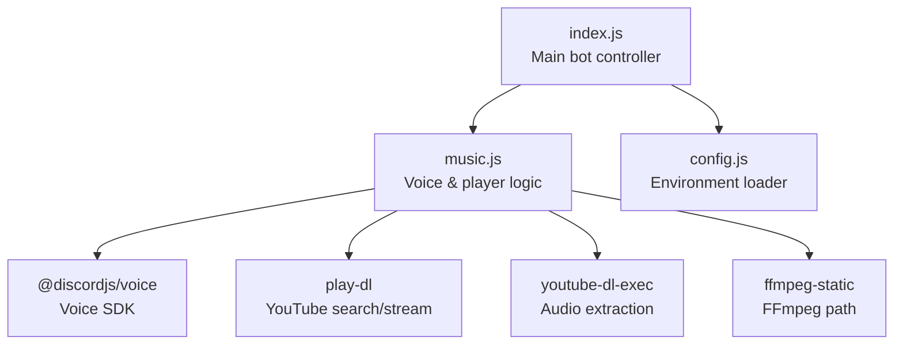
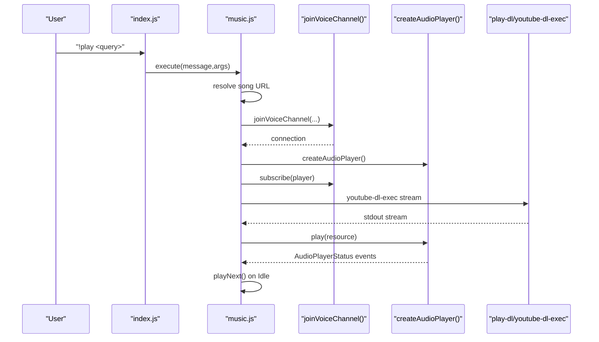
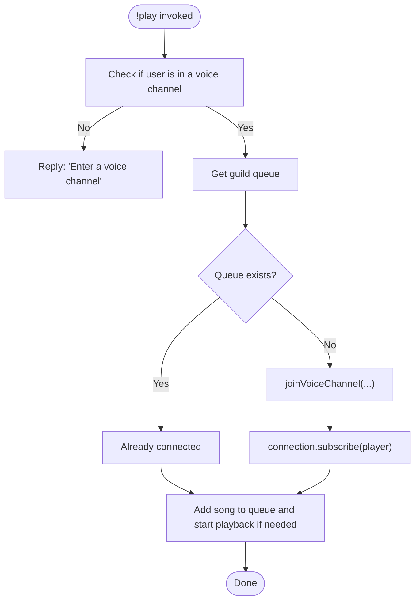
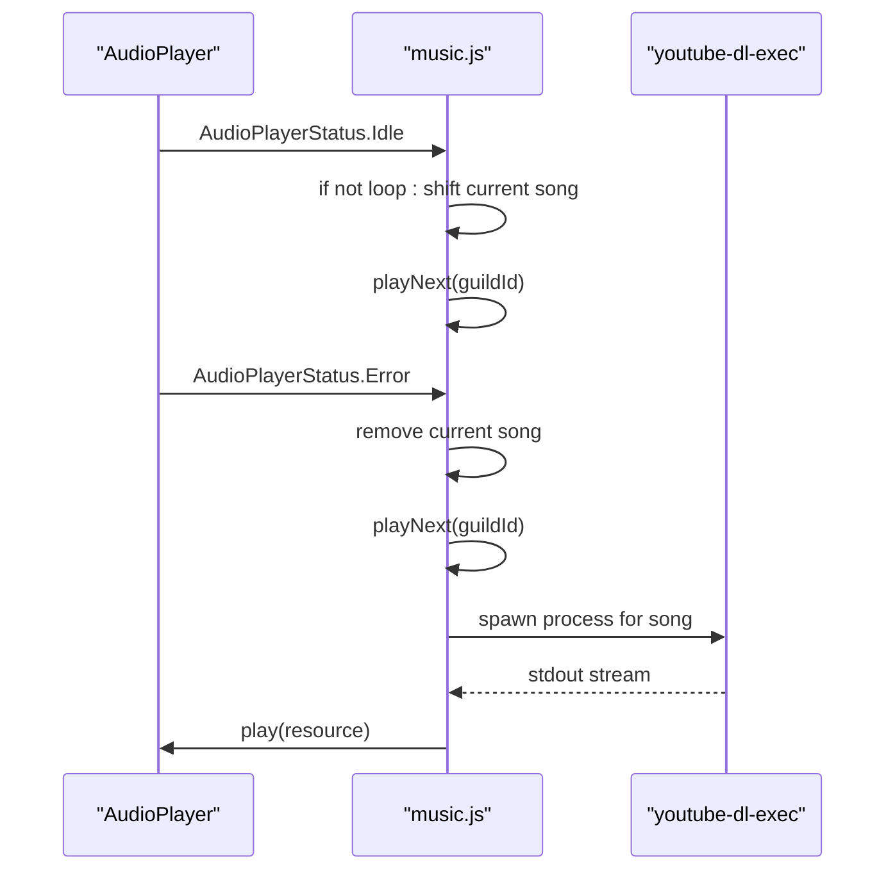
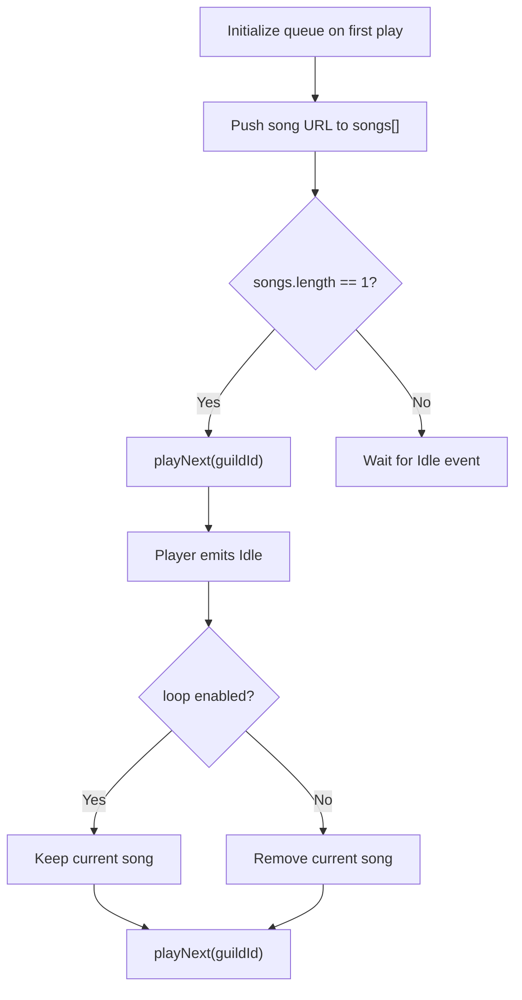
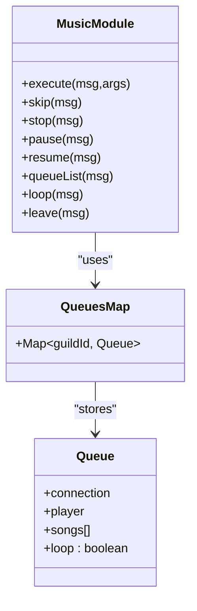
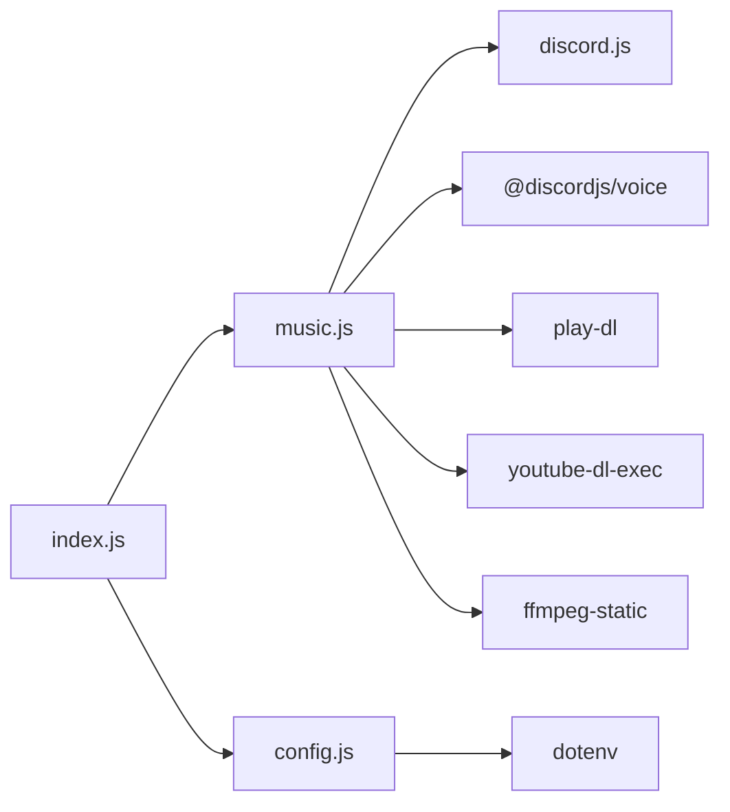

# Voice Channel Connectivity and Player Control

<cite>
**Referenced Files in This Document**
- [README.md](file://README.md)
- [index.js](file://index.js)
- [music.js](file://music.js)
- [config.js](file://config.js)
- [package.json](file://package.json)
</cite>

## Table of Contents
1. [Introduction](#introduction)
2. [Project Structure](#project-structure)
3. [Core Components](#core-components)
4. [Architecture Overview](#architecture-overview)
5. [Detailed Component Analysis](#detailed-component-analysis)
6. [Dependency Analysis](#dependency-analysis)
7. [Performance Considerations](#performance-considerations)
8. [Troubleshooting Guide](#troubleshooting-guide)
9. [Conclusion](#conclusion)
10. [Appendices](#appendices)

## Introduction
This document explains the voice channel connectivity and audio player control systems implemented in the project. It covers:
- Voice channel joining and connection state management
- Automatic disconnection behavior
- Audio player lifecycle and event handling
- Queue management per guild
- Practical guidance for permissions, troubleshooting, and error handling

The system integrates Discord.js v14 with @discordjs/voice for voice connectivity and play-dl/youtube-dl-exec for audio streaming.

## Project Structure
The project consists of:
- A main entry point that handles commands and routes music commands to a dedicated module
- A music module that manages voice connections, players, and queues
- A configuration module that loads environment variables
- A README with usage, commands, and troubleshooting

**Diagram sources**
- [index.js:1-396](file://index.js#L1-L396)
- [music.js:1-212](file://music.js#L1-L212)
- [config.js:1-8](file://config.js#L1-L8)
- [package.json:14-22](file://package.json#L14-L22)

**Section sources**
- [index.js:1-396](file://index.js#L1-L396)
- [music.js:1-212](file://music.js#L1-L212)
- [config.js:1-8](file://config.js#L1-L8)
- [package.json:14-22](file://package.json#L14-L22)

## Core Components
- Voice channel joining and connection management
- Audio player lifecycle and event subscriptions
- Guild-based queue storage and sequential playback
- Command routing from the main bot to the music module

Key responsibilities:
- Join voice channels on demand and subscribe the player
- Manage connection state transitions and errors
- Stream audio using youtube-dl-exec and play-dl
- Maintain a per-guild queue and handle looping and skipping
- Provide commands for control and queue inspection

**Section sources**
- [index.js:257-300](file://index.js#L257-L300)
- [music.js:9-95](file://music.js#L9-L95)
- [music.js:97-155](file://music.js#L97-L155)
- [music.js:157-209](file://music.js#L157-L209)

## Architecture Overview
The voice subsystem is encapsulated in the music module and is invoked by the main bot controller. The flow below maps actual code paths.

**Diagram sources**
- [index.js:257-269](file://index.js#L257-L269)
- [music.js:9-95](file://music.js#L9-L95)
- [music.js:97-155](file://music.js#L97-L155)

## Detailed Component Analysis

### Voice Channel Joining and Connection Management
- The system requires the user to be in a voice channel before playing.
- On first play, it creates a connection using joinVoiceChannel() with guildId and adapterCreator from the guild.
- Subscribes the player to the connection so the player receives audio events.
- Logs connection state changes and captures connection errors.

Connection lifecycle:
- Creation: joinVoiceChannel(...) with channelId, guildId, and adapterCreator
- Subscription: connection.subscribe(player)
- Destruction: connection.destroy() on leave

**Diagram sources**
- [music.js:9-95](file://music.js#L9-L95)

**Section sources**
- [music.js:9-95](file://music.js#L9-L95)

### Audio Player Lifecycle and Event Handling
- Player creation occurs when a new queue is initialized.
- Events handled:
  - Idle: advances to next song (unless loop is enabled)
  - Playing: logs start
  - Error: logs error, removes current song, and continues to next

Playback flow:
- playNext() retrieves the current song from the queue
- Starts youtube-dl-exec to extract audio stream
- Wraps stdout into an arbitrary stream resource
- Plays the resource on the player

**Diagram sources**
- [music.js:44-58](file://music.js#L44-L58)
- [music.js:97-155](file://music.js#L97-L155)

**Section sources**
- [music.js:44-58](file://music.js#L44-L58)
- [music.js:97-155](file://music.js#L97-L155)

### Queue Management
- Queue storage: a Map keyed by guildId
- Each queue contains:
  - connection: the voice connection
  - player: the audio player
  - songs: array of song URLs
  - loop: boolean flag for repeating the current song

Behavior:
- Adding songs: push to songs array
- Starting playback: if queue length becomes 1, trigger playNext
- Skipping: stop the player to move to next song
- Stopping: clear songs and stop player
- Loop toggle: flip loop flag

**Diagram sources**
- [music.js:7-32](file://music.js#L7-L32)
- [music.js:97-155](file://music.js#L97-L155)

**Section sources**
- [music.js:7-32](file://music.js#L7-L32)
- [music.js:97-155](file://music.js#L97-L155)

### Player Controls and Commands
- skip: stops the current track to advance the queue
- stop: clears the queue and stops the player
- pause/resume: pauses/unpauses the current track
- queueList: lists queued songs
- loop: toggles repeat mode
- leave: destroys the voice connection and removes the queue

**Diagram sources**
- [music.js:157-209](file://music.js#L157-L209)
- [music.js:7](file://music.js#L7)

**Section sources**
- [music.js:157-209](file://music.js#L157-L209)

### Connection State Management and Automatic Disconnection
- Connection state logging is performed on stateChange events.
- Connection errors are captured and logged.
- Automatic disconnection behavior:
  - The README documents auto-disconnect after 30 seconds when the queue is empty.
  - The current implementation does not programmatically destroy the connection on idle; manual leave is required.

Operational note:
- The music module exposes a leave function that destroys the connection and deletes the queue entry.

**Section sources**
- [music.js:36-42](file://music.js#L36-L42)
- [music.js:202-209](file://music.js#L202-L209)
- [README.md:656](file://README.md#L656)

## Dependency Analysis
External libraries and their roles:
- discord.js: main bot framework and message/command handling
- @discordjs/voice: voice channel connectivity and audio player
- play-dl: YouTube search and metadata
- youtube-dl-exec: audio extraction and streaming
- ffmpeg-static: FFmpeg path configuration
- dotenv: environment variable loading

**Diagram sources**
- [index.js:1-6](file://index.js#L1-L6)
- [music.js:1-6](file://music.js#L1-L6)
- [config.js:1-2](file://config.js#L1-L2)
- [package.json:14-22](file://package.json#L14-L22)

**Section sources**
- [package.json:14-22](file://package.json#L14-L22)

## Performance Considerations
- Streaming strategy: Uses youtube-dl-exec to pipe audio to the player, minimizing memory overhead.
- Queue processing: Sequential playback with minimal overhead; loop mode avoids re-fetching the same song.
- Resource cleanup: Destroying the connection frees resources; leaving the queue map entry intact until the next play.

[No sources needed since this section provides general guidance]

## Troubleshooting Guide

### Voice Channel Permissions
- Required permissions in the voice channel:
  - Connect
  - Speak
- Without these, the bot cannot join or transmit audio.

**Section sources**
- [README.md:627-635](file://README.md#L627-L635)

### Connection Troubleshooting
Common symptoms and causes:
- “You need to be in a voice channel!”
  - Cause: User not in a voice channel when issuing play.
  - Action: Join a voice channel and retry.
- “Already playing in another voice channel!”
  - Cause: Bot already connected to a different voice channel.
  - Action: Join the same voice channel or use leave to disconnect the bot from the other channel.
- “Error: Used disallowed intents”
  - Cause: Unauthorized privileged intents.
  - Action: Verify intents in the Developer Portal and restart the bot.

**Section sources**
- [README.md:597-614](file://README.md#L597-L614)
- [README.md:586-594](file://README.md#L586-L594)

### Player State Recovery
- Idle state:
  - The player advances to the next song automatically unless loop is enabled.
- Error handling:
  - Errors remove the current song and continue playback.
- Manual recovery:
  - Use skip to force advancement.
  - Use stop to clear the queue and stop playback.
  - Use leave to reset the connection state.

**Section sources**
- [music.js:44-58](file://music.js#L44-L58)
- [music.js:157-171](file://music.js#L157-L171)
- [music.js:202-209](file://music.js#L202-L209)

### Network Issues and Timeouts
- Playback failures:
  - Invalid or unavailable YouTube links cause errors; the system skips the problematic song.
- Process errors:
  - youtube-dl-exec errors are logged; the system attempts to continue with the next song.
- Recommendations:
  - Prefer direct YouTube URLs for reliability.
  - Retry after verifying the video’s availability.

**Section sources**
- [music.js:112-155](file://music.js#L112-L155)
- [README.md:617-625](file://README.md#L617-L625)

### Voice Channel Limits and Auto-disconnect
- Auto-disconnect:
  - The README indicates auto-disconnect after 30 seconds when the queue is empty.
  - Current implementation does not automatically destroy the connection; use leave to disconnect.
- Best practice:
  - Explicitly use leave when finished to free resources promptly.

**Section sources**
- [README.md:656](file://README.md#L656)
- [music.js:202-209](file://music.js#L202-L209)

## Conclusion
The voice channel and audio player system provides a robust foundation for music playback:
- Dynamic voice joining and connection subscription
- Reliable queue management per guild
- Clear event-driven player control
- Practical troubleshooting guidance

To enhance automation, consider integrating an idle timer that triggers connection.destroy() when the queue is empty, aligning with the documented behavior.

[No sources needed since this section summarizes without analyzing specific files]

## Appendices

### Command Reference (Music)
- !play, !p, !tocar: Play a song or add to queue
- !skip, !s, !pular: Skip current song
- !stop, !parar: Stop and clear queue
- !pause, !pausar: Pause playback
- !resume, !despausar, !continuar: Resume playback
- !queue, !q, !fila: List queued songs
- !loop: Toggle loop mode
- !leave, !sair, !disconnect: Leave voice channel

**Section sources**
- [index.js:257-300](file://index.js#L257-L300)
- [README.md:300-428](file://README.md#L300-L428)