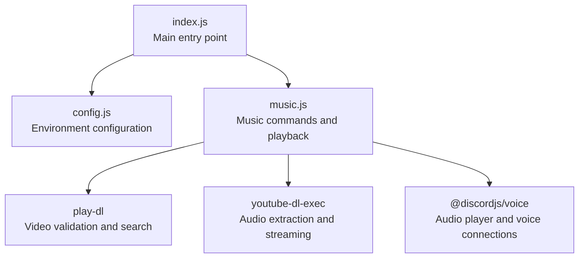
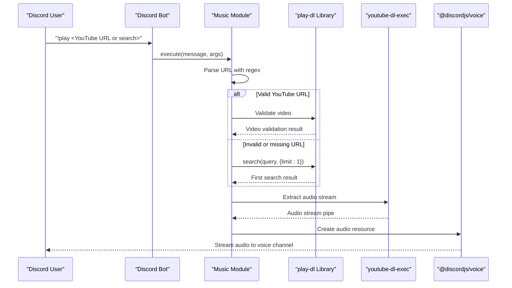
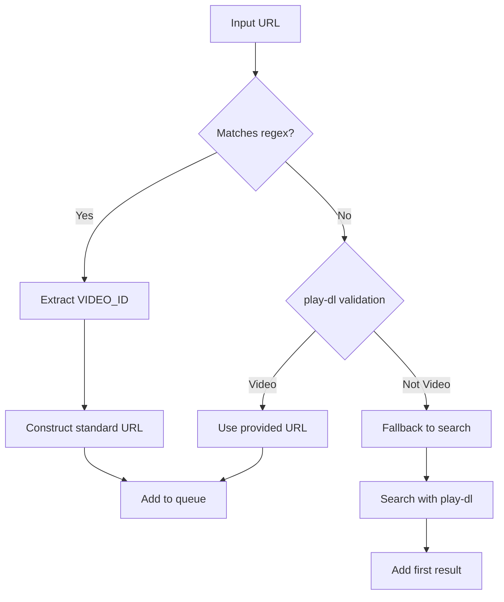
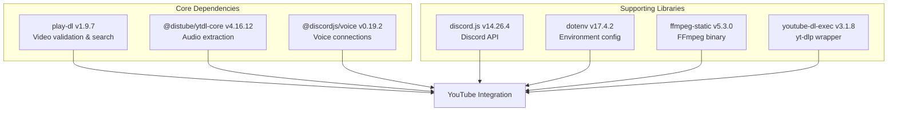

# YouTube Integration and URL Processing

<cite>
**Referenced Files in This Document**
- [index.js](file://index.js)
- [music.js](file://music.js)
- [config.js](file://config.js)
- [package.json](file://package.json)
- [README.md](file://README.md)
</cite>

## Table of Contents
1. [Introduction](#introduction)
2. [Project Structure](#project-structure)
3. [Core Components](#core-components)
4. [Architecture Overview](#architecture-overview)
5. [Detailed Component Analysis](#detailed-component-analysis)
6. [Dependency Analysis](#dependency-analysis)
7. [Performance Considerations](#performance-considerations)
8. [Troubleshooting Guide](#troubleshooting-guide)
9. [Conclusion](#conclusion)

## Introduction
This document provides comprehensive documentation for the YouTube integration system used by the Discord bot. It focuses on URL validation logic using regex patterns for YouTube URLs, the integration with the play-dl library for video validation and search functionality, and the fallback search system. It also explains the YouTube URL parsing mechanism that extracts video IDs from various URL formats, the integration with ytdl-core for audio-only streams, and streaming quality settings. Practical examples of supported URL formats, invalid URL handling, and error scenarios are included, along with guidance on YouTube API limitations, video availability checks, and streaming performance optimization.

## Project Structure
The project follows a modular structure with a main entry point, configuration loading, and a dedicated module for music-related commands and playback logic. The music module encapsulates all YouTube integration concerns, including URL validation, search fallback, and audio streaming.

**Diagram sources**
- [index.js:1-396](file://index.js#L1-L396)
- [music.js:1-212](file://music.js#L1-L212)
- [config.js:1-8](file://config.js#L1-L8)

**Section sources**
- [index.js:1-396](file://index.js#L1-L396)
- [music.js:1-212](file://music.js#L1-L212)
- [config.js:1-8](file://config.js#L1-L8)

## Core Components
The YouTube integration system consists of several core components:

- **URL Validation Engine**: Uses regex patterns to extract YouTube video IDs from various URL formats
- **Search Fallback System**: Implements fallback search using play-dl when direct URLs are not provided
- **Audio Streaming Pipeline**: Integrates with ytdl-core for audio-only stream extraction
- **Queue Management**: Maintains per-server queues for music playback
- **Error Handling**: Comprehensive error handling for invalid URLs, unavailable videos, and streaming failures

Key implementation highlights:
- Regex-based URL parsing supporting multiple YouTube URL formats
- Integration with play-dl for both URL validation and search functionality
- Audio stream creation using ytdl-core with configurable quality settings
- Robust queue management with loop functionality and auto-disconnect

**Section sources**
- [music.js:63-95](file://music.js#L63-L95)
- [music.js:97-155](file://music.js#L97-L155)
- [music.js:1-212](file://music.js#L1-L212)

## Architecture Overview
The YouTube integration follows a layered architecture with clear separation of concerns:

**Diagram sources**
- [music.js:9-95](file://music.js#L9-L95)
- [music.js:110-145](file://music.js#L110-L145)

## Detailed Component Analysis

### URL Validation and Parsing Logic
The system implements sophisticated URL validation and parsing using regex patterns to support multiple YouTube URL formats:

#### Supported URL Formats
- Standard YouTube watch URLs: `youtube.com/watch?v={VIDEO_ID}`
- Shortened URLs: `youtu.be/{VIDEO_ID}`
- Various parameter combinations and URL variations

#### Regex Pattern Implementation
The URL validation uses a comprehensive regex pattern that captures YouTube video IDs from different URL structures. The pattern handles:
- Standard watch URLs with query parameters
- Shortened youtu.be URLs
- Additional URL parameters and fragments
- Edge cases in URL formatting

#### Video ID Extraction Process

**Diagram sources**
- [music.js:63-80](file://music.js#L63-L80)

**Section sources**
- [music.js:63-80](file://music.js#L63-L80)

### Search Functionality and Fallback System
The fallback search system provides robust functionality when direct YouTube URLs are not provided:

#### Search Implementation Details
- Uses play-dl.search() with a limit of 1 result for efficiency
- Handles empty search results gracefully
- Provides meaningful error messages for search failures
- Integrates seamlessly with the URL validation flow

#### Search Result Processing
The system processes search results by extracting the URL from the first result and adding it to the queue. This ensures consistent behavior regardless of whether a direct URL or search query was provided.

**Section sources**
- [music.js:72-76](file://music.js#L72-L76)

### Audio Streaming and Quality Settings
The audio streaming pipeline integrates multiple libraries for optimal performance:

#### Library Integration
- **play-dl**: Video validation and search functionality
- **youtube-dl-exec**: Audio stream extraction and piping
- **@discordjs/voice**: Audio player and voice connection management

#### Streaming Configuration
The system uses yt-dlp (via youtube-dl-exec) with the following configuration:
- Output format: bestaudio
- Quiet mode enabled to reduce noise
- No warnings to minimize console output
- Certificate checking disabled for reliability
- Free formats preferred for compatibility

#### Audio Resource Creation
The extracted audio stream is wrapped as an AudioResource using StreamType.Arbitrary, enabling seamless integration with Discord's voice system.

**Section sources**
- [music.js:110-145](file://music.js#L110-L145)

### Queue Management and Playback Control
The system maintains per-server queues with comprehensive playback control:

#### Queue Structure
- Per-guild queue storage using Map data structure
- Song queue with loop functionality
- Automatic cleanup of failed or invalid entries
- Graceful handling of queue changes during playback

#### Playback Control Functions
- Skip: Stop current song and advance to next
- Stop: Clear queue and disconnect from voice channel
- Pause/Resume: Control current song playback
- Loop: Toggle repeat mode for current song
- Leave: Disconnect from voice channel

**Section sources**
- [music.js:157-209](file://music.js#L157-L209)

## Dependency Analysis
The YouTube integration relies on several key dependencies that work together to provide comprehensive functionality:

**Diagram sources**
- [package.json:14-22](file://package.json#L14-L22)

### Dependency Relationships
- **play-dl** provides the primary interface for YouTube video validation and search
- **youtube-dl-exec** serves as a wrapper around yt-dlp for audio extraction
- **@discordjs/voice** handles the audio player and voice connection management
- **discord.js** provides the Discord API integration and command processing
- **dotenv** manages environment variable configuration

**Section sources**
- [package.json:14-22](file://package.json#L14-L22)

## Performance Considerations
Several factors impact the performance and reliability of the YouTube integration:

### Streaming Performance Optimization
- **Buffer Management**: The system uses yt-dlp's built-in buffering for efficient audio streaming
- **Connection Reuse**: Voice connections are reused across multiple songs to minimize overhead
- **Queue Processing**: Songs are processed sequentially to prevent resource conflicts
- **Memory Management**: Failed or invalid entries are automatically cleaned from queues

### Quality and Compatibility Settings
- **Best Audio Format**: Uses bestaudio format for optimal quality
- **Free Formats Preferred**: Ensures compatibility with various network conditions
- **Certificate Handling**: Disabled certificate checking for improved reliability
- **Quiet Mode**: Reduces console output and processing overhead

### Error Recovery and Resilience
- **Graceful Degradation**: Invalid URLs trigger immediate fallback to search
- **Queue Integrity**: Failed songs are removed from queues to prevent blocking
- **Connection Monitoring**: Automatic detection and handling of connection issues
- **Timeout Handling**: Proper cleanup of resources during errors

## Troubleshooting Guide

### Common URL Validation Issues
- **Invalid URL Format**: Ensure URLs follow supported YouTube formats
- **Missing Video ID**: Verify that URLs contain valid YouTube video identifiers
- **Unsupported URL Types**: Only standard YouTube URLs are supported

### Search and Playback Problems
- **No Search Results**: Try more specific search terms or use direct URLs
- **Video Unavailable**: Private videos, age-restricted content, or deleted videos cannot be played
- **Streaming Failures**: Network connectivity or YouTube service issues may cause temporary failures

### Environment Configuration
- **Missing Dependencies**: Ensure all required packages are installed
- **FFmpeg Issues**: Verify FFmpeg installation and accessibility
- **Discord Permissions**: Confirm bot has necessary voice permissions

### Error Scenarios and Handling
The system implements comprehensive error handling for various failure modes:
- Invalid URL detection and fallback to search
- Video validation failures with graceful degradation
- Streaming errors with automatic queue advancement
- Connection issues with proper cleanup and logging

**Section sources**
- [music.js:77-85](file://music.js#L77-L85)
- [music.js:146-154](file://music.js#L146-L154)
- [README.md:508-657](file://README.md#L508-L657)

## Conclusion
The YouTube integration system provides a robust, feature-complete solution for playing YouTube content in Discord voice channels. Its architecture balances simplicity with powerful functionality, offering support for multiple URL formats, intelligent fallback mechanisms, and reliable streaming performance. The modular design ensures maintainability while the comprehensive error handling provides resilience against common failure scenarios. The system successfully addresses YouTube API limitations through direct stream extraction and provides users with a seamless music playback experience across various Discord server configurations.