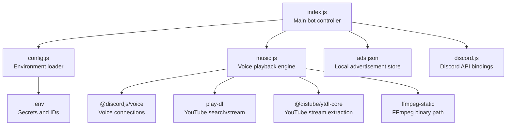
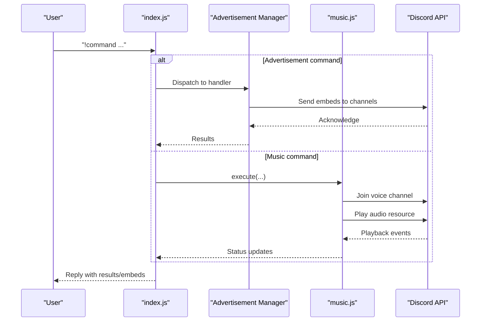
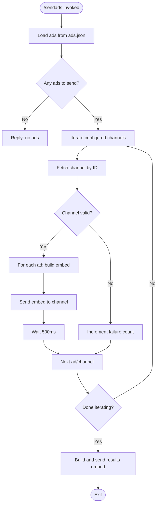
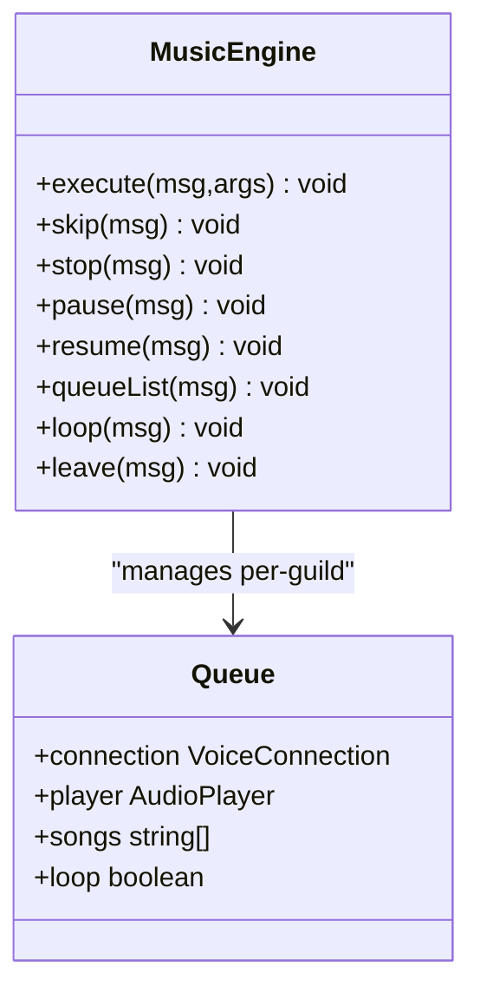
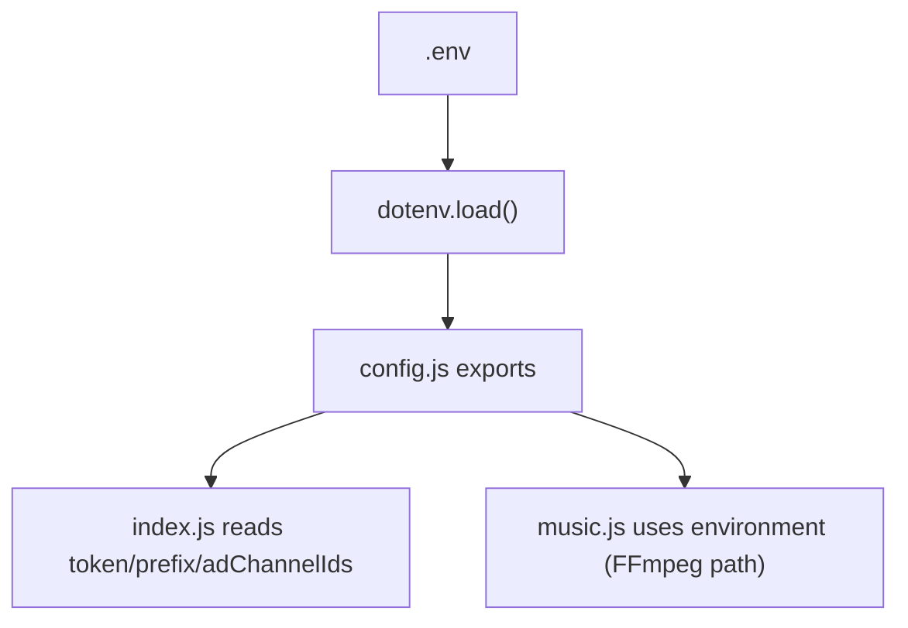
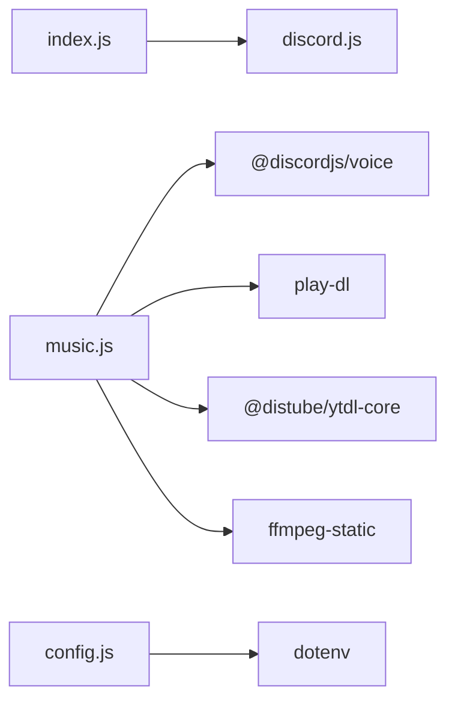

# Project Overview

<cite>
**Referenced Files in This Document**
- [README.md](file://README.md)
- [package.json](file://package.json)
- [index.js](file://index.js)
- [music.js](file://music.js)
- [config.js](file://config.js)
- [.gitignore](file://.gitignore)
</cite>

## Table of Contents
1. [Introduction](#introduction)
2. [Project Structure](#project-structure)
3. [Core Components](#core-components)
4. [Architecture Overview](#architecture-overview)
5. [Detailed Component Analysis](#detailed-component-analysis)
6. [Dependency Analysis](#dependency-analysis)
7. [Performance Considerations](#performance-considerations)
8. [Troubleshooting Guide](#troubleshooting-guide)
9. [Conclusion](#conclusion)
10. [Appendices](#appendices)

## Introduction
This project is a dual-purpose Discord bot designed to serve two complementary functions:
- Advertisement management: Users can register, manage, and broadcast product advertisements across configured channels.
- Music streaming: Users can play YouTube music in voice channels with queue management, pause/resume, and looping controls.

The bot combines a command-driven interface with persistent storage for advertisements and a voice engine for audio streaming. It targets server administrators, community managers, and users who want to automate announcements while enjoying music in the same environment.

## Project Structure
The project follows a minimal, modular layout:
- A central entry point initializes the bot, loads configuration, and routes commands.
- A dedicated module handles music playback and queue management.
- Environment variables are loaded via dotenv and exposed through a small configuration module.
- Local persistence for advertisements is handled by a JSON file.

**Diagram sources**
- [index.js:1-396](file://index.js#L1-L396)
- [music.js:1-203](file://music.js#L1-L203)
- [config.js:1-8](file://config.js#L1-L8)
- [package.json:14-21](file://package.json#L14-L21)

**Section sources**
- [README.md:478-496](file://README.md#L478-L496)
- [package.json:14-21](file://package.json#L14-L21)

## Core Components
- Advertisement subsystem
  - Stores and manages user-created ads locally.
  - Provides commands to add, list, remove, and broadcast ads.
  - Broadcasts ads to configured channels with a controlled rate to avoid rate limits.
- Music subsystem
  - Integrates with YouTube via search and direct URL support.
  - Manages a per-guild queue, playback state, and voice lifecycle.
  - Supports skip, stop, pause/resume, loop toggle, and queue listing.

Key responsibilities:
- Command routing and dispatch in the main controller.
- Configuration loading and environment validation.
- Voice engine orchestration and error handling.

**Section sources**
- [index.js:73-251](file://index.js#L73-L251)
- [index.js:257-300](file://index.js#L257-L300)
- [music.js:9-146](file://music.js#L9-L146)
- [config.js:3-7](file://config.js#L3-L7)

## Architecture Overview
The bot architecture is event-driven and command-centric:
- The main controller listens for messages, parses commands, and delegates to either the advertisement manager or the music engine.
- The music engine maintains a per-guild queue and player state, handling voice connections and audio streams.
- Configuration is loaded from environment variables and persisted locally for ads.

**Diagram sources**
- [index.js:60-389](file://index.js#L60-L389)
- [music.js:9-95](file://music.js#L9-L95)

## Detailed Component Analysis

### Advertisement Management
The advertisement subsystem persists ads locally and exposes commands to manage them:
- Add an ad with title, description, and optional price.
- List personal or global ads.
- Remove a specific ad by ID or clear all personal ads.
- Broadcast all ads to configured channels with a small delay between sends.

**Diagram sources**
- [index.js:158-220](file://index.js#L158-L220)

Operational highlights:
- Embeds are constructed with color-coded fields and timestamps.
- Rate limiting is enforced by a fixed delay between sends.
- Field limits are respected when listing ads in embeds.

**Section sources**
- [index.js:13-29](file://index.js#L13-L29)
- [index.js:73-109](file://index.js#L73-L109)
- [index.js:111-156](file://index.js#L111-L156)
- [index.js:158-220](file://index.js#L158-L220)
- [README.md:642](file://README.md#L642)

### Music Streaming Engine
The music engine integrates YouTube playback with a per-guild queue:
- Validates input as URL or search term.
- Extracts audio-only streams and plays them via the voice player.
- Handles player state transitions, errors, and queue progression.
- Supports skip, stop, pause/resume, loop toggle, and queue listing.

**Diagram sources**
- [music.js:9-202](file://music.js#L9-L202)

Key behaviors:
- First song triggers voice connection and player subscription.
- Subsequent songs are queued; idle state advances to next song unless loop is enabled.
- Robust error handling retries next song on failures.

**Section sources**
- [music.js:9-95](file://music.js#L9-L95)
- [music.js:97-146](file://music.js#L97-L146)
- [music.js:148-202](file://music.js#L148-L202)

### Configuration and Environment
Configuration is loaded from environment variables and exposed to the rest of the app:
- DISCORD_TOKEN: Bot token.
- PREFIX: Command prefix (default: !).
- AD_CHANNEL_IDS: Comma-separated list of text channel IDs for advertisement broadcasts.

**Diagram sources**
- [config.js:1-7](file://config.js#L1-L7)
- [index.js:46-48](file://index.js#L46-L48)
- [music.js:1](file://music.js#L1)

**Section sources**
- [config.js:3-7](file://config.js#L3-L7)
- [README.md:99-136](file://README.md#L99-L136)

## Dependency Analysis
External libraries and their roles:
- discord.js: Event-driven client, intents, embeds, and channel utilities.
- @discordjs/voice: Voice connections and audio player.
- play-dl: YouTube search and stream metadata.
- @distube/ytdl-core: YouTube stream extraction.
- ffmpeg-static: FFmpeg binary path for audio processing.
- dotenv: Environment variable loading.

**Diagram sources**
- [package.json:14-21](file://package.json#L14-L21)
- [index.js:1-6](file://index.js#L1-L6)
- [music.js:1-6](file://music.js#L1-L6)
- [config.js:1](file://config.js#L1)

**Section sources**
- [package.json:14-21](file://package.json#L14-L21)

## Performance Considerations
- Advertisement broadcasting uses a small delay between sends to mitigate rate limits.
- Embed field limits are respected when listing ads to prevent oversized payloads.
- Music playback uses efficient stream extraction and audio resource creation.
- Per-guild queue ensures shared state across text channels in the same server.

[No sources needed since this section provides general guidance]

## Troubleshooting Guide
Common issues and resolutions:
- Invalid token or missing intents: Verify MESSAGE CONTENT INTENT and token correctness.
- Missing permissions in channels: Ensure the bot has required permissions in target channels.
- Incorrect channel IDs format: Use comma-separated IDs without spaces.
- UTF-8 BOM in .env: Save the file as UTF-8 without BOM.
- Voice permission errors: Grant Connect and Speak in the voice channel.
- URL validation errors: Use valid YouTube URLs or precise search terms.

**Section sources**
- [README.md:508-635](file://README.md#L508-L635)

## Conclusion
This Discord bot provides a compact yet powerful combination of advertisement management and music streaming. Its modular design separates concerns between command handling, music playback, and configuration, enabling straightforward customization and deployment. By adhering to the documented setup and operational guidelines, users can efficiently manage announcements and enjoy music within the same server environment.

[No sources needed since this section summarizes without analyzing specific files]

## Appendices

### Practical Use Cases
- Advertisement workflows
  - Register products with titles, descriptions, and prices.
  - Review personal listings and remove outdated items.
  - Broadcast all ads to configured channels with a single command.
- Music streaming scenarios
  - Play YouTube videos by URL or search term.
  - Manage a shared queue with skip, pause/resume, and loop controls.
  - Leave the voice channel cleanly without disrupting other servers.

**Section sources**
- [README.md:163-296](file://README.md#L163-L296)
- [README.md:300-428](file://README.md#L300-L428)

### Scope and Limitations
- Scope
  - Multi-server presence with per-guild music queues.
  - Persistent local storage for ads.
  - Command-driven administration for both features.
- Limitations
  - Relies on YouTube for audio content.
  - Embed field limits constrain listing sizes.
  - Requires explicit intents and permissions for full functionality.

**Section sources**
- [README.md:638-657](file://README.md#L638-L657)

### Deployment Considerations
- Environment setup
  - Configure .env with DISCORD_TOKEN, PREFIX, and AD_CHANNEL_IDS.
  - Ensure ffmpeg-static is available for audio processing.
- Security
  - Protect the bot token and avoid committing .env or ads.json to version control.
- Operational notes
  - Use the provided scripts to start the bot.
  - Monitor logs for voice connection and playback errors.

**Section sources**
- [README.md:99-136](file://README.md#L99-L136)
- [.gitignore:1-4](file://.gitignore#L1-L4)
- [package.json:6-8](file://package.json#L6-L8)