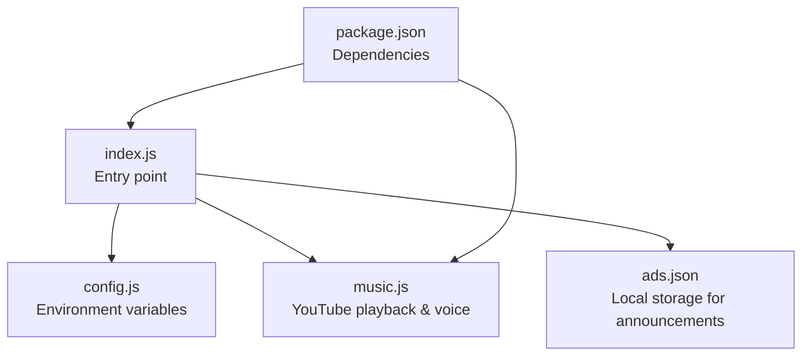
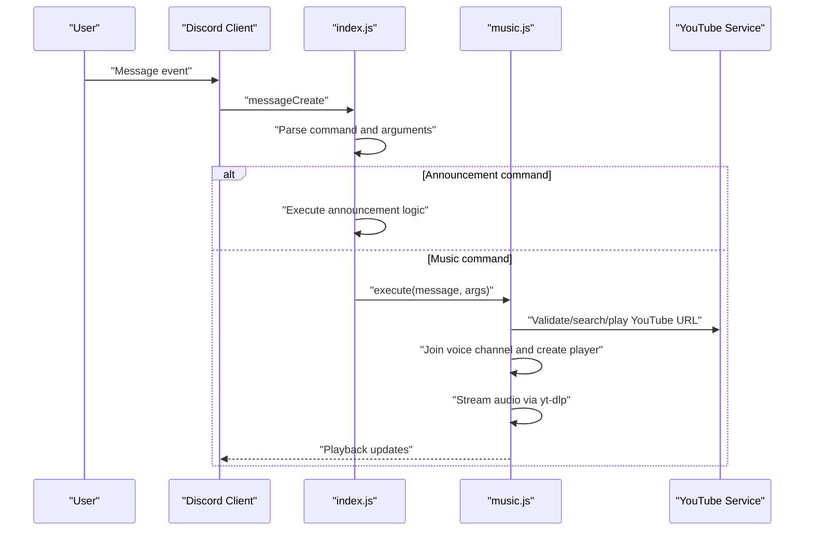
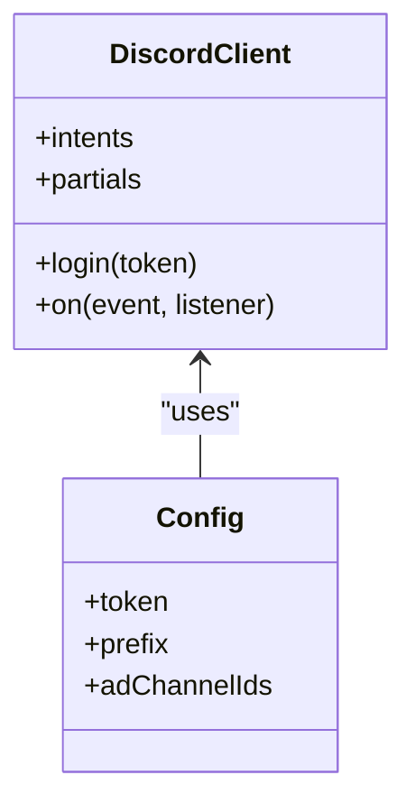
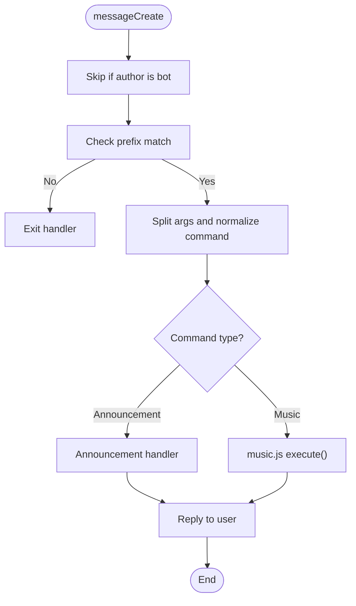
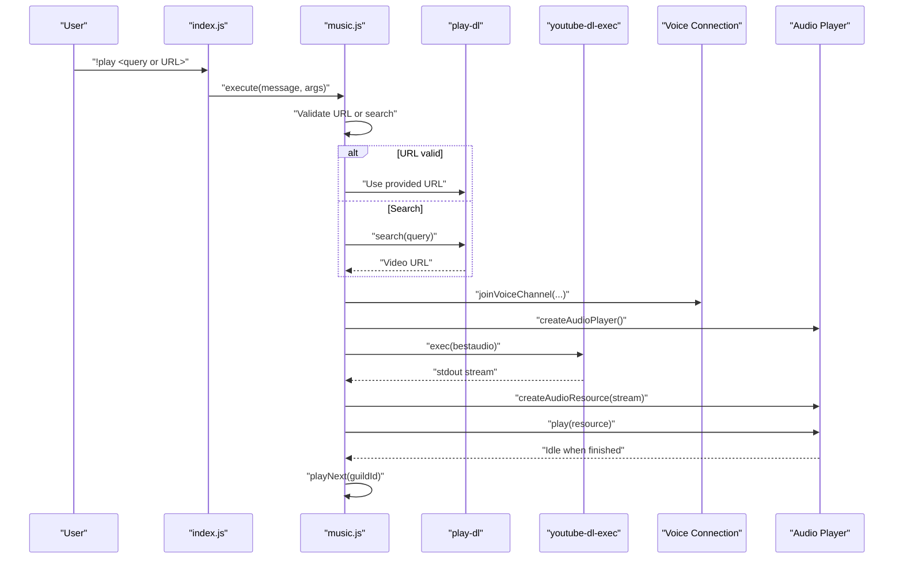
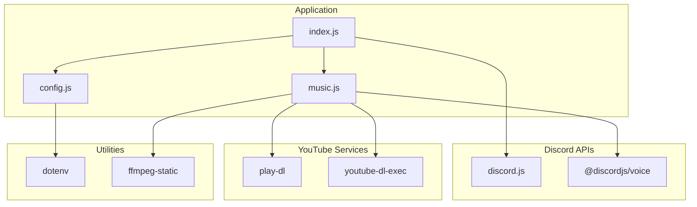

# API Integrations

<cite>
**Referenced Files in This Document**
- [README.md](file://README.md)
- [config.js](file://config.js)
- [index.js](file://index.js)
- [music.js](file://music.js)
- [package.json](file://package.json)
- [ads.json](file://ads.json)
</cite>

## Table of Contents
1. [Introduction](#introduction)
2. [Project Structure](#project-structure)
3. [Core Components](#core-components)
4. [Architecture Overview](#architecture-overview)
5. [Detailed Component Analysis](#detailed-component-analysis)
6. [Dependency Analysis](#dependency-analysis)
7. [Performance Considerations](#performance-considerations)
8. [Troubleshooting Guide](#troubleshooting-guide)
9. [Conclusion](#conclusion)
10. [Appendices](#appendices)

## Introduction
This document provides comprehensive API integration documentation for the Discord bot’s integrations with the Discord API and YouTube service. It covers:
- Discord client configuration and required intents and partials
- Command processing pipeline from message events to function execution, including argument parsing and validation
- YouTube integration via play-dl and youtube-dl-exec, including URL validation, stream extraction, and audio processing
- Voice connection management, audio player state handling, and real-time streaming architecture
- Error handling strategies, rate limiting considerations, and fallback mechanisms
- Security considerations for API tokens, permissions, and rate limiting compliance

## Project Structure
The project is organized around a single entry point that initializes the Discord client, loads configuration, and routes commands to either the announcement module or the music module. The music module encapsulates YouTube playback logic and voice handling.

**Diagram sources**
- [index.js:1-396](file://index.js#L1-L396)
- [config.js:1-8](file://config.js#L1-L8)
- [music.js:1-212](file://music.js#L1-L212)
- [package.json:1-24](file://package.json#L1-L24)
- [ads.json:1-4](file://ads.json#L1-L4)

**Section sources**
- [index.js:1-396](file://index.js#L1-L396)
- [config.js:1-8](file://config.js#L1-L8)
- [music.js:1-212](file://music.js#L1-L212)
- [package.json:1-24](file://package.json#L1-L24)
- [ads.json:1-4](file://ads.json#L1-L4)

## Core Components
- Discord client initialization with intents and partials
- Announcement command processing and persistence
- Music command routing and YouTube playback orchestration
- Voice connection lifecycle and audio player state management

**Section sources**
- [index.js:35-44](file://index.js#L35-L44)
- [index.js:60-389](file://index.js#L60-L389)
- [music.js:9-155](file://music.js#L9-L155)

## Architecture Overview
The bot listens for messageCreate events, parses commands, and delegates to either the announcement handler or the music module. The music module manages voice connections, audio players, and YouTube streams.

**Diagram sources**
- [index.js:60-389](file://index.js#L60-L389)
- [music.js:9-155](file://music.js#L9-L155)

## Detailed Component Analysis

### Discord Client Configuration
The client is configured with the following intents and partials:
- Intents: Guilds, GuildMessages, MessageContent, GuildVoiceStates, DirectMessages
- Partials: Channel

These settings enable the bot to:
- Access server and channel metadata
- Read message content for command parsing
- Track voice state changes for music playback
- Interact in DMs if needed

**Diagram sources**
- [index.js:35-44](file://index.js#L35-L44)
- [config.js:3-7](file://config.js#L3-L7)

**Section sources**
- [index.js:35-44](file://index.js#L35-L44)
- [config.js:3-7](file://config.js#L3-L7)

### Command Processing Pipeline
The messageCreate event handler performs:
- Early exits for bot messages and non-prefix messages
- Argument splitting and command normalization
- Dispatch to specific handlers based on the command word
- Error logging and user-friendly replies for exceptions

Argument parsing and validation:
- Split by whitespace and trim excess spaces
- Specialized parsing for announcement commands (field separator)
- Validation of required arguments for music commands

**Diagram sources**
- [index.js:60-389](file://index.js#L60-L389)

**Section sources**
- [index.js:60-389](file://index.js#L60-L389)

### Announcement Module
Key capabilities:
- Load and save announcements to a local JSON file
- Add, list, remove, and clear announcements
- Send announcements to configured channels with rate limiting
- Embed formatting and user feedback

Important behaviors:
- Local persistence via ads.json
- Rate limiting by delaying sends between announcements
- Permission checks for channel availability and type

**Section sources**
- [index.js:13-29](file://index.js#L13-L29)
- [index.js:73-109](file://index.js#L73-L109)
- [index.js:111-156](file://index.js#L111-L156)
- [index.js:158-220](file://index.js#L158-L220)
- [index.js:222-251](file://index.js#L222-L251)
- [ads.json:1-4](file://ads.json#L1-L4)

### Music Module
Core responsibilities:
- Validate YouTube URLs or search by query
- Join voice channels and manage audio players
- Stream audio using yt-dlp and play-dl
- Queue management and loop control
- Player state transitions and cleanup

YouTube integration:
- URL validation using a regex pattern for YouTube video IDs
- Fallback to play-dl video validation and search
- yt-dlp process execution for best audio extraction
- Audio resource creation and player playback

Voice connection and player lifecycle:
- Create player and subscribe to connection
- Handle idle state to advance queue
- Error handling for connection and player errors
- Graceful leave and queue cleanup

**Diagram sources**
- [index.js:257-269](file://index.js#L257-L269)
- [music.js:9-155](file://music.js#L9-L155)

**Section sources**
- [index.js:257-301](file://index.js#L257-L301)
- [music.js:9-155](file://music.js#L9-L155)

### YouTube Integration Details
- URL validation: Extract YouTube video IDs from common URL patterns
- Search fallback: Use play-dl to resolve query to a YouTube URL
- Stream extraction: Launch yt-dlp with bestaudio format and pipe stdout
- Audio resource: Wrap yt-dlp stdout into an arbitrary stream resource for the player
- Error handling: Catch and log errors during search, stream creation, and playback; advance queue on failure

**Section sources**
- [music.js:63-85](file://music.js#L63-L85)
- [music.js:110-155](file://music.js#L110-L155)

### Voice Connection Management
- Join voice channel on first play command
- Subscribe player to connection
- Monitor connection and player state changes
- Clean up on leave or stop commands

**Section sources**
- [music.js:15-39](file://music.js#L15-L39)
- [music.js:202-210](file://music.js#L202-L210)

### Audio Player State Handling
- Idle state triggers next song
- Player error logs and shifts queue
- Pause/resume controls
- Stop clears queue and stops player

**Section sources**
- [music.js:44-58](file://music.js#L44-L58)
- [music.js:157-185](file://music.js#L157-L185)

### Real-Time Streaming Architecture
- yt-dlp runs as a subprocess and streams audio to the player
- Arbitrary stream type is used to accommodate yt-dlp output
- Resource is created from yt-dlp stdout and fed to the player

**Section sources**
- [music.js:112-145](file://music.js#L112-L145)

## Dependency Analysis
External dependencies and their roles:
- discord.js: Discord API client and utilities
- @discordjs/voice: Voice connection and audio player
- play-dl: YouTube search and validation
- youtube-dl-exec: yt-dlp subprocess for audio extraction
- dotenv: Environment variable loading
- ffmpeg-static: FFmpeg binary path configuration

**Diagram sources**
- [package.json:14-22](file://package.json#L14-L22)
- [index.js:1-6](file://index.js#L1-L6)
- [music.js:1-6](file://music.js#L1-L6)
- [config.js:1](file://config.js#L1)

**Section sources**
- [package.json:14-22](file://package.json#L14-L22)
- [index.js:1-6](file://index.js#L1-L6)
- [music.js:1-6](file://music.js#L1-L6)
- [config.js:1](file://config.js#L1)

## Performance Considerations
- Announcement sending rate limiting: Delays between sending each announcement to avoid rate limits
- Queue-based playback: Prevents overlapping streams and ensures orderly playback
- yt-dlp subprocess: Efficiently streams audio without buffering the entire track
- Player idle handling: Automatically advances queue when playback completes

[No sources needed since this section provides general guidance]

## Troubleshooting Guide
Common issues and resolutions:
- Invalid token: Verify DISCORD_TOKEN in .env
- Missing privileged intents: Enable MESSAGE CONTENT INTENT in Developer Portal
- Missing permissions: Ensure bot has required permissions in channels
- Channel configuration errors: Confirm AD_CHANNEL_IDS format and channel types
- Command not responding: Check PREFIX and intents
- Voice permission errors: Grant Connect and Speak in voice channels
- Playback errors: Validate YouTube URL or try a different search term

**Section sources**
- [README.md:508-657](file://README.md#L508-L657)
- [index.js:392-395](file://index.js#L392-L395)

## Conclusion
The bot integrates Discord and YouTube services through a clean separation of concerns: a central message router and a dedicated music module. The configuration emphasizes necessary intents and partials for reliable operation, while the music module implements robust error handling, queue management, and efficient streaming via yt-dlp. Proper environment configuration and adherence to rate limits and permissions ensure stable operation.

[No sources needed since this section summarizes without analyzing specific files]

## Appendices

### Security Considerations
- Store DISCORD_TOKEN securely in .env and never commit it to version control
- Restrict bot permissions to only what is necessary
- Validate and sanitize user inputs for commands
- Monitor logs for unauthorized access attempts

**Section sources**
- [README.md:640-641](file://README.md#L640-L641)

### Rate Limiting Compliance
- Announcement sending delays between messages to channels
- Respect Discord API rate limits by avoiding bursty operations
- Use yt-dlp efficiently to minimize network overhead

**Section sources**
- [README.md:642](file://README.md#L642)
- [index.js:199](file://index.js#L199)