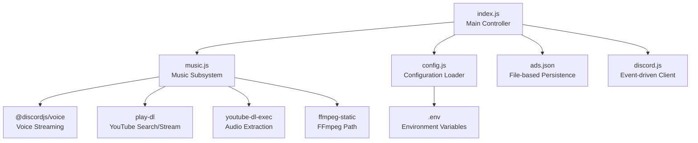
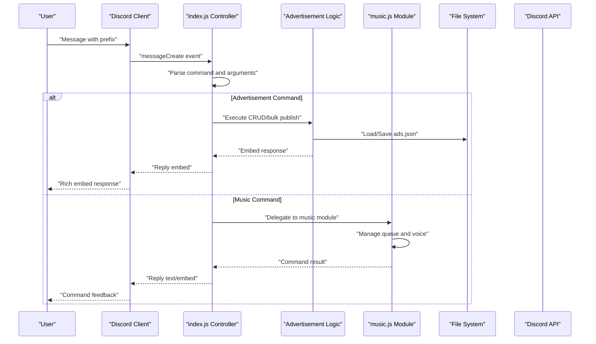
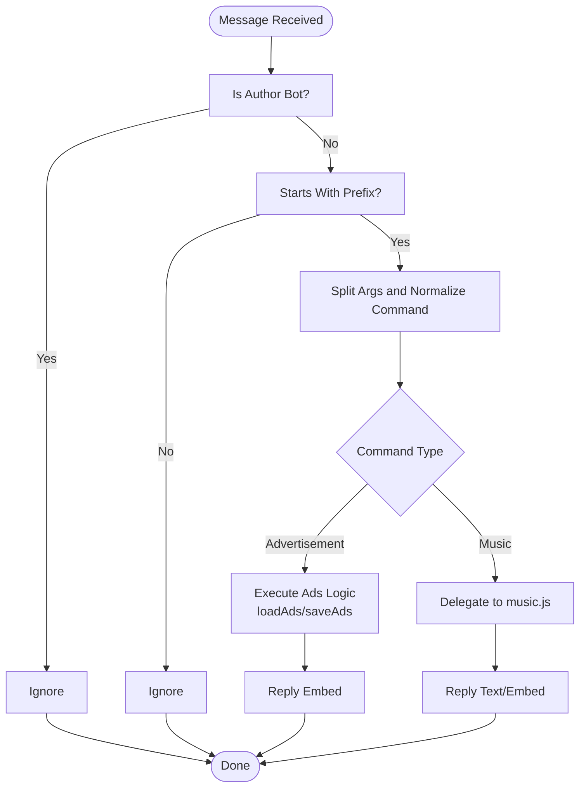
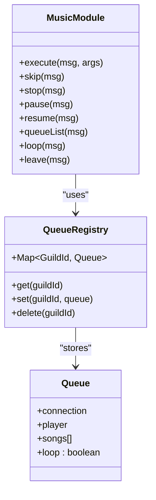
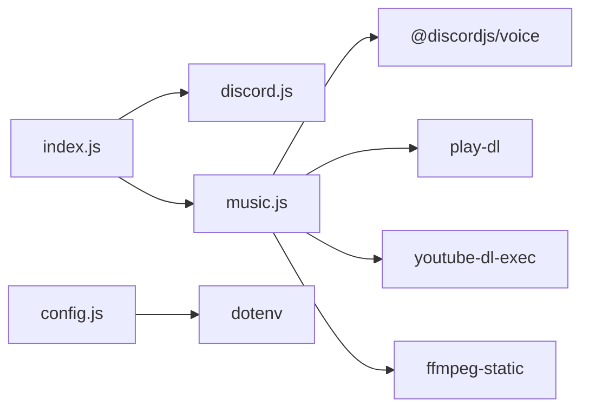
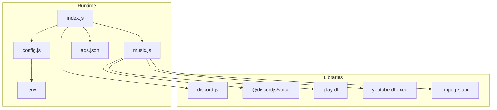

# Architecture Overview

<cite>
**Referenced Files in This Document**
- [index.js](file://index.js)
- [music.js](file://music.js)
- [config.js](file://config.js)
- [package.json](file://package.json)
- [README.md](file://README.md)
- [.gitignore](file://.gitignore)
</cite>

## Table of Contents
1. [Introduction](#introduction)
2. [Project Structure](#project-structure)
3. [Core Components](#core-components)
4. [Architecture Overview](#architecture-overview)
5. [Detailed Component Analysis](#detailed-component-analysis)
6. [Dependency Analysis](#dependency-analysis)
7. [Performance Considerations](#performance-considerations)
8. [Troubleshooting Guide](#troubleshooting-guide)
9. [Conclusion](#conclusion)
10. [Appendices](#appendices)

## Introduction
This document presents a comprehensive architectural overview of a modular, event-driven Discord bot that combines advertisement management with music playback capabilities. The system follows a main controller pattern in the entry point, separates concerns between two functional domains (advertisement management and music), and integrates with Discord’s ecosystem via discord.js. It documents event handling, asynchronous operations, file-based persistence, inter-module communication, and patterns such as singleton-like queue management and factory-style embed construction. Guidance is included for extensibility and future feature additions.

## Project Structure
The project is intentionally minimalistic, enabling clear separation of concerns:
- index.js: Main controller orchestrating events, commands, and integration with the music module.
- music.js: Music playback subsystem with queue management and audio streaming.
- config.js: Centralized configuration loader for environment variables.
- package.json: Dependencies and scripts.
- README.md: Usage, commands, and operational notes.
- .gitignore: Ignores dependencies, secrets, and generated data.

**Diagram sources**
- [index.js:1-396](file://index.js#L1-L396)
- [music.js:1-212](file://music.js#L1-L212)
- [config.js:1-8](file://config.js#L1-L8)
- [package.json:1-24](file://package.json#L1-L24)

**Section sources**
- [index.js:1-396](file://index.js#L1-L396)
- [music.js:1-212](file://music.js#L1-L212)
- [config.js:1-8](file://config.js#L1-L8)
- [package.json:1-24](file://package.json#L1-L24)
- [.gitignore:1-4](file://.gitignore#L1-L4)

## Core Components
- Main Controller (index.js)
  - Initializes the Discord client with required intents and partials.
  - Registers event handlers for message creation and client readiness.
  - Implements a command router that dispatches to advertisement management or delegates music commands to the music module.
  - Provides advertisement CRUD operations and bulk publishing to configured channels.
  - Uses discord.js EmbedBuilder to construct rich embed responses.
  - Manages file-based persistence for advertisements via synchronous file I/O.

- Music Subsystem (music.js)
  - Singleton-like queue registry keyed by guild ID.
  - Orchestrates voice connections, audio players, and resource streaming.
  - Implements playback lifecycle: enqueue, play, skip, stop, pause/resume, queue listing, loop toggle, and leave.
  - Integrates with external APIs for YouTube search/streaming and audio extraction.

- Configuration Loader (config.js)
  - Loads environment variables from .env and exposes normalized configuration to the rest of the app.

- Package Manifest (package.json)
  - Declares runtime dependencies and start script.

**Section sources**
- [index.js:1-396](file://index.js#L1-L396)
- [music.js:1-212](file://music.js#L1-L212)
- [config.js:1-8](file://config.js#L1-L8)
- [package.json:1-24](file://package.json#L1-L24)

## Architecture Overview
The system employs an event-driven architecture centered around the Discord client. The main controller listens for message events, parses commands, and either executes advertisement logic or forwards music commands to the music module. The music subsystem maintains a guild-scoped queue and manages voice streaming using external libraries. Configuration is loaded from environment variables, and advertisement data persists to a JSON file.

**Diagram sources**
- [index.js:60-389](file://index.js#L60-L389)
- [music.js:9-212](file://music.js#L9-L212)

## Detailed Component Analysis

### Main Controller Pattern (index.js)
- Event Registration
  - Client readiness logs configuration details and channel IDs.
  - Message creation handler filters bot messages and validates prefix.
  - Command routing switches on normalized command tokens.

- Advertisement Management
  - addad: Parses pipe-separated fields, constructs an ad object, persists to ads.json, and replies with a constructed embed.
  - myads/allads: Filters and paginates up to 25 fields per embed, leveraging EmbedBuilder.
  - sendads: Iterates configured channel IDs, fetches channels, sends embeds with delays to respect rate limits, and reports results.
  - removead/clearads: Mutates stored ads and persists changes.

- Music Command Delegation
  - play/p, tocar: Delegates to music.execute with error handling.
  - skip/s, pular: Delegates to music.skip.
  - stop/parar: Delegates to music.stop.
  - pause/pausar: Delegates to music.pause.
  - resume/despausar/continuar: Delegates to music.resume.
  - queue/q, fila: Delegates to music.queueList.
  - loop: Delegates to music.loop.
  - leave/sair/disconnect: Delegates to music.leave.

- Embed Factory Pattern
  - EmbedBuilder instances are created per command to produce rich, contextual responses. This pattern centralizes presentation logic and allows reuse across commands.

- Asynchronous Operation Management
  - Async/await used for channel fetching, embed sending, and delayed operations.
  - Error boundaries wrap delegated music commands to prevent unhandled rejections.

- File-based Persistence Strategy
  - ads.json is read/written synchronously for simplicity and deterministic behavior.
  - Load/save helpers encapsulate JSON parsing and stringify with formatting.

**Diagram sources**
- [index.js:60-389](file://index.js#L60-L389)

**Section sources**
- [index.js:1-396](file://index.js#L1-L396)

### Music Subsystem (music.js)
- Queue Management
  - A Map stores per-guild queues with connection, player, songs array, and loop flag.
  - First-play creates a voice connection, subscribes a player, and initializes queue metadata.

- Playback Lifecycle
  - playNext handles audio resource creation via youtube-dl-exec and play-dl, guards against race conditions, and plays resources on the player.
  - Event listeners handle idle transitions, errors, and state changes.
  - Commands: skip, stop, pause, resume, queueList, loop, leave operate on the guild-scoped queue.

- External API Integrations
  - play-dl for YouTube validation and search.
  - youtube-dl-exec for audio extraction streams.
  - ffmpeg-static path configuration for audio processing.

**Diagram sources**
- [music.js:7-212](file://music.js#L7-L212)

**Section sources**
- [music.js:1-212](file://music.js#L1-L212)

### Configuration Loader (config.js)
- Loads environment variables via dotenv and exports normalized values:
  - token: Discord bot token.
  - prefix: Command prefix (defaulted if missing).
  - adChannelIds: Array of channel IDs parsed from comma-separated string.

**Section sources**
- [config.js:1-8](file://config.js#L1-L8)

### File-based Data Persistence
- Advertisement storage
  - ads.json is read and written synchronously.
  - loadAds returns default structure if file is missing or unreadable.
  - saveAds writes formatted JSON with error logging.

- Persistence strategy
  - Simple and predictable for small-scale deployments.
  - Suitable for development and low-volume production scenarios.
  - Consider migration to a database for high concurrency and reliability.

**Section sources**
- [index.js:11-29](file://index.js#L11-L29)

### Inter-module Communication
- index.js imports and invokes music.js functions directly, passing the message context.
- music.js exposes a module interface with named functions for each command.
- Embed construction is centralized in index.js via EmbedBuilder, while music responses are primarily text-based.

**Section sources**
- [index.js:257-300](file://index.js#L257-L300)
- [music.js:211-212](file://music.js#L211-L212)

## Dependency Analysis
External dependencies and their roles:
- discord.js: Client initialization, gateway intents, partials, and EmbedBuilder.
- @discordjs/voice: Voice connections and audio player lifecycle.
- play-dl: YouTube search and validation.
- youtube-dl-exec: Audio extraction streams.
- ffmpeg-static: Static FFmpeg path for audio processing.
- dotenv: Environment variable loading.

**Diagram sources**
- [index.js:1-396](file://index.js#L1-L396)
- [music.js:1-212](file://music.js#L1-L212)
- [config.js:1-8](file://config.js#L1-L8)
- [package.json:14-22](file://package.json#L14-L22)

**Section sources**
- [package.json:14-22](file://package.json#L14-L22)

## Performance Considerations
- Rate limiting
  - Advertisement publishing includes deliberate delays between sends to avoid API throttling.
- Queue safety
  - playNext checks queue existence and song validity before playback to mitigate race conditions.
- Resource cleanup
  - Player error listeners advance the queue and continue playback.
- I/O characteristics
  - Synchronous file I/O for ads.json simplifies logic but can block the event loop under heavy load; consider async I/O for production.

[No sources needed since this section provides general guidance]

## Troubleshooting Guide
Common issues and resolutions:
- Authentication failures
  - Verify DISCORD_TOKEN correctness and MESSAGE CONTENT INTENT activation.
- Permission errors
  - Ensure bot has required permissions in channels and voice channels.
- Configuration problems
  - Confirm AD_CHANNEL_IDS format and PREFIX value.
- Music playback issues
  - Validate YouTube URLs, video availability, and voice permissions.

**Section sources**
- [README.md:508-657](file://README.md#L508-L657)

## Conclusion
The bot’s architecture cleanly separates advertisement management and music playback, with a main controller coordinating events and delegating specialized tasks. The music subsystem uses a singleton-like queue registry per guild, while advertisement logic relies on simple file-based persistence. EmbedBuilder is used as a factory for rich responses. The design supports incremental enhancements such as database-backed persistence, improved error handling, and modular command extensions.

[No sources needed since this section summarizes without analyzing specific files]

## Appendices

### System Diagrams

#### Component Relationships

**Diagram sources**
- [index.js:1-396](file://index.js#L1-L396)
- [music.js:1-212](file://music.js#L1-L212)
- [config.js:1-8](file://config.js#L1-L8)
- [package.json:14-22](file://package.json#L14-L22)

### Singleton Pattern Implementation for Music Queue Management
- A Map keyed by guild ID holds queue objects, enabling per-server isolation.
- Queues are lazily created upon first play and destroyed on leave.
- This pattern avoids global state pollution and ensures thread-safe (per-event-loop) access.

**Section sources**
- [music.js:7-32](file://music.js#L7-L32)
- [music.js:202-209](file://music.js#L202-L209)

### Factory Pattern for Embed Builders
- EmbedBuilder is instantiated per command to produce consistent, contextual responses.
- Centralizes presentation logic and reduces duplication across commands.

**Section sources**
- [index.js:97-108](file://index.js#L97-L108)
- [index.js:119-132](file://index.js#L119-L132)
- [index.js:142-155](file://index.js#L142-L155)
- [index.js:187-199](file://index.js#L187-L199)
- [index.js:209-219](file://index.js#L209-L219)
- [index.js:308-383](file://index.js#L308-L383)

### Extensibility Guidance
- Advertisement domain
  - Replace synchronous file I/O with async I/O and a database for scalability.
  - Add pagination and filtering for large ad catalogs.
- Music domain
  - Introduce playlist support and shuffle/autoplay features.
  - Add metrics and logging for queue operations.
- General
  - Extract command handlers into separate modules for better testability.
  - Introduce middleware for permission checks and rate limiting.

[No sources needed since this section provides general guidance]