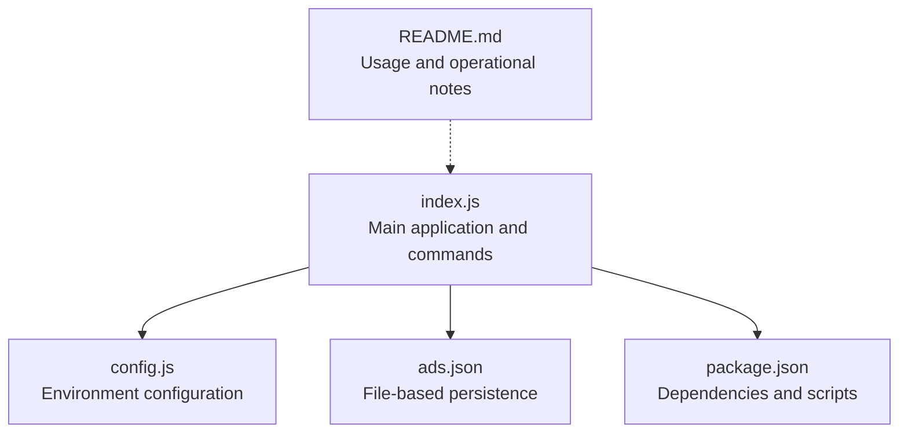
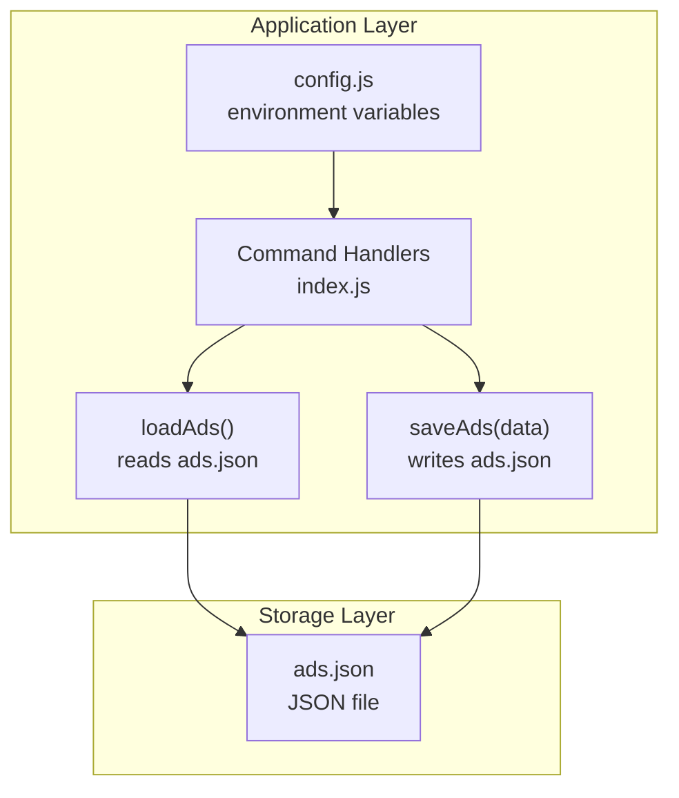
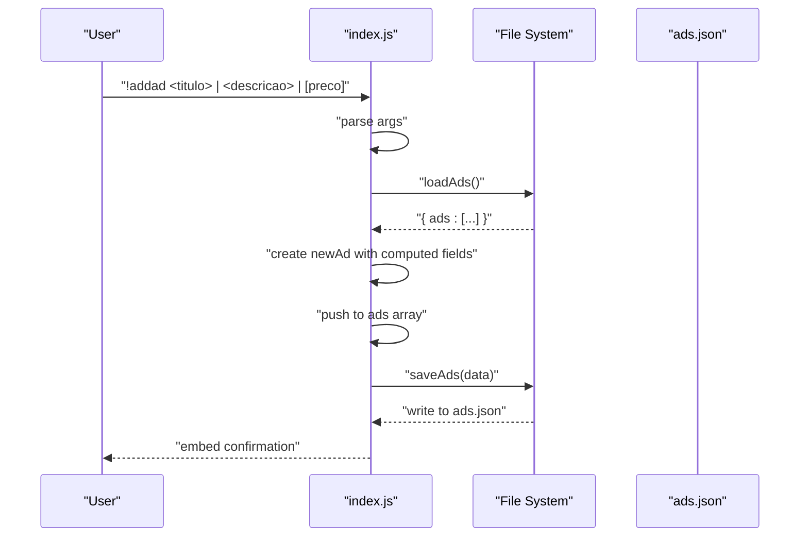
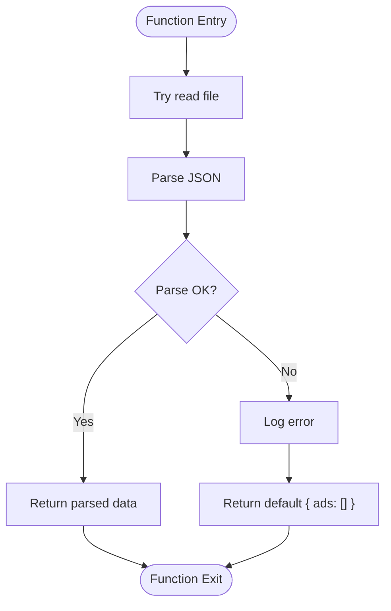
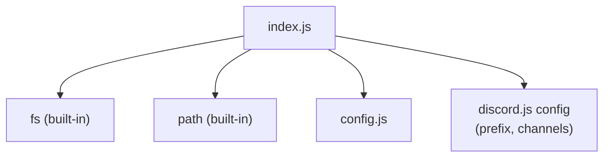

# Data Models and Storage

<cite>
**Referenced Files in This Document**
- [index.js](file://index.js)
- [config.js](file://config.js)
- [ads.json](file://ads.json)
- [package.json](file://package.json)
- [README.md](file://README.md)
</cite>

## Table of Contents
1. [Introduction](#introduction)
2. [Project Structure](#project-structure)
3. [Core Components](#core-components)
4. [Architecture Overview](#architecture-overview)
5. [Detailed Component Analysis](#detailed-component-analysis)
6. [Dependency Analysis](#dependency-analysis)
7. [Performance Considerations](#performance-considerations)
8. [Troubleshooting Guide](#troubleshooting-guide)
9. [Conclusion](#conclusion)
10. [Appendices](#appendices)

## Introduction
This document provides detailed data model documentation for the advertisement system and its file-based persistence mechanism. It covers the advertisement object structure, JSON file storage format, CRUD operations, error handling for file I/O, and operational characteristics of the load/save functions. It also documents path resolution, security considerations, data integrity, backup strategies, and migration considerations for future schema changes.

## Project Structure
The advertisement system is implemented within a single-file Node.js application with a companion configuration module and a JSON file for persistent storage. The project layout is minimalistic and focused on a single-purpose feature set.

**Diagram sources**
- [index.js:1-396](file://index.js#L1-L396)
- [config.js:1-8](file://config.js#L1-L8)
- [ads.json:1-4](file://ads.json#L1-L4)
- [package.json:1-24](file://package.json#L1-L24)

**Section sources**
- [index.js:1-396](file://index.js#L1-L396)
- [config.js:1-8](file://config.js#L1-L8)
- [ads.json:1-4](file://ads.json#L1-L4)
- [package.json:1-24](file://package.json#L1-L24)
- [README.md:478-496](file://README.md#L478-L496)

## Core Components
- Advertisement object model: The advertisement record is stored as a JavaScript object with the following fields:
  - id: Number (Unix timestamp)
  - titulo: String (title)
  - descricao: String (description)
  - preco: String (price or “Consultar” placeholder)
  - criadoEm: String (creation timestamp in locale format)
  - autorId: String (Discord user ID)
  - autorNome: String (Discord username)
- JSON storage format: The file stores an object containing an array of advertisements under the key “ads”. The initial state is an empty array.
- Persistence functions:
  - loadAds(): Synchronous file read with UTF-8 decoding and JSON parsing; returns a default object with an empty ads array on failure.
  - saveAds(data): Synchronous file write with JSON stringification and indentation; logs errors on failure.

**Section sources**
- [index.js:11-29](file://index.js#L11-L29)
- [index.js:84-92](file://index.js#L84-L92)
- [ads.json:1-4](file://ads.json#L1-L4)

## Architecture Overview
The advertisement system integrates with a Discord bot. Commands trigger creation, listing, removal, and bulk sending of advertisements. Data is persisted to a JSON file located in the project root.

**Diagram sources**
- [index.js:11-29](file://index.js#L11-L29)
- [index.js:60-389](file://index.js#L60-L389)
- [config.js:1-8](file://config.js#L1-L8)

## Detailed Component Analysis

### Advertisement Object Model
- Fields and types:
  - id: Number (Unix timestamp)
  - titulo: String
  - descricao: String
  - preco: String
  - criadoEm: String
  - autorId: String
  - autorNome: String
- Validation rules observed in code:
  - Required: titulo, descricao
  - Optional: preco (defaults to “Consultar”)
  - Creation timestamp: criadoEm is set to a localized string
  - Ownership: authorship verified by comparing autorId with the requesting user’s ID
- Example advertisement object structure:
  - {
    - id: 1719234567890,
    - titulo: "Camiseta Nike",
    - descricao: "Tamanho G, preta, nova com etiqueta",
    - preco: "R$ 80,00",
    - criadoEm: "15/06/2024, 14:30:45",
    - autorId: "123456789012345678",
    - autorNome: "SeuNome"
  - }

**Section sources**
- [index.js:84-92](file://index.js#L84-L92)
- [index.js:222-241](file://index.js#L222-L241)

### JSON File Storage Format
- File location: ads.json in the project root
- Root object shape: { ads: [ ... ] }
- Initial state: ads array is empty
- Write format: JSON stringified with indentation for readability

**Section sources**
- [index.js:11](file://index.js#L11)
- [ads.json:1-4](file://ads.json#L1-L4)

### CRUD Operations Implementation
- Create (addad):
  - Parses command arguments separated by pipe delimiters
  - Constructs a new advertisement object with computed id, timestamps, and author fields
  - Appends to the ads array and persists immediately
- Read (myads, allads):
  - Loads the entire ads collection
  - Filters by author for personal listings
  - Limits displayed entries to 25 for embed constraints
- Update (implicit via remove/clear):
  - Removal filters out a specific advertisement by id and author
  - Clear removes all advertisements owned by the user
- Delete (removead, clearads):
  - removead: finds and removes a single advertisement by id and author
  - clearads: filters out all advertisements owned by the user

**Diagram sources**
- [index.js:73-109](file://index.js#L73-L109)
- [index.js:13-21](file://index.js#L13-L21)
- [index.js:23-29](file://index.js#L23-L29)

**Section sources**
- [index.js:73-109](file://index.js#L73-L109)
- [index.js:111-133](file://index.js#L111-L133)
- [index.js:135-156](file://index.js#L135-L156)
- [index.js:222-241](file://index.js#L222-L241)
- [index.js:243-251](file://index.js#L243-L251)

### Load and Save Functions Behavior
- loadAds():
  - Synchronous operation using fs.readFileSync
  - Reads UTF-8 encoded file and parses JSON
  - On error, logs and returns a default object with an empty ads array
- saveAds(data):
  - Synchronous operation using fs.writeFileSync
  - Writes JSON stringified data with indentation
  - On error, logs but does not throw

**Diagram sources**
- [index.js:13-21](file://index.js#L13-L21)

**Section sources**
- [index.js:13-21](file://index.js#L13-L21)
- [index.js:23-29](file://index.js#L23-L29)

### Path Resolution and Security Considerations
- Path resolution:
  - The ads.json path is constructed using Node.js path module and resolved against the script’s directory
  - This ensures deterministic file location regardless of working directory
- Security considerations:
  - File-based storage is local and not network-accessible by default
  - The project includes the ads.json file in .gitignore, preventing accidental exposure
  - Token and sensitive configuration are loaded from .env, which is also included in .gitignore
  - Access to the ads.json file depends on filesystem permissions of the host machine

**Section sources**
- [index.js:11](file://index.js#L11)
- [README.md:483](file://README.md#L483)

### Data Integrity, Backup, and Migration
- Data integrity:
  - The system performs synchronous writes, reducing the risk of partial writes during a single operation
  - On load failure, the system falls back to an empty ads array, preventing crashes
- Backup strategies:
  - Regularly copy ads.json to a secure offsite location
  - Version control the file only if it is safe to do so (not recommended due to .gitignore)
- Migration considerations:
  - Current schema: { ads: [ { id, titulo, descricao, preco, criadoEm, autorId, autorNome } ] }
  - Future schema changes should include:
    - Schema version field in the root object
    - Migration function to transform older records
    - Backward compatibility checks before applying transformations
    - Atomic write operations to prevent corruption during updates

**Section sources**
- [ads.json:1-4](file://ads.json#L1-L4)
- [README.md:646](file://README.md#L646)

## Dependency Analysis
The advertisement system relies on core Node.js modules and the project’s configuration module. The file-based persistence is implemented using the built-in fs and path modules.

**Diagram sources**
- [index.js:1-6](file://index.js#L1-L6)
- [config.js:1-8](file://config.js#L1-L8)

**Section sources**
- [index.js:1-6](file://index.js#L1-L6)
- [config.js:1-8](file://config.js#L1-L8)

## Performance Considerations
- Synchronous I/O:
  - loadAds() and saveAds() are synchronous, which simplifies error handling but blocks the event loop during file operations
  - For high-throughput environments, consider asynchronous variants with proper error propagation
- Rate limiting:
  - Bulk send operations include a small delay between messages to avoid rate limits
- Embed limitations:
  - Listing commands cap at 25 items due to Discord embed field limits

**Section sources**
- [index.js:13-29](file://index.js#L13-L29)
- [index.js:176-200](file://index.js#L176-L200)
- [README.md:644](file://README.md#L644)

## Troubleshooting Guide
- File I/O errors:
  - loadAds() logs and returns a default empty array; verify file permissions and existence
  - saveAds() logs failures; ensure the directory is writable
- Command usage:
  - addad requires at least two pipe-separated arguments; missing arguments prompt usage guidance
  - removead requires a valid advertisement ID and ownership verification
- Environment configuration:
  - Ensure DISCORD_TOKEN and AD_CHANNEL_IDS are correctly set in .env
  - Verify MESSAGE CONTENT INTENT is enabled in the Discord Developer Portal

**Section sources**
- [index.js:73-80](file://index.js#L73-L80)
- [index.js:222-235](file://index.js#L222-L235)
- [config.js:1-8](file://config.js#L1-L8)
- [README.md:508-562](file://README.md#L508-L562)

## Conclusion
The advertisement system employs a straightforward, file-based persistence model centered around a single JSON file. Its design emphasizes simplicity and ease of deployment, with synchronous file operations and basic validation rules. While suitable for small-scale usage, production deployments should consider asynchronous I/O, robust backup procedures, and schema migration strategies to ensure long-term reliability and maintainability.

## Appendices

### Advertisement Object Reference
- id: Number (Unix timestamp)
- titulo: String
- descricao: String
- preco: String (“Consultar” if omitted)
- criadoEm: String (localized timestamp)
- autorId: String (Discord user identifier)
- autorNome: String (Discord username)

**Section sources**
- [index.js:84-92](file://index.js#L84-L92)

### Sample JSON Structure
- Initial state:
  - {
    - "ads": []
  - }
- After adding an advertisement:
  - {
    - "ads": [
      - {
        - "id": 1719234567890,
        - "titulo": "Camiseta Nike",
        - "descricao": "Tamanho G, preta, nova com etiqueta",
        - "preco": "R$ 80,00",
        - "criadoEm": "15/06/2024, 14:30:45",
        - "autorId": "123456789012345678",
        - "autorNome": "SeuNome"
      - }
    - ]
  - }

**Section sources**
- [ads.json:1-4](file://ads.json#L1-L4)
- [index.js:84-92](file://index.js#L84-L92)