# Deployment and Configuration

<cite>
**Referenced Files in This Document**
- [README.md](file://README.md)
- [package.json](file://package.json)
- [package-lock.json](file://package-lock.json)
- [index.js](file://index.js)
- [config.js](file://config.js)
- [.gitignore](file://.gitignore)
- [music.js](file://music.js)
</cite>

## Table of Contents
1. [Introduction](#introduction)
2. [Environment Setup](#environment-setup)
3. [Dependency Management](#dependency-management)
4. [.env Configuration](#.env-configuration)
5. [Build and Runtime Process](#build-and-runtime-process)
6. [Deployment Strategies](#deployment-strategies)
7. [Containerization Options](#containerization-options)
8. [Configuration Validation](#configuration-validation)
9. [Environment-Specific Settings](#environment-specific-settings)
10. [Security Considerations](#security-considerations)
11. [Backup Procedures](#backup-procedures)
12. [Scaling Considerations](#scaling-considerations)
13. [Monitoring and Maintenance](#monitoring-and-maintenance)
14. [Troubleshooting Guide](#troubleshooting-guide)
15. [Conclusion](#conclusion)

## Introduction

This document provides comprehensive deployment and configuration guidance for the Discord Announcement and Music Bot. The bot serves dual purposes: managing mass announcements across multiple channels and playing music in voice channels. It requires careful environment configuration, dependency management, and production-ready deployment strategies.

The project is built with Node.js and utilizes the discord.js library for Discord API interactions, along with specialized packages for audio streaming and YouTube content playback.

## Environment Setup

### Prerequisites

The bot requires specific runtime requirements for optimal operation:

- **Node.js Version**: Node.js 16.9.0 or higher (recommended: latest LTS)
- **Operating System**: Cross-platform compatible (Windows, Linux, macOS)
- **Discord Permissions**: Administrative access to create and configure bots
- **System Dependencies**: FFmpeg for audio processing (automatically managed)

### System Requirements

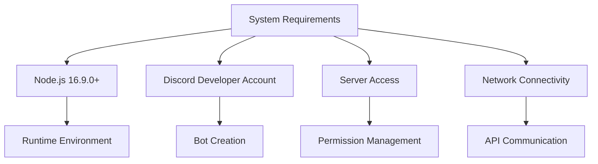

**Section sources**
- [README.md:38-43](file://README.md#L38-L43)
- [package.json:1-24](file://package.json#L1-L24)

## Dependency Management

### Core Dependencies

The project relies on several key dependencies for its functionality:

```mermaid
graph TB
subgraph "Core Dependencies"
A[discord.js v14] --> A1["Discord API Integration"]
B[@discordjs/voice v0.19.2] --> B1["Voice Channel Management"]
C[play-dl v1.9.7] --> C1["YouTube Content Streaming"]
D[dotenv v17.4.2] --> D1["Environment Configuration"]
end
subgraph "Supporting Dependencies"
E[ffmpeg-static v5.3.0] --> E1["Audio Processing"]
F[youtube-dl-exec v3.1.8] --> F1["Video Download"]
G[@distube/ytdl-core v4.16.12] --> G1["YouTube Downloader"]
end
```

**Diagram sources**
- [package.json:14-22](file://package.json#L14-L22)

### Version Compatibility Matrix

| Package | Required Version | Compatible Range | Notes |
|---------|------------------|------------------|-------|
| discord.js | ^14.26.4 | >=14.0.0 | Core Discord API |
| @discordjs/voice | ^0.19.2 | >=0.19.0 | Voice channel support |
| play-dl | ^1.9.7 | ^1.x.x | YouTube streaming |
| dotenv | ^17.4.2 | ^17.x.x | Environment loading |
| ffmpeg-static | ^5.3.0 | ^5.x.x | Audio processing |
| youtube-dl-exec | ^3.1.8 | ^3.x.x | Video downloading |

### Dependency Resolution Process

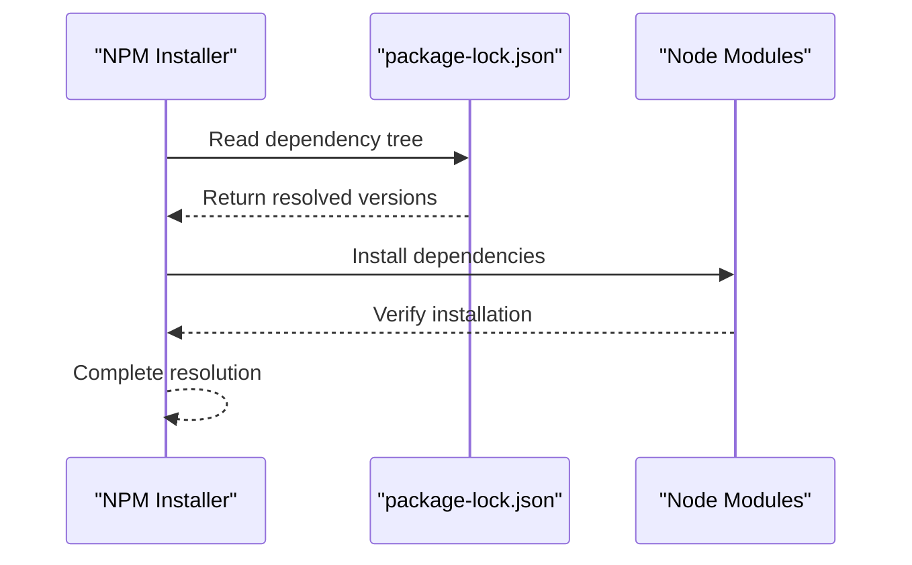

**Section sources**
- [package.json:14-22](file://package.json#L14-L22)
- [package-lock.json:1-200](file://package-lock.json#L1-L200)

## .env Configuration

### Required Variables

The bot requires three primary configuration variables stored in the `.env` file:

| Variable | Purpose | Format | Example |
|----------|---------|--------|---------|
| DISCORD_TOKEN | Bot authentication token | String (no quotes) | `MTI3NDU2Nzg5MDExMjM0NTY3ODkw` |
| AD_CHANNEL_IDS | Comma-separated channel IDs | Numeric IDs | `123456789012345678,987654321098765432` |
| PREFIX | Command prefix character | Single character | `!` |

### Configuration Structure

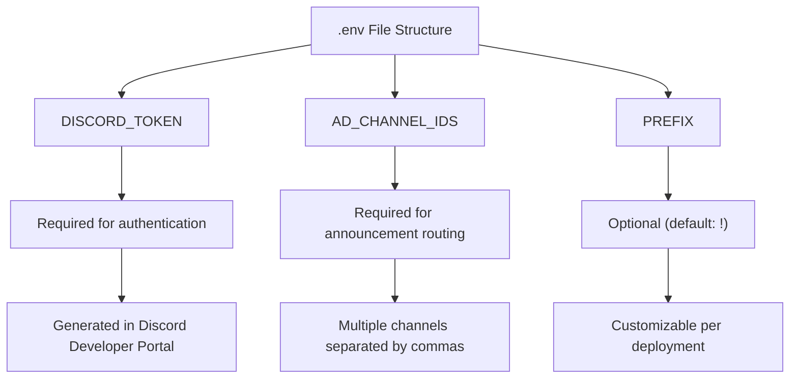

**Diagram sources**
- [README.md:99-137](file://README.md#L99-L137)
- [config.js:3-7](file://config.js#L3-L7)

### Security Best Practices

1. **Token Protection**: Never commit the `.env` file to version control
2. **File Permissions**: Restrict access to configuration files
3. **Environment Isolation**: Use separate environments for development and production
4. **Rotation Schedule**: Regularly rotate bot tokens

**Section sources**
- [README.md:103-112](file://README.md#L103-L112)
- [README.md:640](file://README.md#L640)

## Build and Runtime Process

### Application Startup Flow

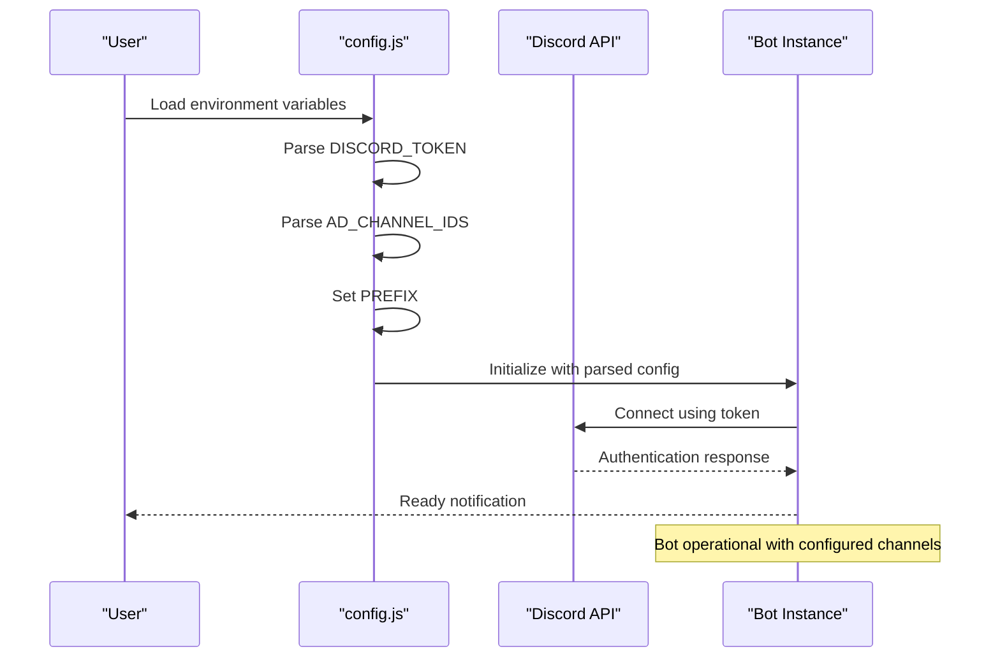

**Diagram sources**
- [index.js:35-54](file://index.js#L35-L54)
- [config.js:3-7](file://config.js#L3-L7)

### Runtime Architecture

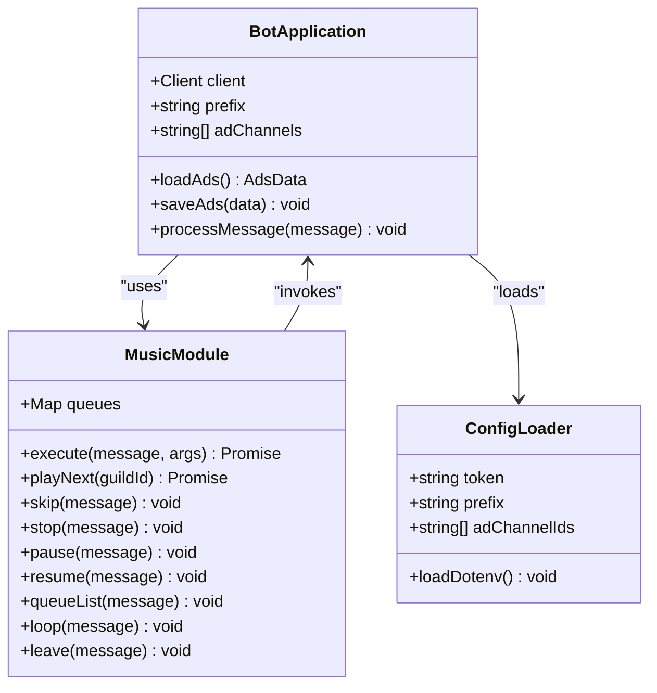

**Diagram sources**
- [index.js:1-396](file://index.js#L1-L396)
- [music.js:1-212](file://music.js#L1-L212)
- [config.js:1-8](file://config.js#L1-L8)

**Section sources**
- [index.js:1-396](file://index.js#L1-L396)
- [music.js:1-212](file://music.js#L1-L212)

## Deployment Strategies

### Platform Deployment Options

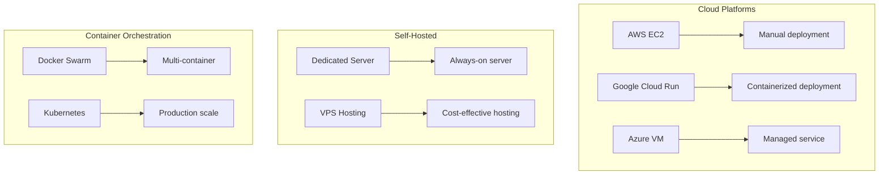

### Deployment Checklist

| Task | Description | Status |
|------|-------------|--------|
| Environment Setup | Configure Node.js runtime | ☐ |
| Dependency Installation | Run npm install | ☐ |
| Configuration Validation | Test .env variables | ☐ |
| Database Initialization | Create ads.json if missing | ☐ |
| Service Registration | Register bot with Discord | ☐ |
| Monitoring Setup | Configure health checks | ☐ |

### Production Readiness

1. **Process Management**: Use PM2 or systemd for process supervision
2. **Logging**: Implement structured logging with rotation
3. **Health Checks**: Add readiness/liveness probes
4. **Graceful Shutdown**: Handle SIGTERM signals properly

## Containerization Options

### Docker Configuration

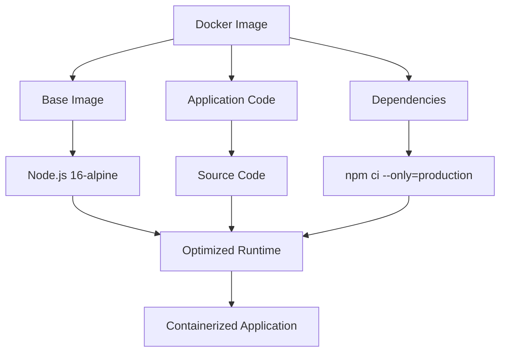

**Diagram sources**
- [package.json:14-22](file://package.json#L14-L22)

### Container Benefits

1. **Consistency**: Reproducible environments across deployments
2. **Isolation**: Resource boundaries and security isolation
3. **Scalability**: Easy horizontal scaling
4. **Portability**: Deploy anywhere Docker runs

### Container Security Considerations

1. **Image Hardening**: Use minimal base images
2. **Non-root User**: Run containers as non-root users
3. **Secrets Management**: Use environment variables or secret volumes
4. **Network Policies**: Restrict outbound connections

## Configuration Validation

### Environment Variable Validation

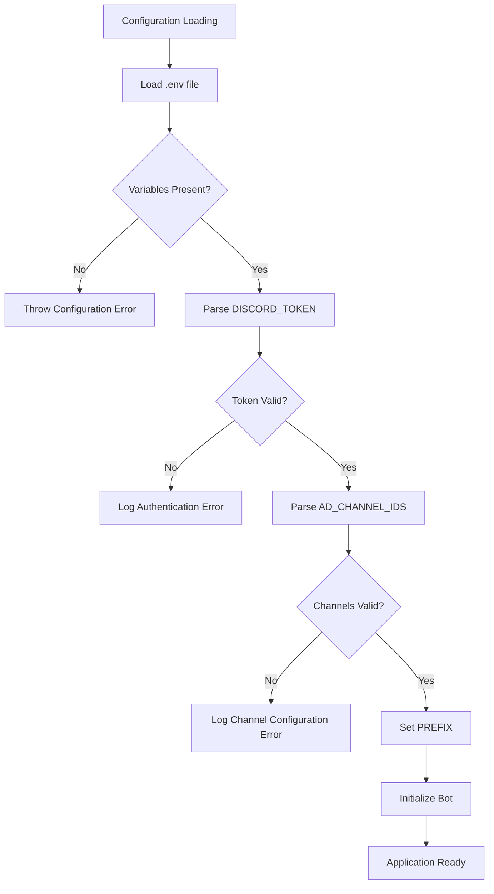

**Diagram sources**
- [config.js:3-7](file://config.js#L3-L7)
- [index.js:391-395](file://index.js#L391-L395)

### Validation Implementation

The configuration loader performs essential validation:

1. **Token Validation**: Ensures DISCORD_TOKEN is present and properly formatted
2. **Channel Validation**: Verifies AD_CHANNEL_IDS contains valid numeric IDs
3. **Prefix Validation**: Provides default fallback if PREFIX is missing
4. **Type Coercion**: Converts string values to appropriate types

**Section sources**
- [config.js:1-8](file://config.js#L1-L8)
- [index.js:46-48](file://index.js#L46-L48)

## Environment-Specific Settings

### Development Environment

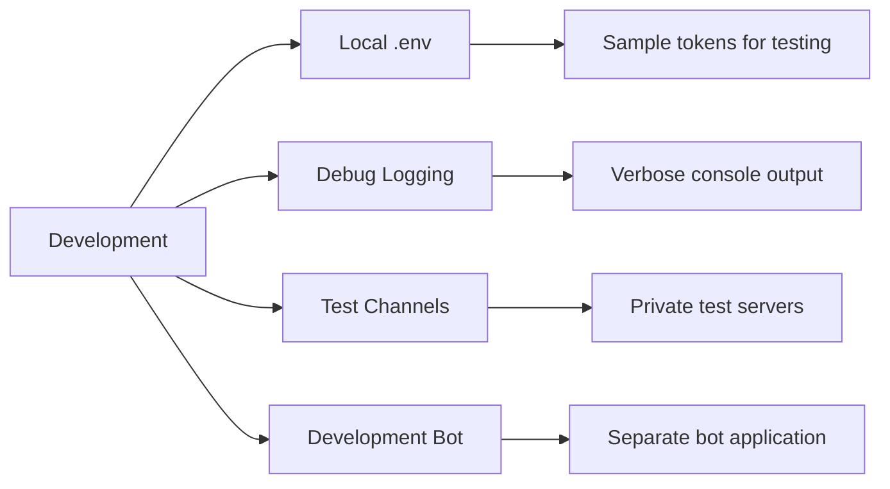

### Production Environment

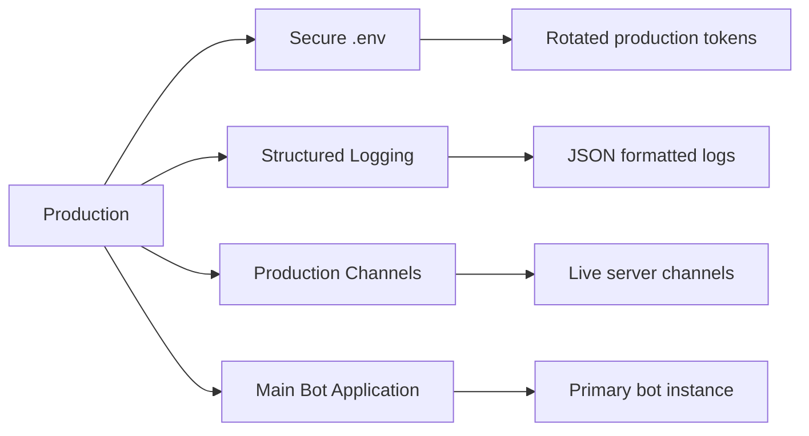

### Configuration Management

| Aspect | Development | Production |
|--------|-------------|------------|
| Logging | Verbose console output | Structured JSON logs |
| Error Reporting | Local notifications | External monitoring |
| Rate Limits | Higher tolerance | Strict compliance |
| Backup Frequency | Manual | Automated daily |
| Rollback Strategy | Manual | Automated rollback |

## Security Considerations

### Sensitive File Protection

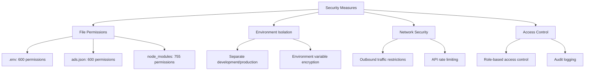

### Security Best Practices

1. **File Permissions**: Restrict access to configuration files
2. **Network Isolation**: Limit outbound connections to Discord API
3. **Token Rotation**: Regularly update bot tokens
4. **Input Validation**: Sanitize all user inputs
5. **Error Handling**: Avoid exposing sensitive information in errors

**Section sources**
- [.gitignore:1-4](file://.gitignore#L1-L4)
- [README.md:640](file://README.md#L640)

## Backup Procedures

### Data Backup Strategy

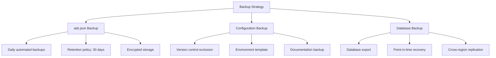

### Backup Implementation

1. **Automated Scheduling**: Daily cron jobs for backup execution
2. **Retention Policy**: Maintain backups for 30 days
3. **Encryption**: Encrypt backups at rest and in transit
4. **Verification**: Regular restore testing
5. **Offsite Storage**: Store backups in geographically diverse locations

### Recovery Procedures

1. **Full System Restore**: Complete environment recreation
2. **Selective Restoration**: Targeted data recovery
3. **Rollback Strategy**: Quick recovery from failed updates
4. **Disaster Recovery**: Business continuity planning

## Scaling Considerations

### Horizontal Scaling

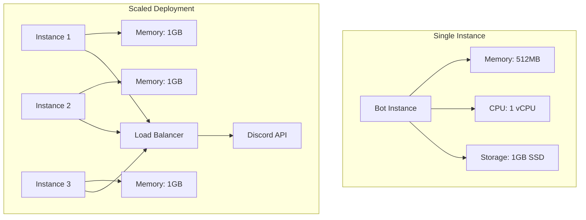

### Performance Optimization

1. **Connection Pooling**: Efficient Discord API connection management
2. **Memory Management**: Proper cleanup of voice connections
3. **Database Optimization**: Efficient JSON file operations
4. **Network Optimization**: CDN usage for media content

### Resource Requirements

| Metric | Single Instance | Multi-Instance |
|--------|----------------|----------------|
| Memory | 512MB | 1GB per instance |
| CPU | 1 vCPU | 2 vCPUs total |
| Storage | 1GB SSD | 2GB SSD per instance |
| Bandwidth | 100Mbps | 500Mbps total |

## Monitoring and Maintenance

### Health Monitoring

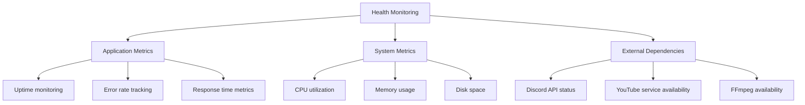

### Maintenance Procedures

1. **Regular Updates**: Monitor and apply dependency updates
2. **Performance Tuning**: Optimize based on usage patterns
3. **Capacity Planning**: Scale resources based on growth
4. **Security Audits**: Regular security assessments
5. **Backup Verification**: Monthly restore testing

### Alerting Configuration

| Metric | Threshold | Action |
|--------|-----------|--------|
| Bot Unavailable | 5 minutes | Alert admin |
| Error Rate | >1% | Auto-restart |
| Memory Usage | >80% | Scale up |
| Disk Space | <10% free | Cleanup required |

## Troubleshooting Guide

### Common Deployment Issues

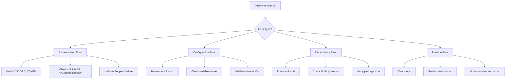

### Error Categories and Solutions

| Error Type | Symptoms | Solution |
|------------|----------|----------|
| Authentication Failure | "Invalid token provided" | Regenerate bot token |
| Permission Denied | "Missing Permissions" | Grant required Discord permissions |
| Configuration Error | "Cannot read properties" | Fix .env file encoding |
| Dependency Issues | "Module not found" | Run npm install |
| Rate Limiting | "Too Many Requests" | Implement backoff strategy |

**Section sources**
- [README.md:508-636](file://README.md#L508-L636)

### Debugging Workflow

1. **Reproduce Issue**: Confirm problem occurs consistently
2. **Check Logs**: Review application and system logs
3. **Validate Configuration**: Verify all environment variables
4. **Test Dependencies**: Ensure all required services are running
5. **Isolate Problem**: Narrow down cause to specific component
6. **Apply Fix**: Implement solution and verify resolution

## Conclusion

This deployment and configuration guide provides comprehensive coverage for operating the Discord Announcement and Music Bot in production environments. The key considerations include proper environment setup, secure configuration management, robust deployment strategies, and comprehensive monitoring.

The bot's dual functionality as an announcement manager and music streaming service requires careful attention to both Discord API limitations and audio processing requirements. Proper security measures, particularly around token protection and file permissions, are essential for production safety.

Successful deployment requires adherence to the dependency management guidelines, proper environment configuration, and implementation of monitoring and backup procedures. Regular maintenance and security audits will ensure long-term reliability and performance.

The modular architecture of the application, with separate concerns for announcements and music functionality, facilitates both development and production operations while maintaining clear separation of responsibilities.