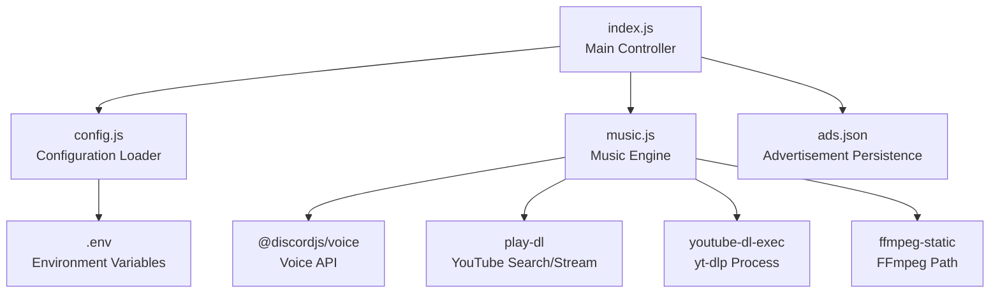
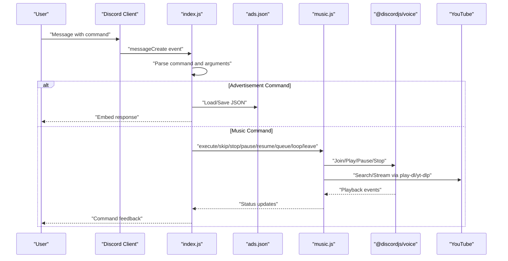
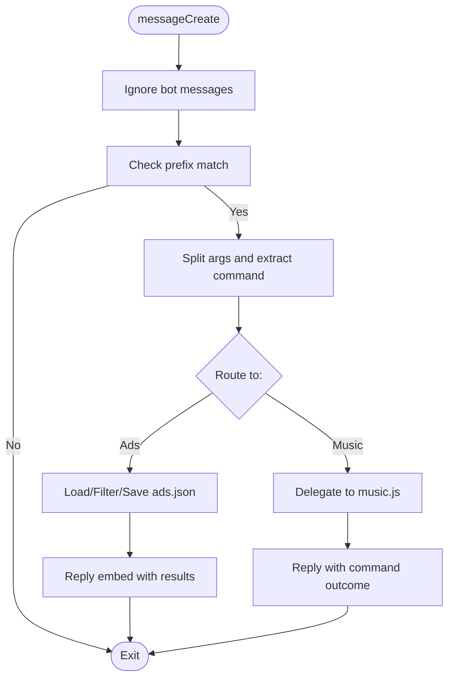
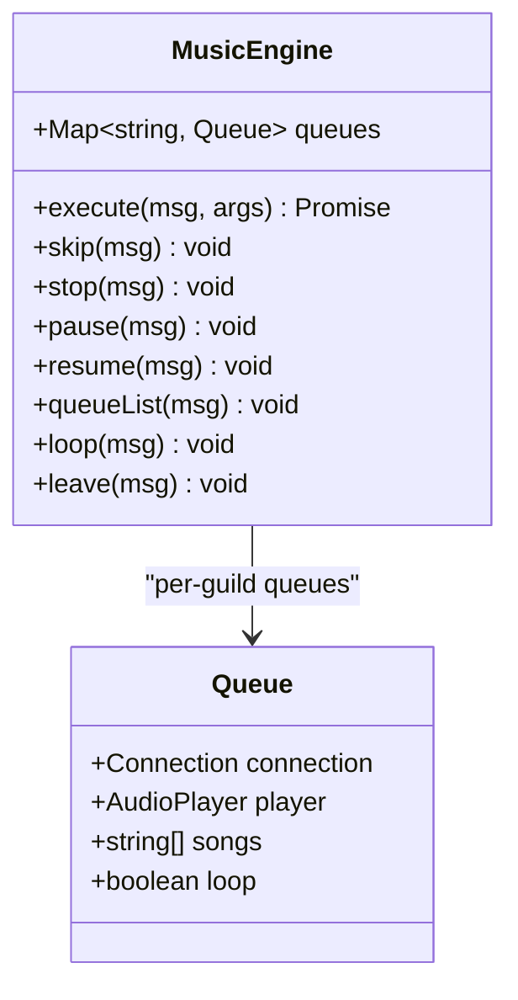
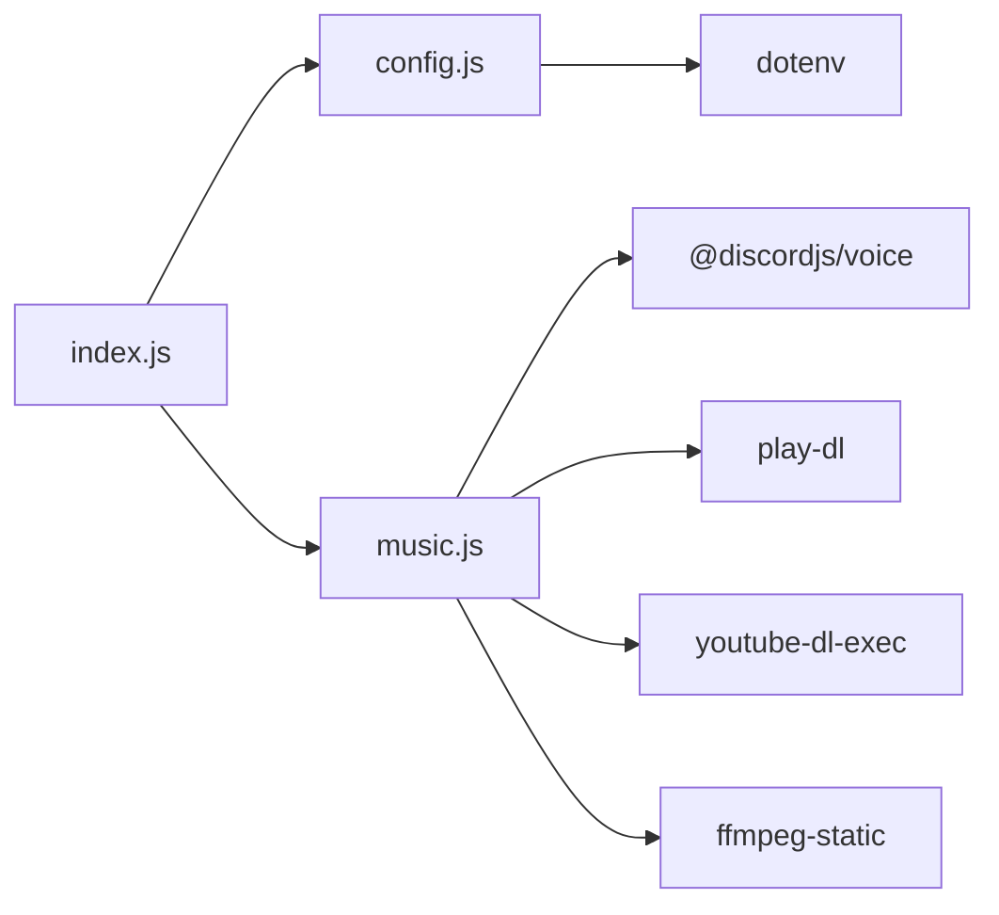

# Technical Reference

<cite>
**Referenced Files in This Document**
- [index.js](file://index.js)
- [music.js](file://music.js)
- [config.js](file://config.js)
- [package.json](file://package.json)
- [README.md](file://README.md)
- [.gitignore](file://.gitignore)
</cite>

## Table of Contents
1. [Introduction](#introduction)
2. [Project Structure](#project-structure)
3. [Core Components](#core-components)
4. [Architecture Overview](#architecture-overview)
5. [Detailed Component Analysis](#detailed-component-analysis)
6. [Dependency Analysis](#dependency-analysis)
7. [Performance Considerations](#performance-considerations)
8. [Troubleshooting Guide](#troubleshooting-guide)
9. [Security and Scalability](#security-and-scalability)
10. [Extensibility Guide](#extensibility-guide)
11. [Build and Deployment](#build-and-deployment)
12. [Conclusion](#conclusion)

## Introduction
This document provides a comprehensive technical reference for the bot’s internal architecture and implementation details. It covers the modular code structure, configuration management patterns, event-driven architecture using discord.js, command processing mechanisms, asynchronous operation handling, data flow between components, file system integration for advertisement persistence, and external API integrations with Discord and YouTube. It also includes guidance for developers extending functionality, adding new commands, or modifying existing features.

## Project Structure
The project follows a minimal, modular layout with clear separation of concerns:
- index.js: Main entry point orchestrating bot lifecycle, configuration loading, command routing, and advertisement management.
- music.js: Dedicated module encapsulating audio playback logic, queue management, and YouTube integration.
- config.js: Centralized configuration loader using dotenv for environment variables.
- package.json: Dependencies and scripts for development and production.
- README.md: Usage documentation and operational guidance.
- .gitignore: Ignores sensitive and generated files (node_modules, .env, ads.json).

**Diagram sources**
- [index.js:1-396](file://index.js#L1-L396)
- [music.js:1-212](file://music.js#L1-L212)
- [config.js:1-8](file://config.js#L1-L8)
- [package.json:1-24](file://package.json#L1-L24)

**Section sources**
- [index.js:1-396](file://index.js#L1-L396)
- [music.js:1-212](file://music.js#L1-L212)
- [config.js:1-8](file://config.js#L1-L8)
- [package.json:1-24](file://package.json#L1-L24)
- [README.md:478-496](file://README.md#L478-L496)

## Core Components
- Main Controller (index.js):
  - Initializes the Discord client with required intents and partials.
  - Loads configuration from config.js and environment variables.
  - Implements command routing for advertisement and music commands.
  - Manages advertisement persistence via file system (ads.json).
  - Integrates with the music engine module for audio operations.
- Music Engine (music.js):
  - Manages per-guild audio queues using a Map keyed by guild ID.
  - Handles YouTube URL validation, search, and streaming via yt-dlp and play-dl.
  - Implements audio player lifecycle events and error handling.
- Configuration Manager (config.js):
  - Loads DISCORD_TOKEN, PREFIX, and AD_CHANNEL_IDS from .env.
  - Splits comma-separated channel IDs into an array for downstream use.
- Package Management (package.json):
  - Declares runtime dependencies for Discord integration, voice playback, and environment configuration.
  - Provides a start script for production deployment.

Key implementation patterns:
- Event-driven architecture using discord.js Client events (messageCreate, clientReady).
- Asynchronous command processing with try/catch blocks and embedded response handling.
- File-based persistence for advertisements with JSON serialization/deserialization.
- Modular separation of concerns between command orchestration and audio playback.

**Section sources**
- [index.js:35-44](file://index.js#L35-L44)
- [index.js:60-389](file://index.js#L60-L389)
- [music.js:7-212](file://music.js#L7-L212)
- [config.js:1-8](file://config.js#L1-L8)
- [package.json:6-22](file://package.json#L6-L22)

## Architecture Overview
The system employs an event-driven model with a central controller delegating specialized tasks to dedicated modules. The main controller listens for message events, parses commands, and routes them to either advertisement management or music engine functions. The music engine manages voice connections, audio resources, and playback state transitions.

**Diagram sources**
- [index.js:60-389](file://index.js#L60-L389)
- [music.js:9-155](file://music.js#L9-L155)

## Detailed Component Analysis

### Main Controller (index.js)
Responsibilities:
- Client initialization with required intents and partials.
- Configuration loading and logging of configured advertisement channels.
- Command parsing and dispatch to handlers.
- Advertisement CRUD operations with JSON persistence.
- Bulk advertisement sending to configured channels with rate limiting.
- Delegation to music engine for audio commands.

Processing Logic:
- Message filtering: ignores bot messages and non-prefix messages.
- Argument extraction and command normalization.
- Switch-based command routing with embedded error handling and user feedback.
- Advertisement persistence: loadAds/saveAds manage ads.json with JSON parse/stringify.
- Channel iteration with error counting and per-message delay to respect Discord rate limits.

Asynchronous Operations:
- Await-based command execution for sendads and music delegation.
- Promise-based delays for controlled message pacing.
- Error-first callbacks for file system operations.

**Diagram sources**
- [index.js:60-389](file://index.js#L60-L389)

**Section sources**
- [index.js:35-44](file://index.js#L35-L44)
- [index.js:60-389](file://index.js#L60-L389)
- [index.js:13-29](file://index.js#L13-L29)

### Music Engine (music.js)
Responsibilities:
- Manage per-guild audio queues using a Map keyed by guild ID.
- Validate YouTube URLs and search for videos when needed.
- Stream audio via yt-dlp and feed to Discord’s audio player.
- Handle player lifecycle events (Playing, Idle) and errors.
- Provide commands: play, skip, stop, pause, resume, queue, loop, leave.

Implementation Patterns:
- Queue management: lazy initialization of connection and player upon first play.
- URL validation: regex for YouTube short/long URLs and library validation for direct URLs.
- Streaming pipeline: spawn yt-dlp process, pipe stdout to audio resource, then play via player.
- Race condition protection: verify queue state before playing to prevent stale streams.
- Event-driven state management: subscribe to connection/player events for diagnostics and flow control.

**Diagram sources**
- [music.js:7-212](file://music.js#L7-L212)

**Section sources**
- [music.js:9-155](file://music.js#L9-L155)
- [music.js:157-212](file://music.js#L157-L212)

### Configuration Management (config.js)
Responsibilities:
- Load environment variables using dotenv.
- Normalize configuration values: token, prefix, and channel IDs array.

Patterns:
- Environment-first loading with fallback defaults.
- Channel IDs split into an array, filtering empty entries.

**Section sources**
- [config.js:1-8](file://config.js#L1-L8)

### Advertisement Persistence (ads.json)
Responsibilities:
- Local JSON storage for advertisement records.
- File-based CRUD operations with synchronous IO wrappers.

Patterns:
- loadAds: readFileSync with JSON.parse and error logging.
- saveAds: writeFileSync with JSON.stringify and error logging.
- Data model: array of ads with metadata (title, description, price, timestamps, author).

**Section sources**
- [index.js:13-29](file://index.js#L13-L29)

## Dependency Analysis
External dependencies declared in package.json:
- discord.js: Core Discord API integration for client, events, and embeds.
- @discordjs/voice: Voice connection and audio player for streaming.
- play-dl: YouTube search and stream URL resolution.
- youtube-dl-exec: Spawn yt-dlp processes for audio extraction.
- ffmpeg-static: FFmpeg path configuration for audio processing.
- dotenv: Environment variable loading.

Internal dependencies:
- index.js depends on config.js and music.js.
- music.js depends on @discordjs/voice, play-dl, youtube-dl-exec, and ffmpeg-static.

**Diagram sources**
- [index.js:1-3](file://index.js#L1-L3)
- [music.js:1-5](file://music.js#L1-L5)
- [config.js:1](file://config.js#L1)
- [package.json:14-22](file://package.json#L14-L22)

**Section sources**
- [package.json:14-22](file://package.json#L14-L22)
- [index.js:1-3](file://index.js#L1-L3)
- [music.js:1-5](file://music.js#L1-L5)
- [config.js:1](file://config.js#L1)

## Performance Considerations
- Rate limiting: sendads iterates channels and sends messages with a 500ms delay per advertisement to avoid Discord rate limits.
- Queue efficiency: per-guild queues minimize cross-server contention; idle detection triggers cleanup.
- Streaming pipeline: yt-dlp stdout piped directly to audio resource avoids unnecessary buffering.
- Error resilience: try/catch around file IO and external operations prevents crashes and logs actionable errors.
- Memory management: queues are stored in-memory per guild; consider pruning inactive queues if scaling to many servers.

[No sources needed since this section provides general guidance]

## Troubleshooting Guide
Common issues and resolutions:
- Invalid token: Verify DISCORD_TOKEN in .env and ensure MESSAGE CONTENT INTENT is enabled in Developer Portal.
- Missing permissions: Ensure bot has View Channel, Send Messages, Embed Links, Read Message History, Connect, and Speak in target channels.
- Channel IDs misconfiguration: Confirm AD_CHANNEL_IDS format (comma-separated without spaces) and that IDs correspond to text channels.
- UTF-8 BOM in .env: Save .env as UTF-8 without BOM and ensure no leading/trailing whitespace.
- Bot not responding: Check PREFIX in .env and confirm MESSAGE CONTENT INTENT is enabled.
- YouTube playback failures: Validate URL correctness, ensure video is not age-restricted or private, or try a more specific search term.
- Voice permission issues: Grant Connect and Speak permissions in the voice channel.

**Section sources**
- [README.md:508-657](file://README.md#L508-L657)

## Security and Scalability
Security:
- Token protection: DISCORD_TOKEN is loaded from .env and ignored by git; never commit secrets.
- Least privilege: Configure bot permissions strictly for required actions.
- Input sanitization: Command parsing uses basic splitting; consider stricter validation for complex inputs.

Scalability:
- Current design: Single-process, per-guild queues; suitable for small to medium deployments.
- Bottlenecks: File-based ads.json is a single point of failure and concurrency bottleneck.
- Recommendations: Replace ads.json with a database (e.g., SQLite or PostgreSQL) for concurrent access and durability; shard by guild or deploy multiple instances behind a load balancer.

[No sources needed since this section provides general guidance]

## Extensibility Guide
Adding new advertisement commands:
- Extend the switch statement in index.js with a new case.
- Implement loadAds/saveAds or reuse existing helpers.
- Use EmbedBuilder for consistent responses.

Adding new music commands:
- Add a new exported function in music.js and export it from the module.
- Register the command in index.js under the music command group.

Integrating external APIs:
- For YouTube, leverage play-dl and youtube-dl-exec as implemented.
- For other services, add dependencies to package.json and import in the relevant module.

Refactoring suggestions:
- Move advertisement CRUD into a separate module for better cohesion.
- Introduce a command handler registry to reduce switch complexity.
- Add unit tests for critical paths (parsing, validation, queue operations).

[No sources needed since this section provides general guidance]

## Build and Deployment
Build system:
- Minimal build: No transpilation or bundling required; Node.js runtime executes CommonJS modules directly.

Dependency management:
- Install dependencies with npm install.
- Production startup via npm start, which runs node index.js.

Deployment architecture:
- Single-instance deployment recommended for simplicity.
- Environment variables (.env) must be present at runtime.
- Persisted data (ads.json) should be backed up regularly.

**Section sources**
- [package.json:6-8](file://package.json#L6-L8)
- [README.md:140-158](file://README.md#L140-L158)
- [.gitignore:1-4](file://.gitignore#L1-L4)

## Conclusion
The bot implements a clean, event-driven architecture with clear separation between advertisement management and music playback. The main controller coordinates configuration, command routing, and persistence, while the music engine encapsulates voice streaming and queue logic. Robust error handling and rate-limiting ensure reliability. For production use, consider replacing file-based persistence with a database and adding tests and monitoring to support growth.