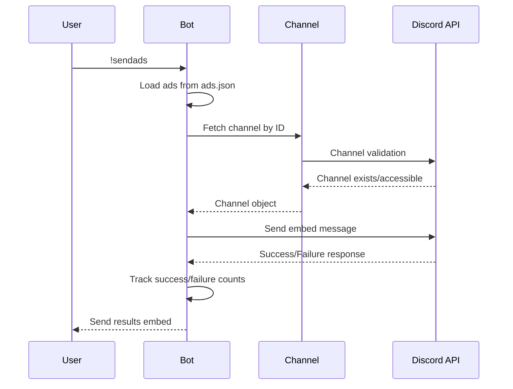
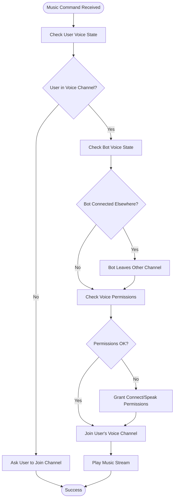
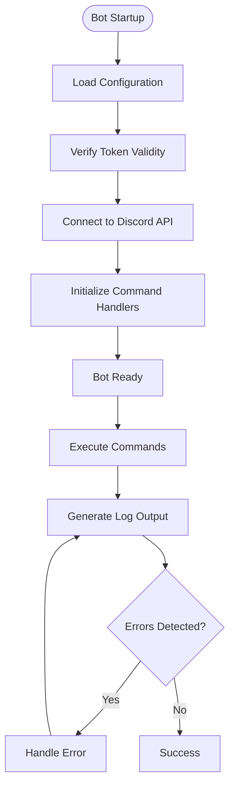
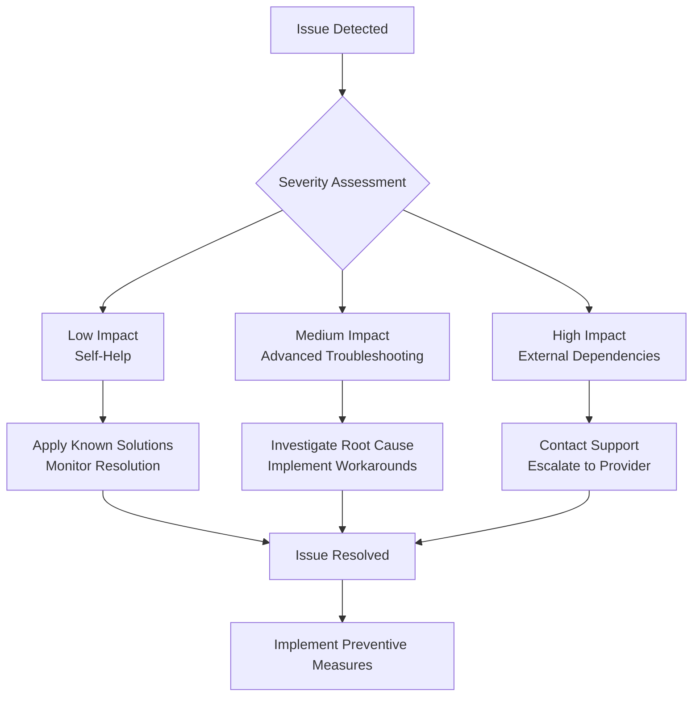

# Troubleshooting Guide

<cite>
**Referenced Files in This Document**
- [README.md](file://README.md)
- [index.js](file://index.js)
- [music.js](file://music.js)
- [config.js](file://config.js)
- [package.json](file://package.json)
- [ads.json](file://ads.json)
</cite>

## Table of Contents
1. [Introduction](#introduction)
2. [Common Error Categories](#common-error-categories)
3. [Token and Authentication Issues](#token-and-authentication-issues)
4. [Permission and Access Problems](#permission-and-access-problems)
5. [Advertisement System Troubleshooting](#advertisement-system-troubleshooting)
6. [Music Streaming Troubleshooting](#music-streaming-troubleshooting)
7. [Discord-Specific Issues](#discord-specific-issues)
8. [Debugging and Log Interpretation](#debugging-and-log-interpretation)
9. [Preventive Measures](#preventive-measures)
10. [Escalation Procedures](#escalation-procedures)

## Introduction

This comprehensive troubleshooting guide addresses common operational challenges encountered when running the Discord Announcement and Music Bot. The guide covers systematic diagnostic approaches, step-by-step resolution procedures, and preventive measures for various error scenarios including invalid tokens, permission issues, advertisement failures, and music streaming problems.

The bot combines two primary functionalities: mass announcement distribution across configured channels and music streaming capabilities with queue management. Understanding both systems is crucial for effective troubleshooting.

## Common Error Categories

The bot encounters several distinct categories of errors that require different diagnostic approaches:

### Authentication and Connection Errors
- Invalid token errors preventing bot startup
- Privileged intent configuration issues
- Rate limiting scenarios from excessive API calls

### Advertisement System Errors
- Mass sending failures to configured channels
- Embed limitation problems (25-field cap)
- Data persistence issues with ads.json

### Music Streaming Errors
- Voice channel connectivity problems
- Audio quality and streaming failures
- Queue management and playback errors

### Discord Integration Issues
- Bot permissions in channels and voice states
- Channel access restrictions
- Intent configuration problems

**Section sources**
- [README.md:508-657](file://README.md#L508-L657)

## Token and Authentication Issues

### Invalid Token Errors

**Symptoms:**
- Error message: "Erro ao conectar o bot: An invalid token was provided"
- Bot fails to start completely
- Console shows connection error during login

**Root Causes:**
- Incorrect or empty DISCORD_TOKEN in .env file
- Token contains unwanted characters (spaces, quotes, line breaks)
- Token expired or revoked from Discord Developer Portal

**Diagnostic Steps:**
1. Verify .env file contains DISCORD_TOKEN with proper format
2. Check for invisible characters or whitespace around the token
3. Confirm token hasn't been reset or changed in Developer Portal
4. Ensure token is copied correctly without extra spaces

**Resolution Procedure:**
1. Navigate to Discord Developer Portal → Applications → Your Bot
2. Click "Reset Token" to generate a new token
3. Copy the new token exactly as shown
4. Paste into .env file without any spaces or quotes
5. Save file and restart the bot
6. Monitor console for successful connection message

**Preventive Measures:**
- Store tokens securely and never share
- Use version control exclusions (.gitignore) for .env files
- Regularly backup token information separately from code

**Section sources**
- [README.md:510-518](file://README.md#L510-L518)
- [index.js:392-395](file://index.js#L392-L395)

### Privileged Intent Configuration Issues

**Symptoms:**
- Error: "Erro ao conectar o bot: Privileged intent(s) provided without allowing it as a developer option"
- Bot connects but doesn't respond to commands
- MESSAGE CONTENT INTENT not functioning

**Root Causes:**
- MESSAGE CONTENT INTENT not enabled in Developer Portal
- SERVER MEMBERS INTENT not approved for bot usage
- Intent changes not saved or applied

**Diagnostic Steps:**
1. Check Developer Portal → Bot → Privileged Gateway Intents
2. Verify MESSAGE CONTENT INTENT is checked
3. Confirm bot has proper approval status
4. Test with minimal intents first

**Resolution Procedure:**
1. Go to Discord Developer Portal → Your Application → Bot
2. Enable "MESSAGE CONTENT INTENT" under Privileged Gateway Intents
3. Optionally enable SERVER MEMBERS INTENT
4. Click "Save Changes" at bottom
5. Restart the bot completely
6. Verify bot responds to commands immediately

**Preventive Measures:**
- Enable all required intents during initial setup
- Document intent requirements for future reference
- Test bot functionality immediately after enabling intents

**Section sources**
- [README.md:521-529](file://README.md#L521-L529)

## Permission and Access Problems

### Missing Permissions Errors

**Symptoms:**
- Error: "Erro ao enviar para canal XXXXX: Missing Permissions"
- Advertisement commands fail with permission errors
- Bot appears unable to send messages in channels

**Root Causes:**
- Bot lacks required permissions in target channels
- Channel-specific permission overrides blocking bot
- Voice channel permission issues for music commands

**Diagnostic Steps:**
1. Check bot role permissions in target channels
2. Verify channel-specific permission overwrites
3. Test bot in different channels to isolate issue
4. Confirm voice channel permissions for music commands

**Resolution Procedure:**
1. Right-click target channel → Edit Channel
2. Go to "Permissions" tab
3. Add bot user and grant following permissions:
   - View Channel (required for all channels)
   - Send Messages (for text channels)
   - Embed Links (for rich embeds)
   - Read Message History (for proper embed display)
   - Connect (for voice channels)
   - Speak (for music playback)
4. Remove any deny permissions for bot
5. Test advertisement sending and music commands

**Preventive Measures:**
- Configure all required permissions during initial bot setup
- Document permission requirements for different channel types
- Test bot in staging environment before production deployment

**Section sources**
- [README.md:532-544](file://README.md#L532-L544)

### Channel Configuration Issues

**Symptoms:**
- "!sendads não envia nada / diz que nenhum canal está configurado"
- Empty channel list in bot startup logs
- Advertisement commands fail silently

**Root Causes:**
- AD_CHANNEL_IDS empty or incorrectly formatted
- IDs separated with spaces instead of commas
- Non-existent or deleted channel IDs
- Wrong channel type (voice instead of text)

**Diagnostic Steps:**
1. Verify AD_CHANNEL_IDS format in .env file
2. Check each ID corresponds to existing text channels
3. Confirm no spaces around comma separators
4. Validate channel types are text channels, not voice

**Resolution Procedure:**
1. Enable Developer Mode in Discord settings
2. Right-click each target channel → Copy ID
3. Paste IDs into .env file separated by commas only
4. Example format: `AD_CHANNEL_IDS=111111111111111111,222222222222222222`
5. Remove any spaces around commas
6. Save and restart bot
7. Verify channel count in startup logs

**Preventive Measures:**
- Use consistent ID copying method
- Test channel IDs before adding to configuration
- Maintain backup of verified channel configurations

**Section sources**
- [README.md:547-562](file://README.md#L547-L562)
- [config.js:6](file://config.js#L6)

## Advertisement System Troubleshooting

### Mass Sending Failures

**Symptoms:**
- Advertisement sends show zero successes
- Partial failures in send statistics
- Some channels receive messages while others don't

**Root Causes:**
- Channel-specific permission issues
- Rate limiting from rapid successive sends
- Channel deletion or access revocation
- Embed field limitations (25-field cap)

**Diagnostic Steps:**
1. Check individual channel permissions
2. Monitor console for specific error messages per channel
3. Verify channel existence and accessibility
4. Count total advertisements (should be ≤ 25 for single embed)

**Resolution Procedure:**
1. Test individual channel access manually
2. Remove problematic channels from AD_CHANNEL_IDS
3. Split large advertisement lists across multiple runs
4. Ensure proper spacing in comma-separated IDs
5. Wait between batch operations if rate limiting occurs

**Advanced Troubleshooting:**

**Section sources**
- [index.js:158-220](file://index.js#L158-L220)
- [README.md:642](file://README.md#L642)

### Embed Limitation Problems

**Symptoms:**
- Advertisement lists truncated at 25 items
- "!myads" and "!allads" limited to 25 entries
- Missing advertisements in long lists

**Root Causes:**
- Discord embed field limit (25 fields per embed)
- Large advertisement datasets exceeding embed capacity
- Pagination requirements for extensive data

**Resolution Procedure:**
1. Use "!myads" for personal lists (limited to 25)
2. Use "!allads" for server-wide viewing (limited to 25)
3. Consider splitting large advertisement campaigns
4. Use multiple runs with smaller batches

**Preventive Measures:**
- Design advertisement campaigns with reasonable item counts
- Implement manual batching for large datasets
- Consider alternative storage solutions for extensive data

**Section sources**
- [README.md:644](file://README.md#L644)

### Data Persistence Issues

**Symptoms:**
- Ads disappear after bot restart
- Empty ads.json file after installation
- Data loss during updates or migrations

**Root Causes:**
- ads.json file not properly created or written
- File system permission issues
- Project relocation or deletion affecting local storage
- JSON parsing errors in ads.json

**Diagnostic Steps:**
1. Check ads.json file exists and has proper permissions
2. Verify JSON syntax in ads.json file
3. Monitor console for file write errors
4. Test basic advertisement creation and saving

**Resolution Procedure:**
1. Ensure ads.json has proper file permissions
2. Check disk space availability
3. Verify Node.js has write access to project directory
4. Monitor console output for file system errors
5. Consider implementing database migration for production use

**Preventive Measures:**
- Regular backups of ads.json
- Implement data validation before file writes
- Consider cloud storage alternatives for critical data
- Document data migration procedures

**Section sources**
- [index.js:13-29](file://index.js#L13-L29)
- [ads.json:1-4](file://ads.json#L1-L4)
- [README.md:646](file://README.md#L646)

## Music Streaming Troubleshooting

### Voice Channel Connectivity Issues

**Symptoms:**
- Error: "Você precisa estar em um canal de voz para usar este comando!"
- Bot joins but immediately disconnects
- Audio plays but no sound output

**Root Causes:**
- User not connected to voice channel
- Bot already connected to different voice channel
- Voice channel permission issues
- ffmpeg installation problems

**Diagnostic Steps:**
1. Verify user is in a voice channel
2. Check if bot is already connected elsewhere
3. Test voice channel permissions for bot
4. Verify ffmpeg installation and path configuration

**Resolution Procedure:**
1. Join any voice channel in the server
2. Use "!leave" to disconnect bot from other channels
3. Enter the same voice channel as the bot
4. Grant proper voice permissions to bot
5. Install ffmpeg if not present
6. Restart bot after permission changes

**Advanced Troubleshooting:**

**Section sources**
- [music.js:9-11](file://music.js#L9-L11)
- [README.md:597-604](file://README.md#L597-L604)

### Audio Quality and Streaming Problems

**Symptoms:**
- No audio output despite playing
- Choppy or distorted audio
- Frequent buffering and interruptions
- Audio stops unexpectedly

**Root Causes:**
- youtube-dl-exec process failures
- Network connectivity issues
- Audio format conversion problems
- Resource exhaustion during streaming

**Diagnostic Steps:**
1. Monitor console for yt-dlp process errors
2. Check network connectivity to YouTube
3. Verify audio format compatibility
4. Monitor system resources during playback

**Resolution Procedure:**
1. Update youtube-dl-exec to latest version
2. Check firewall and network restrictions
3. Verify audio format support
4. Restart bot to clear resource issues
5. Consider alternative audio sources

**Section sources**
- [music.js:110-155](file://music.js#L110-L155)

### Queue Management Errors

**Symptoms:**
- Songs not playing in expected order
- Queue gets stuck or corrupted
- Memory leaks with long-running queues
- Playback errors during queue transitions

**Root Causes:**
- Race conditions during queue operations
- Improper queue cleanup on errors
- Memory accumulation with failed streams
- Concurrency issues with multiple queue operations

**Diagnostic Steps:**
1. Monitor queue length and song progression
2. Check for error logs during queue transitions
3. Verify proper queue cleanup on failures
4. Monitor memory usage during extended playback

**Resolution Procedure:**
1. Implement proper queue error handling
2. Add queue cleanup mechanisms
3. Monitor and limit queue size
4. Restart bot if queue corruption detected
5. Consider implementing queue persistence

**Section sources**
- [music.js:7-8](file://music.js#L7)
- [music.js:157-209](file://music.js#L157-L209)

## Discord-Specific Issues

### Bot Permissions and Channel Access

**Symptoms:**
- Bot responds to commands but ignores actions
- Commands appear to execute but nothing happens
- Music commands fail with permission errors
- Advertisement commands blocked by permissions

**Root Causes:**
- Insufficient bot permissions in target channels
- Channel-specific permission overrides
- Voice channel permission mismatches
- Role hierarchy conflicts

**Diagnostic Steps:**
1. Check bot role hierarchy position
2. Verify channel-specific permission overrides
3. Test bot in different channel types
4. Compare user vs bot permission sets

**Resolution Procedure:**
1. Move bot role above affected channels
2. Remove conflicting permission overrides
3. Grant appropriate permissions for channel type
4. Test bot functionality in isolated environment

**Section sources**
- [README.md:627-635](file://README.md#L627-L635)

### Rate Limiting Scenarios

**Symptoms:**
- Advertisement sends slow or delayed
- API rate limit warnings in console
- Temporary bans from excessive messaging
- Command timeouts and failures

**Root Causes:**
- Discord API rate limiting
- Excessive simultaneous operations
- Rapid successive message sends
- Server-side rate limit enforcement

**Diagnostic Steps:**
1. Monitor console for rate limit indicators
2. Check timing between advertisement sends
3. Verify compliance with Discord guidelines
4. Monitor server response times

**Resolution Procedure:**
1. Maintain 500ms delay between sends (already implemented)
2. Batch operations during low-traffic periods
3. Monitor rate limit warnings and adjust accordingly
4. Implement exponential backoff for retries

**Preventive Measures:**
1. Design operations to respect rate limits
2. Implement retry mechanisms with delays
3. Monitor API usage patterns
4. Consider premium rate limits for high-volume use

**Section sources**
- [README.md:642](file://README.md#L642)
- [index.js:199](file://index.js#L199)

### Intent Configuration Problems

**Symptoms:**
- Bot connects but doesn't respond to commands
- MESSAGE CONTENT INTENT not functioning
- Commands ignored regardless of prefix
- Bot appears functional but unresponsive

**Root Causes:**
- MESSAGE CONTENT INTENT not enabled
- SERVER MEMBERS INTENT conflicts
- Intent approval requirements
- Developer Portal configuration errors

**Diagnostic Steps:**
1. Verify intents enabled in Developer Portal
2. Check intent approval status
3. Test with minimal intent set
4. Monitor console for intent-related errors

**Resolution Procedure:**
1. Enable MESSAGE CONTENT INTENT in Developer Portal
2. Save changes and wait for propagation
3. Restart bot completely
4. Test command functionality immediately

**Section sources**
- [README.md:586-594](file://README.md#L586-L594)

## Debugging and Log Interpretation

### Console Output Analysis

**Key Log Categories:**
- Connection and startup messages
- Command processing and execution
- Error and failure notifications
- Audio streaming and voice channel events

**Interpreting Common Log Messages:**
- "✅ Bot online como: ..." - Successful startup
- "❌ Erro ao conectar o bot:" - Authentication/connection errors
- "🔊 Bot entrou no canal de voz:" - Voice channel connection
- "🎧 Criando stream de áudio:" - Audio streaming initiation
- "❌ Erro ao enviar para canal:" - Advertisement sending failures

**Debugging Workflow:**
1. Monitor startup logs for immediate connection issues
2. Watch command execution logs for processing errors
3. Track error messages for specific failure patterns
4. Observe audio streaming logs for media issues

**Enhanced Logging Setup:**

**Section sources**
- [index.js:50-54](file://index.js#L50-L54)
- [music.js:34-58](file://music.js#L34-L58)

### Error Message Patterns

**Authentication Errors:**
- "An invalid token was provided" - Token verification failure
- "Privileged intent(s) provided without allowing it" - Intent configuration issues
- "Used disallowed intents" - Intent approval problems

**Advertisement Errors:**
- "Missing Permissions" - Channel permission issues
- "Cannot read properties of undefined" - Environment configuration problems
- "Nenhum canal de anúncios configurado" - Channel configuration issues

**Music Streaming Errors:**
- "Entre em um canal de voz!" - Voice channel connectivity
- "Erro ao buscar/tocar a música" - Audio streaming failures
- "Já estou tocando em outro canal de voz!" - Multi-server conflicts

**Section sources**
- [README.md:508-657](file://README.md#L508-L657)

## Preventive Measures

### Configuration Best Practices

**Environment Configuration:**
- Use UTF-8 encoding without BOM for .env files
- Maintain consistent ID formatting (no spaces around commas)
- Store sensitive tokens in secure locations
- Regular configuration backups

**Operational Safeguards:**
- Implement graceful error handling
- Add timeout mechanisms for external operations
- Monitor resource usage during extended operations
- Test configurations in staging environments

**Data Protection:**
- Regular backups of ads.json
- Validation of data before persistence
- Implementation of data migration procedures
- Secure handling of sensitive information

**Section sources**
- [README.md:638-657](file://README.md#L638-L657)

### Monitoring and Maintenance

**Health Checks:**
- Daily verification of bot connectivity
- Weekly review of error logs
- Monthly audit of configuration files
- Quarterly assessment of performance metrics

**Maintenance Schedule:**
- Update dependencies regularly
- Review and update permissions as needed
- Clean up unused advertisements periodically
- Monitor and adjust rate limiting as required

**Documentation Requirements:**
- Maintain configuration change logs
- Document troubleshooting procedures
- Record resolution steps for common issues
- Share knowledge with team members

## Escalation Procedures

### Issue Classification Matrix

**Level 1 - Self-Help (Immediate Resolution):**
- Configuration errors (token, permissions, intents)
- Simple command failures
- Local file system issues
- Basic network connectivity problems

**Level 2 - Advanced Troubleshooting (Requires Investigation):**
- Complex permission conflicts
- Rate limiting and API issues
- Audio streaming problems
- Multi-channel coordination failures

**Level 3 - External Dependencies (Requires External Action):**
- Discord Developer Portal approvals
- Intent approval processes
- Third-party service outages
- Infrastructure provider issues

### Escalation Workflow

### Support Resources

**Internal Resources:**
- Team members with Discord bot experience
- System administrators for infrastructure issues
- DevOps engineers for deployment problems
- Security personnel for token and access issues

**External Resources:**
- Discord Developer Portal support
- GitHub repository issues for bug reports
- Community forums for general guidance
- Professional support services for enterprise needs

**Section sources**
- [README.md:638-657](file://README.md#L638-L657)

## Conclusion

This comprehensive troubleshooting guide provides systematic approaches to resolving common issues with the Discord Announcement and Music Bot. By understanding the error categories, implementing preventive measures, and following structured diagnostic procedures, users can effectively resolve most operational challenges.

Key success factors include proper configuration management, understanding Discord's permission model, implementing robust error handling, and maintaining regular monitoring and maintenance schedules. The guide's structured approach ensures that both immediate fixes and long-term solutions are addressed comprehensively.

For persistent or complex issues, the escalation procedures provide clear pathways to obtaining additional support while maintaining operational continuity through temporary workarounds and preventive measures.